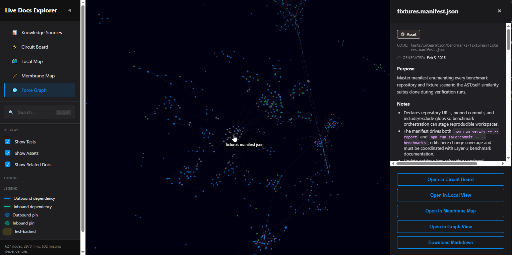
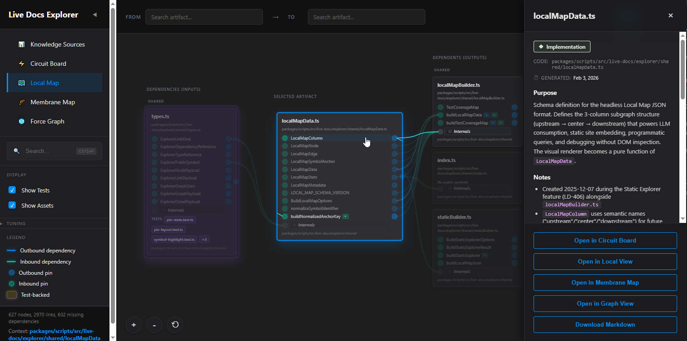
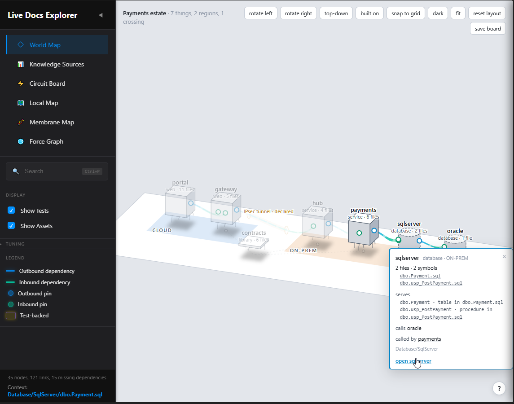
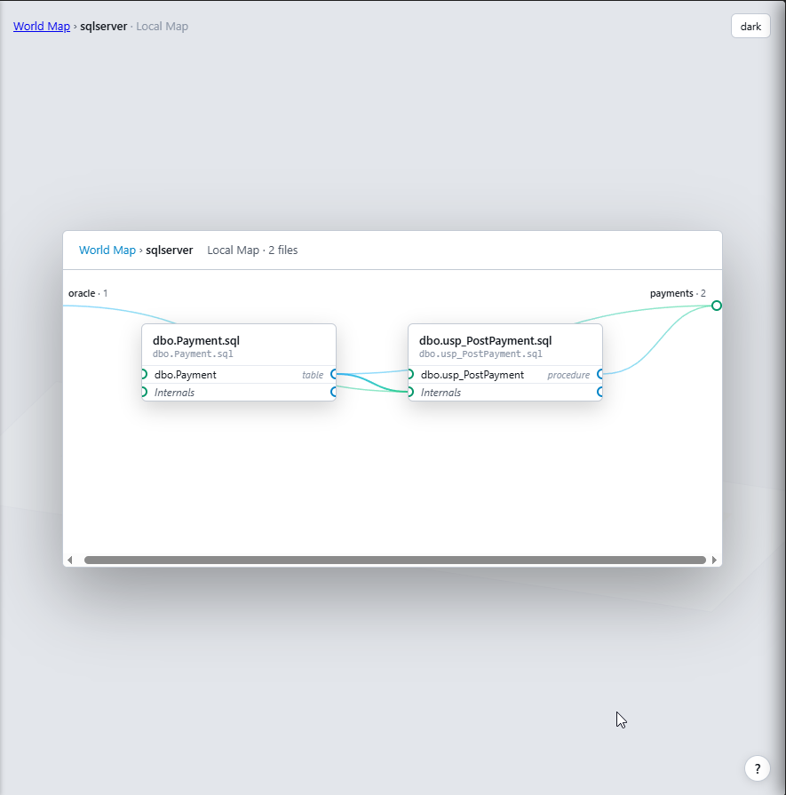

# Claude Code session, 2026-09-27 09:00 to 2026-09-29 15:17 UTC

_Both sides of the session in order, rebuilt from Claude Code's session log by [claude-code-transcript.mjs](../../../scripts/claude-code-transcript.mjs). The owner's prompts are verbatim; a line starting with `>` in one is the owner quoting Claude. Claude's messages are verbatim except in two places: their headings sit two levels deeper, so that the speakers stay the outline, and their links to files in the repository are rewritten to resolve from this folder. The work between is one line in italics: tool calls counted, subagents, workflows and commits named. What Claude Code itself said, an error or a notice, is quoted under an italic line. Commands, tool output, reasoning, the progress lines the editor showed while Claude worked, subagent reports and compaction summaries are not kept._

- Model: Fable 5.1.
- The owner: 36 prompts, and 13 messages sent while Claude was working.
- Claude: 194 messages, 1515 tool calls, 13 subagents launched.
- The repository: 54 commits. The context: compacted 9 times.

## Owner · 2026-09-27 09:00 UTC

Before we continue with the work from the last chat, I'd ask that you please refresh yourself on what we did in the last chat (where we started versus where we ended and the journey between). Would you be able to refresh yourself on the most recent Claude Code session and reorient me on our current progress state?

## Claude (Fable 5.1) · 2026-09-27 09:00 UTC

I'll look for the most recent session transcript in the Claude Code projects directory and in the repo's chat record, then reconstruct where we started and ended.

_Work, 09:00 UTC: 1 shell command._

The previous session is the 10 MB transcript from last night into this morning. I'll extract its user turns and assistant text in order so I can trace the arc, and pull the memory files in parallel.

_Work, 09:00 to 09:01 UTC: 3 shell commands, 3 files read._

Still reading the previous transcript. I'm most of the way through the last session; the final stretch covers the three engine commits from this morning.

_Work, 09:01 to 09:03 UTC: 1 file read, 8 shell commands._

I've read the whole previous session, the memory files, and verified the tree. Here is where things stand.

#### Where we started

You opened the session on the evening of 2026-09-26, back after months away from a repo built entirely with GitHub Copilot, and asked for a baby-versus-bathwater audit with permission to stop and ask. Four parallel investigations plus my own reading produced the audit. Everything passed, but the rigor apparatus graded itself, roughly forty percent of the code was unreachable from any user command, the public demo bundled your raw chat transcripts, and the Explorer's default screen was mostly an empty tile.

#### The journey

The conversation moved through four phases.

- **Reframe.** Your answers rewrote the product. The audience is humans looking at a picture, not agents reading markdown. The founding question stays, but the deliverable is the map. You described the canvas of software cubes with visible guts, and we agreed the same model holds at every scale: a thing exposes and consumes. Markdown stays canonical, with a gitignored derived index over it. Requirement-ID schemes go because they bias toward mediocrity.
- **Two files before any deletion.** I wrote [AGENTS.md](../../../../AGENTS.md) as vendor-neutral steering and rewrote [vision.mdmd.md](../../../../.mdmd/layer-1/vision.mdmd.md) around five sentences and the scale table. You approved both, then softened the vision's rendering language yourself by pointing out the design is not specified and may be 3D.
- **Cleanup pass.** Copilot-era steering replaced, chat transcripts excluded from the bundle, ten stale Layer 1 to 3 docs retired with their nuggets mined into the decisions log, guides rewritten to today's truth, a gitattributes file for LF. Four commits, all gated.
- **The next-work map and the engine retirement.** After a compaction you asked for a temp HTML map of the path forward. You answered its six forks: tree-sitter is the shipped destination, the compiler is the oracle and never runs inside the product, delete the system layer and co-activation now, wait on the 3D probe until the index exists, single main branch, and you granted autonomy on the engine work with no per-checkpoint reviews. Three retirement commits followed this morning.

| Commit | What went |
| --- | --- |
| ca655066 | Electron harness and AST benchmark; integration suites now run under Vitest |
| 0de42d28 | Inference path, fixture oracles, system layer, headless harness, self-grading tools, seven Layer-3 docs |
| 986fe8e2 | Extension shell and language server; Explorer landing heuristic made generic |

Net across the three: about 92,000 lines removed. Non-test source is near 45,000 lines.

#### Current state, verified just now

The tree is clean on main at 986fe8e2. Tracked Live Docs number 457, four fewer than the last report said, which is a rounding in that report rather than drift. The `packages/extension` folder still exists on disk but holds only ignored build output, nothing tracked. Node is on 22 as pinned, with the jump to 26 dated for after 2026-10-28. The C# toolchain the next step needs is present: dotnet 10, scip-dotnet under your dotnet tools, and the C# grammar in the tree-sitter WASM package. The static server from last night is still serving the next-work map on port 4173.

Vision step 1 is done. Step 2, making the engine honest, is where we are. The agreed sequence inside it is the C# oracle first, then the tree-sitter C# adapter reported as a disagreement list, then the strict grammar with a round-trip test, then the derived index, and only then the 3D probe.

The immediate next action, as promised at the end of the last session, is to prove that scip-dotnet can index an SDK-style project targeting .NET Framework 4.8 on Linux before anything is built on it. After that comes the oracle fixture shaped like your estate: WebForms substrate with Web API 2 controllers, the API gateway, the WCF hub, a WCF service on Entity Framework, and a SQL Server procedure with a linked-server query into Oracle.

Two open items from your side that remain unmade decisions: whether the chat history stays in the repo at all, and the `packages/server` rename, which I left alone as churn. Say the word and I'll start on the scip-dotnet proof.

## Owner · 2026-09-27 09:16 UTC

>Two open items from your side that remain unmade decisions: whether the chat history stays in the repo at all, and the packages/server rename, which I left alone as churn. Say the word and I'll start on the scip-dotnet proof.

Nicely done! Nicely done! 

As far as chat history preservation, I say "keep until modernization effort complete". It still has a lot of useful stuff to mine, which will eventually bubble up and crystallize into the modernization, such that at its conclusion the prior chat history (shaped around the last generation of frontier LLMs) is finally ready to delete, as its utility as training data wanes into obsolescence (along with, of course, the loud and false signals it sends into search results here in the workspace during day-to-day work). As far as renames go, I must reassert: I am using a common sense engine (LLMs) to solve a common sense problem (software architecture understanding). If it seems semantically smoother and more correct to do the rename, do the rename. You should find this kind of underlying signal in my old chats from the prior generation of frontier LLMs, where I try to verbalize some hope that the common-sense could, under the same kind of prompts, elicit essentially the same-shaped result. (Not just because it is idiomatic or sensible but because it is correct). You'll see this sense of "self-healing" I try to indicate in my old prompts about the system. An assertion that, once the semantic intent is somehow codified, the same rough shape must always result from it. 

A heady topic for later perhaps. In terms of the concrete ongoing work, I believe that we are aligned. Please proceed and continue to attempt to listen for the _spirit_ of user intent wherever it finds you. Without the old Github Copilot chats deleted, the workspace is a search minefield for user intent signals and thoughts about what this software could do. But give precedence temporally; new supercedes old, and so forth. 

All I mean to say, I guess, is that between your ability to search claude code chats and your ability to search the old GHCP chat histories, you genuinely should have everything you need to succeed. It's like really late/early and I'd like to sleep but would also like to see concrete progress made picking the low-hanging fruit in the overnight. I have strong confidence in your ability to follow common sense, self-elicit parismonious simplicity with emergence, and knock this out of the park. Of course, my personal priority for you to stop on genuine forks in the road (design forks) is held in highest priority, so I am absolutely happy to come back to a short transcript where, 5 minutes later, you hit a fork in the road and simply stopped with a wonderful set of questions that couldn't be answered from prior user intent signals. That is A-okay. Let's just keep this ball rolling, but rolling within good standards of stewardship.

## Claude (Fable 5.1) · 2026-09-27 09:17 UTC

Understood on all three. I'll record the chat-history decision and the rename authorization in memory, then start on the concrete work: the rename, the scip-dotnet proof, and the fixture. I'll stop only at a real design fork.

_Work, 09:17 to 10:06 UTC: 82 shell commands; committed cad63bdd "chore: rename packages/server to packages/generator and flatten its source"._

The gate's only failure is the SlopCop symbol audit. I'll read its report from the log to see which new Live Doc it objects to.

_Work, 10:10 to 10:13 UTC: 10 shell commands._

Still failing the symbol audit, now with three issues instead of two. Reading them.

_Work, 10:17 UTC: 6 shell commands._

The flagged files each hold only one id, so the duplicate must be another heading in the same doc that slugs identically. I'll read one full flagged doc and the audit's slug logic.

_Work, 10:19 to 10:30 UTC: 20 shell commands; committed 4c965539 "feat(oracle): measure the shipped generator against the compiler"._

Two commits landed tonight, the tree is clean, and the next step has a proven loading path. Here is the night in full.

#### What landed

| Commit | Change |
| --- | --- |
| cad63bdd | `packages/server` renamed to `packages/generator`, source flattened, stale pipeline doc and tracing guide rewritten from real output, dead re-export shim and its tracked compiled twin removed |
| 4c965539 | The compiler-backed oracle, the estate fixture, a generator fix, and the first measurement |

Every commit passed the full gate with a recorded exit code. Memory is updated with everything below.

#### The oracle

Three scripts under `scripts/oracle/`. The converter turns a SCIP index into unfiltered file-to-file edges with the symbols that carry them. The index command copies a fixture, runs scip-dotnet, and writes `expected/compiler-edges.json`. The compare command runs the shipped generator over the fixture and prints every disagreement as a list, never a score. An integration test checks the bookkeeping on both measured fixtures.

One honest wrinkle found and handled: scip-dotnet names a type by its innermost namespace only, so the portal's and the gateway's `PaymentsController` collide as one symbol. The converter resolves that by project visibility from the solution's references and lists anything still ambiguous rather than guessing. Upgrading to scip-dotnet 0.2.14 did not change the naming.

#### The estate fixture

Your chain in miniature, five .NET Framework 4.8 projects that build on Linux with zero errors: WebForms substrate with Web API 2 controllers and vanilla JS, a Web API 2 gateway, a WCF hub routing by workload and environment, a WCF service on Entity Framework 6 calling a stored procedure, and the SQL reaching Oracle through a linked server. It carries compiler edges and twenty hand-verified edges for the hops no compiler sees.

#### The baseline measurement

- **Compiler edges:** the shipped C# adapter matches 0 of 37 on the estate and 0 of 2 on WebForms. It records `using` namespaces as text and never resolves a type to its file. It also emits junk like `newPaymentsContext()){Paymentpayment`.
- **Hand-verified edges:** 3 of 20 found, all markup-to-script hops.
- Rosetta parity counts a C# edge as present when a namespace name appears in the text, which is why the old suite looked healthier than this. Recorded in the decisions log.

#### A defect the fixture exposed

Scripts linked `getElementById` ids to markup docs that published no symbols, so the gate's symbol audit failed on the new fixture. The ASP.NET markup adapter now publishes element ids the way the HTML adapter does. Fixing that surfaced three Copilot-era headings in authored Notes that faked those anchors; they are gone. Seven more fakes for configuration keys remain, recorded as a generator gap, because the JSON and config adapters do not yet publish the keys the generator links to.

#### Next step and my leans

The tree-sitter C# adapter. The loading question is settled by a spike: `web-tree-sitter` loads the C# grammar from the existing WASM package with a clean CommonJS import, and the vscode package's own entry point is broken for Node. Three leans you can veto in the morning, none blocking:

1. Resolve references through a C#-internal qualified-name table rather than widening the shared symbol index now.
2. Start without solution awareness and add project visibility when the disagreement list demands it.
3. Emit symbol-level links as the TypeScript adapter does.

Follow-ups noted but not done: `tests/integration/benchmarks/` is a stale name, `packages/shared` and `packages/scripts` are still LSP-era names, and ESLint ignores every test file "temporarily," which is a lowered gate worth restoring.

## Owner · 2026-09-27 18:07 UTC

>One honest wrinkle found and handled: scip-dotnet names a type by its innermost namespace only, so the portal's and the gateway's PaymentsController collide as one symbol. The converter resolves that by project visibility from the solution's references and lists anything still ambiguous rather than guessing. Upgrading to scip-dotnet 0.2.14 did not change the naming.

Good to know the wrinkles, thank you. It is possible that we need a little duct tape to hold together the difference between what we want the oracle to do and what it actually does. But I of course aspire for us to carry an architecture simple enough that external improvements in the ability to detect and categorize edges can make themselves available to us. 

>The tree-sitter C# adapter. The loading question is settled by a spike: web-tree-sitter loads the C# grammar from the existing WASM package with a clean CommonJS import, and the vscode package's own entry point is broken for Node. Three leans you can veto in the morning, none blocking:
>Resolve references through a C#-internal qualified-name table rather than widening the shared symbol index now.
>Start without solution awareness and add project visibility when the disagreement list demands it.
>Emit symbol-level links as the TypeScript adapter does.

>Follow-ups noted but not done: tests/integration/benchmarks/ is a stale name, packages/shared and packages/scripts are still LSP-era names, and ESLint ignores every test file "temporarily," which is a lowered gate worth restoring.

Agreed on all fronts. Keep pushing this towards its completed state as you've proposed. What you describe is straightforward, and that gives me some confidence that it is likely the right approach. Please continue.

## Claude (Fable 5.1) · 2026-09-27 18:07 UTC

Approved on all fronts, so I'm starting the tree-sitter C# adapter. First I need the full picture of what the current C# adapter produces, how adapters plug into the generator and the symbol index, and which fixture behaviors the existing tests protect, so nothing true is lost in the replacement.

_Work, 18:07 to 18:16 UTC: 24 shell commands._

Two of the checks printed nothing, so I'll rerun them showing errors, and read the three test sections I'll have to update alongside the code.

_Work, 18:17 to 18:38 UTC: 22 shell commands._

Only the full gate remains before the commit, so I'm running it now over the whole change set.

_Work, 18:38 UTC: 1 shell command._

Lint stopped the gate with three errors. I'll read them from the log.

_Work, 18:40 to 18:43 UTC: 4 shell commands._

The gate is green: 846 unit tests, 28 integration tests, zero broken links, zero symbol issues, no orphans. Committing the adapter now and recording the hash in memory.

_Work, 18:47 to 18:56 UTC: 11 shell commands; committed 605ff092 "feat(csharp): parse C# with tree-sitter and resolve names across the workspace"._

The rename passes the gate. Committing it now and updating the memory notes that named the old directory.

_Work, 18:59 to 19:00 UTC: 1 shell command; committed aec5f74b "chore: move the sample programs to tests/integration/programs"._

Next: lift the test-file ignore from ESLint by keeping the typed rules on package source only, then measure what the untyped rules report on the test files.

_Work, 19:00 to 19:02 UTC: 2 shell commands._

Seven regex escapes and eighteen unused imports or variables remain, all in tests. I'll read each site so the removals are clean, all in one pass.

_Work, 19:04 UTC: 3 shell commands._

Two edits remain in that file and one in the stale-state spec, then a full lint, and the gate with the Playwright suite included since I touched spec files.

_Work, 19:05 to 19:07 UTC: 2 shell commands._

My range edit also touched a regex literal on line 155, where the escapes are required. I'll restore that line, confirm lint is clean, and rerun the gate with the Playwright suite.

_Work, 19:08 UTC: 1 shell command._

The gate is green with the Playwright suite included. I'll record the restored lint coverage in the decisions log and memory, run the quick markdown audit on that edit, and commit.

_Work, 19:14 to 19:15 UTC: 1 shell command; committed 94a661d8 "chore: lint the test files again"._

Three more commits landed this turn and the tree is clean. Here is where things stand.

#### What landed

| Commit | Change |
| --- | --- |
| 605ff092 | The tree-sitter C# adapter, a `.config` adapter, JSON key symbols, and the last faked anchors removed |
| aec5f74b | The sample programs moved from the benchmarks directory to `tests/integration/programs` |
| 94a661d8 | ESLint covers the test files again |

Each passed the full gate with a recorded exit code, and the last two also passed the Playwright suite.

#### The adapter, measured

The compare command on the two C# fixtures now reads as follows.

- **Estate:** 37 of 37 compiler edges found, none missing, none extra. Hand-verified hops rose from 3 to 8 of 20.
- **WebForms:** 2 of 2 compiler edges found.
- **Remaining 12 hand-verified hops** are ones the adapter does not attempt: HTTP routes between deployments, endpoint addresses matched across config files, endpoint names computed at runtime, the `base("name=" + …)` connection string, and everything inside SQL.

The three leans held up. Names resolve through a workspace type table built once per generation run, with per-file facts cached by modification time, so each file is parsed once. Resolution follows the compiler's order: enclosing types, enclosing namespaces from the inside out, then usings and aliases. Partial classes link to the peer file that declares the members they use. Solution awareness was never needed: the Portal and Gateway controllers that collide in the oracle resolve correctly by namespace.

#### Two things the adapter forced

Config keys held in constants and WCF endpoint names now resolve, which meant the targets had to publish anchors. A new `.config` adapter publishes settings, connection strings, endpoints and services and links contracts and services to their types, and the JSON adapter publishes key paths. With those real, all ten faked headings in authored fixture notes are gone and the decisions log records the gap as closed. Two integration assertions that encoded the old adapter's blindness now assert the resolved links.

#### The one follow-up I held

The `packages/shared` and `packages/scripts` names are still LSP-era, but the right names depend on where the generator, the derived index, its consumers and the Explorer end up, which the index step decides. Renaming twice would be pure churn, so it waits for that step.

#### Next

The remaining language adapters onto tree-sitter, each measured the same way, then the strict grammar with a round-trip test, then the derived index. Grammars for Python, Go, Java and Rust already ship in the WASM package, and their SCIP indexers are installed in the container.

_2026-09-27 19:25 UTC: the owner ran `/compact`. 685,711 tokens of context became a summary, and Claude's working memory starts over here._

## Owner · 2026-09-27 19:25 UTC

>The packages/shared and packages/scripts names are still LSP-era, but the right names depend on where the generator, the derived index, its consumers and the Explorer end up, which the index step decides. Renaming twice would be pure churn, so it waits for that step.

Wise. Thank you. Agreed.

>The remaining language adapters onto tree-sitter, each measured the same way, then the strict grammar with a round-trip test, then the derived index. Grammars for Python, Go, Java and Rust already ship in the WASM package, and their SCIP indexers are installed in the container.

I have pushed your commits. You have the green light from me to continue.

## Claude (Fable 5.1) · 2026-09-27 19:25 UTC

Picking up the next piece: another language adapter onto tree-sitter, measured against a compiler-backed oracle the same way as C#. First I need to see which languages have both a grammar and an indexer available, and what the oracle scripts assume.

_Work, 19:25 to 19:33 UTC: 32 shell commands._

I have what I need. Writing the generalized oracle: a shared fixture-copy helper, the converter with indexer-agnostic symbol display and outside-document handling, the indexer table, and the tests.

_Work, 19:36 to 19:51 UTC: 29 shell commands._

The gate passed. Verifying its output, checking the ledger's tests by hand since pytest is not installed, and looking at what the gate regenerated before committing this checkpoint.

_Work, 19:52 to 20:01 UTC: 19 shell commands; committed a84c5af7 "feat(oracle): index every sample program whose language has an indexer"._

All nine new tests pass. Next batch: give a package's `__init__.py` its package name as label, regenerate the Live Docs so the ledger files get theirs, and update the architecture docs in parallel.

_Work, 20:02 UTC: 3 shell commands._

Docs regenerated, including the 15 ledger Live Docs. Now: the polyglot adapters doc, authored purposes for the new Live Docs, and a check of the regenerated posting.py doc.

_Work, 20:03 to 20:05 UTC: 4 shell commands._

The authoring script stopped at a README that has no Live Doc, before the adapter fix ran. Finishing the authoring conditionally, applying the case-exact probe, and regenerating.

_Work, 20:06 to 20:14 UTC: 15 shell commands; committed 9af2e61a "feat(python): parse Python with tree-sitter and follow imports to where names are defined"._

Type-check passes. Running the existing Java tests and both integration suites, measuring the new adapter on all four Java programs, linting, and previewing two generated warehouse docs.

_Work, 20:15 to 20:23 UTC: 17 shell commands, 1 tool lookup._

The Java gate passed. Committing the Java adapter with the current test count, then moving on to Go.

_Work, 20:23 UTC: 2 shell commands; committed 7ad489c2 "feat(java): parse Java with tree-sitter and resolve names as javac does"._

Java is committed and the depot program is indexed. Writing the Go adapter now, deleting the standard-library list it no longer needs, and writing its tests, all in this step.

_Work, 20:26 to 20:29 UTC: 7 shell commands._

Docs updated. Now regenerating the Live Docs and authoring the depot and Go adapter docs, and in parallel printing the Rust grammar shapes and reading the current Rust scanner for the next adapter.

_Work, 20:30 to 20:34 UTC: 11 shell commands._

The Go gate failed. Looking at what broke.

_Work, 20:35 to 20:41 UTC: 5 shell commands._

The Go gate passed. Committing Go, then moving the Rust drafts into the repository and type-checking them.

_Work, 20:42 to 20:49 UTC: 14 shell commands; committed 4a1e6210 "feat(go): parse Go with tree-sitter and resolve names by package and module path"._

All other Rust programs still match every compiler edge. Now regenerating the Live Docs and authoring the stockroom, Rust adapter and updated oracle docs, then the gate.

_Work, 20:50 UTC: 1 shell command._

Everything is authored and the symbol audit is clean. Starting the full gate for the Rust change and, while it runs, recording the day's Java, Go and Rust progress in memory.

_Work, 20:51 UTC: 3 shell commands._

The Rust gate passed with 883 unit and 48 integration tests. Committing, then updating the memory note with the commit hash.

_Work, 20:54 UTC: 1 shell command; committed 467d4754 "feat(rust): parse Rust with tree-sitter and resolve paths through the crate's module tree"._

Five commits landed since your green light, each through the full gate, and the tree is clean on `main`.

#### What landed

| Commit | Change |
| --- | --- |
| a84c5af7 | The oracle picks its indexer from the fixture's project file, so all six installed indexers are wired in |
| 9af2e61a | Python adapter on tree-sitter, with the `python/ledger` program |
| 7ad489c2 | Java adapter on tree-sitter, with `java/warehouse` |
| 4a1e6210 | Go adapter on tree-sitter, with `go/depot` |
| 467d4754 | Rust adapter on tree-sitter, with `rust/stockroom`, and Cargo crate structure in the oracle |

#### What the measurement said

The first thing the wider oracle showed was that the Rosetta-size programs cannot fail a line scanner. Python and Java matched every compiler edge before I touched them. So each language got a program built from the shapes real code takes, and the scanner was measured on it before the rewrite.

| Program | Scanner | Adapter | Left over |
| --- | --- | --- | --- |
| python/ledger | 7 of 25 | 24 of 25, 1 extra | one call needs type inference |
| java/warehouse | 16 of 33, 1 extra | 33 of 33 | nothing |
| go/depot | 20 of 37 | 30 of 37 | six are scip-go's package-symbol artifact, one a promoted method |
| rust/stockroom | 10 of 44 | 34 of 36, 2 extra | one method call by inference, one `crate/` from a macro expansion |

Every other program in those four languages, and both C# programs, still match all of their edges. Each leftover is named in the decisions log with the reason it is left.

Three facts about the tools were learned the hard way and are recorded. The workspace mount is case-insensitive, so a file probe must check the directory listing or `Account.py` "exists". The generator's file index carries only the globbed sources, so `Cargo.toml` and `go.mod` must be read from disk. rust-analyzer names every crate root of a package `crate/`, so the oracle now reads Cargo's crates as it reads .NET projects and narrows a `crate::` reference to the file's own root.

One design rule fell out of the Go work and applies everywhere: an adapter must publish every symbol it links to. The symbol audit caught the Go adapter linking unexported same-package names it did not publish, so package-level Go declarations are now all published, unexported ones included.

#### Where this stops

Ruby, C and PowerShell are still scanners. Neither Ruby nor C has an indexer installed here (scip-ruby needs a Sorbet project, scip-clang a compilation database), so they cannot be measured the same way, and I did not rewrite them unmeasured. The next step in the vision's order is the strict grammar and round-trip test for generated markdown, then the derived index, where the `packages/shared` and `packages/scripts` renames wait.

_2026-09-27 21:08 UTC: the owner ran `/compact`. 608,976 tokens of context became a summary, and Claude's working memory starts over here._

## Owner · 2026-09-27 21:17 UTC

I have pushed those five commits. Thank you very much. I have issued a context compaction, meaning you will start with a fresh context window (-ish) at this message. Because it's the second compaction of the session that I've seen, you're now working off a summary of a summary. I'd ask that you please attempt to locate all (or as many as feasible -- occasionally a steering message might be categorized in the jsonl differently -- or at least an instance of Fable 5.1 last night seemed to think so) user prompts from my claude code sessions. This is, within the narrative of the overall workspace, me coming back to a project I care deeply about after letting it lie fallow for a few months, waiting for the new frontier models to be capable of pushing it further forward. 

In addition to attempting to find my verbatim user prompts from the 2 (3?) sessions I've done with Claude Code in this workspace, I'd ask that you make a serious attempt to take the workspace "memories" or whatever odd claude-specific artifacts you've been minting during these sessions and ensure that they are placed in the repo in a way that any other agent could access them. The AGENTS.md file should be able to point future agents to those preference files or memories or whatever they are to be called. If there is a common format for this (like my choice to use AGENTS.md instead of populating a full CLAUDE.md), use that. Why am I pushing so hard on vendor neutrality for AI agents in the workspace? Because GitHub has some killer agentic workflows in the works which can be fired off from repo events. I have ideas about improvement-loops (attempting to create Live Documentation for a known open-source repo, noting all the places that our system failed, raise issue on the repo, have agent take on the issue and raise a PR) once the repo is in a more stable state (perhaps a month from now, perhaps further out). I want to make sure that the things you're saving are vendor-neutral so that any agent can come in and understand the workspace with the same set of common facts. 

Give attention to the overall progress state that you can infer from temporal ordering of these chats. Make sure that you're on track and that coming from a summary-of-a-summary doesn't lead you astray as you continue work. 

>The next step in the vision's order is the strict grammar and round-trip test for generated markdown, then the derived index, where the packages/shared and packages/scripts renames wait.

This sounds correct but let's just make sure with the work above. Once you're confident on next work with the above completed, you are clear to proceed with it immediately (so long as there are no decisions you need from me on them).

## Claude (Fable 5.1) · 2026-09-27 21:17 UTC

I'll start by finding every transcript and memory file Claude has written for this workspace, then pull the user prompts out of the transcripts verbatim.

_Work, 21:17 UTC: 1 shell command._

Two sessions exist: one from Sep 26 evening through Sep 27 morning, and this one. I'll inspect the record shapes before extracting.

_Work, 21:17 UTC: 1 shell command._

Now I'll extract every candidate user prompt: text user records, queued (steering) operations, and the last-prompt records, with their timestamps and flags.

_Work, 21:17 to 21:18 UTC: 3 shell commands._

The absorbed enqueues carry no text themselves. I'll look at what records sit between each enqueue and its removal, since the steering text has to be stored somewhere in that window.

_Work, 21:18 to 21:22 UTC: 11 shell commands, 4 files read._

## Owner · 2026-09-27 21:23 UTC · sent while Claude was working

_Quoted below: words the editor showed while Claude worked, which this record does not keep_

>and note the naming convention of the newest chat archive files

I haven't decided on one. It's possible none will be needed from here forward. I am not yet fully familiar with the quirks of the current round of frontier models.

## Claude (Fable 5.1) · 2026-09-27 21:23 UTC

_Work, 21:23 to 21:31 UTC: 16 shell commands, 2 files read._

The gate is running in the background. While it runs, I'm reading the rendering side and the consumers of the parser, since the grammar step has to cover both ends of the round trip.

_Work, 21:31 to 21:35 UTC: 6 files read, 5 shell commands._

The gate passed on the memory and archive change. Committing it now.

_Work, 21:36 to 21:39 UTC: 14 shell commands, 1 file read; committed 4a4698cd "docs: keep the agents' memory and the owner's prompts in the repository"._

All references are mapped. I'm now applying the evidence retirement across code, config, scripts, docs and tests in one pass, then regenerating the Live Docs.

_Work, 21:40 to 21:49 UTC: 13 shell commands, 1 file written._

## Owner · 2026-09-27 21:50 UTC · sent while Claude was working

I was just popping by and checking in on the work you did earlier to create harness-independent forms of some of those memory-like markdown files. Looks pretty solid overall! The only thing I'd ask is that you attempt to remove implicit biases by scrubbing my name except where absolutely necessary, instead leaving it as "User" or "the user", that kind of thing. Same with "him": we know that's gonna muddy the semantic space of agents going in, and to varying degrees depending on the model that sees it. Un-bias that with "they/them" so that unnecessary concepts don't muddy the semantic space during work.

## Claude (Fable 5.1) · 2026-09-27 21:50 UTC

The gate passed on the evidence retirement. I'll commit it, then make the small import-resolution fix as its own commit, and keep drafting the grammar work in the scratchpad while that gate runs.

_Work, 21:50 to 21:51 UTC: 2 shell commands; committed a2d8cd1a "chore: retire the test-evidence sections and the target manifest"._

## Owner · 2026-09-27 21:51 UTC · sent while Claude was working

_With `.mdmd/layer-4/tests/integration/programs/typescript/rosetta/src/main.ts.mdmd.md` open in the editor._

>The gate passed on the evidence retirement. I'll commit it, then make the small import-resolution fix as its own commit, and keep drafting the grammar work in the scratchpad while that gate runs. 

Wait don't commit that yet. Look how many diffs there are. Look how many live docs got updated. Figure out what happened. Everybody seems to have a similar delete at the bottom

## Claude (Fable 5.1) · 2026-09-27 21:51 UTC

_Work, 21:51 to 21:54 UTC: 4 shell commands._

The commit you're looking at is a2d8cd1a, local and unpushed. It landed a few seconds before your message reached me, so nothing is lost: I can undo it on your word with a soft reset that leaves every change in the working tree for you to inspect, or keep it. I have stopped committing until you decide. The pronoun scrub you asked for, the import-resolution fix and its four passing tests are in the working tree, uncommitted.

**What the "similar delete at the bottom" is.** It is deliberate. That commit retires the test-evidence machinery, and regenerating the docs removed the sections it used to write. The breakdown of the 406 docs in the commit:

| Docs | What changed                                                                                  |
| ---- | --------------------------------------------------------------------------------------------- |
| 334  | Test-archetype docs lost their `Targets` and `Supporting Fixtures` sections                   |
| 62   | Implementation docs lost their `Observed Evidence` section                                    |
| 6    | The same, plus an edited authored note or a changed docstring in the source                   |
| 3    | Deleted outright: the docs of the three deleted source files                                  |
| 1    | Only its timestamp changed, because its source file was edited and the input hash moved        |

Every regenerated doc also shows two changed lines at the top: the `Generated At` line and the provenance comment, which carry a timestamp that moves whenever generated content changes. That is why the diff looks larger than the deletion itself.

**Why I did it, and why it was a judgment call rather than a fork I brought to you.** Those three sections were the one part of a Live Doc that did not come from the source file. They were filled from a manifest that a pipeline stage rebuilt on every run and that was never committed, so the same source gave different docs on different days. Today's first gate changed nine docs nobody had touched, purely because that manifest had been rebuilt. The sections also stored the inbound direction of edges the `Dependencies` section already holds, which the edge-storage decision in the log forbids. A test's targets were its imports. No coverage summary or waiver file existed in the workspace, so nothing recorded was lost. I judged it within "prefer deletion" and necessary before writing the strict grammar, since a grammar would otherwise have to describe sections about to go. The reasoning is recorded in the decisions log entry the commit adds.

If you would rather keep the sections, say so and I will undo the commit. If you agree with the retirement, the next commits are the pronoun scrub and the import-resolution fix, then the grammar module, which is drafted.

## Owner · 2026-09-27 21:56 UTC

>What the "similar delete at the bottom" is. It is deliberate. That commit retires the test-evidence machinery, and regenerating the docs removed the sections it used to write. The breakdown of the 406 docs in the commit:

Scoping down away from knowing whether an artifact tests another artifact in a workspace? Sad, but okay. If you think the smaller scope for now is better, I'm okay with that. I hope to one day regain that information, but I understand that we've already run into hard limits on what we can detect with off-the-shelf (self-improving over time) parts like the wasm tree-sitter. Perhaps some languages get richer support than others. Anyway, so long as it was deliberate, you can carry on.

## Claude (Fable 5.1) · 2026-09-27 21:56 UTC

Nothing about which tests exercise a file was lost. A test imports what it exercises, and that import is already stored in the test's `Dependencies` section. The graph's inbound index answers "which tests cover this file" from those edges, which is exactly what the tracing guide's "Finding a file's tests" example does. What went was a second copy of the same edges, plus slots for coverage percentages and waivers that were never filled. Carrying on.

_Work, 21:57 to 22:01 UTC: 5 shell commands, 3 files written; committed 70b757ee "docs: refer to the owner without a name or gendered pronouns"._

The gate is running. I'll draft the graph builder on the new model while it runs, since it is the main consumer of the parser.

_Work, 22:02 to 22:06 UTC: 2 files written, 2 file edits, 7 shell commands; committed e766010c "fix(typescript): resolve imports of files whose names contain a dot"._

I'm converting the four docstring tests from the removed line renderer to the model plus a small exported section renderer, then rebuilding and running the round-trip test over the whole corpus.

_Work, 22:07 to 22:11 UTC: 11 shell commands._

_2026-09-27 22:11 UTC: Claude Code said:_

> You've hit your session limit · resets 11pm (UTC)

## Owner · 2026-09-27 23:03 UTC

>What went was a second copy of the same edges, plus slots for coverage percentages and waivers that were never filled. Carrying on.

D'oh! Makes sense. Understood -- apologies! 

>You've hit your session limit · resets 11pm (UTC)

Ope no problem. What is that, 7PM my time? Will just send this around then. 

You're clearly doing very solid and diligent work. I suspect I have overexercised or overbuilt a reactive muscle towards LLM-driven changes, all caused by constraints of the last generation of the frontier. I will attempt to be more trusting of your judgment, but will also probably need additional help interpreting and understanding the work you do if that's the case. The thing I don't want to have happen is for the understanding of the system to run away from me. (Albeit, one could debate whether I fully ever had it, hah!) 

I'm trying to -- before such an awesome visualization we want to build exists -- trying to envision the whole system and what's changing at varying levels of detail. Primarily this has been me exploring the prepped diffs and raising questions, but you're seeing me make mistakes in my interpretation. I continue to appreciate being corrected; being correct and understanding the system is the aim.

## Claude (Fable 5.1) · 2026-09-27 23:04 UTC

_Work, 23:04 UTC: 2 shell commands._

While the gate runs, I'll prepare the next step, which drops the two metadata lines nothing reads, by finding every place that mentions them and drafting the edit script in the scratchpad.

_Work, 23:05 to 23:06 UTC: 2 shell commands, 1 file written._

The gate failed in the integration project: one suite of six. Let me see which and why.

_Work, 23:06 to 23:08 UTC: 11 shell commands._

Nothing else references those mirrors. Running the rewritten inspect suite now, linting it, and noting the change in the testing doc.

_Work, 23:09 UTC: 2 shell commands._

Ten of the eleven inspect cases pass over docs the generator writes on the spot. The PowerShell case exits with an error; let me reproduce it by hand to read the message.

_Work, 23:10 to 23:12 UTC: 6 shell commands._

Now updating the two authored notes that name the emitter's old location, and rebuilding to run the PowerShell adapter test and the inspect suite.

_Work, 23:12 UTC: 1 shell command._

The path is found now; the remaining failure is a value comparison. Let me read the diff.

_Work, 23:13 to 23:14 UTC: 5 shell commands._

All eleven inspect cases pass over generated docs, and the full gate is running again. Let me wait for it and pull the test counts from its log.

_Work, 23:15 to 23:19 UTC: 6 shell commands; committed b0a811c3 "fix(powershell): ship the AST emitter with the adapter and keep parameter spelling"._

The PowerShell commit now holds only its own files. Committing the grammar step with everything else the gate validated.

_Work, 23:19 to 23:20 UTC: 1 shell command; committed 3a89aed9 "feat(grammar): one module renders and parses every Live Doc, and a round trip proves it"._

The next step drops the two metadata lines nothing reads. The script is ready; I'll run it, then build, lint and test before regenerating the corpus.

_Work, 23:20 to 23:22 UTC: 5 shell commands._

The round trip holds over the regenerated corpus and the gate is running. Meanwhile I'll note the trimmed metadata in the status line.

_Work, 23:22 UTC: 1 shell command._

The gate is green with 892 unit tests and 46 integration tests, and a repeat regeneration reports every doc unchanged. Committing the trim.

_Work, 23:25 to 23:26 UTC: 2 shell commands; committed 13f66380 "chore(grammar): drop the Live Doc ID line and the provenance comment" and 5f0164e2 "docs: record the evening's commits and the next step in the direction file"._

Eight commits since your last push, each through the full gate, and the tree is clean. The strict grammar step is complete.

#### What changed in the system

**A Live Doc now has a grammar.** One module, `document.ts`, holds the model of everything a doc says, writes it, and reads it back, refusing anything else and naming the line. The generator renders that model; lint, the graph behind the Explorer and `inspect`, and the oracle all read docs through the same parser. Before this, two renderers wrote docs and a regex parser recovered a fraction, so each consumer pattern-matched markdown for itself. A new integration suite parses and re-renders every committed doc and requires the same bytes back. The grammar commit changed no committed doc, which proves it describes what the generator had always written.

**A doc carries only what comes from its source file.** The test-evidence sections went, as you saw. Then two metadata lines went because nothing read them: the `Live Doc ID`, an identifier scheme derivable from the path, and the provenance comment. Every doc is now two lines shorter, and its metadata is layer, archetype, code path and timestamp.

**Strictness found real problems.** The inspect suite had been running over 24 Live Docs written by hand in November 2025, with invented anchors in an appendix the old parser ignored. The suite now generates each fixture's docs on the spot, and every path it expects is one the real generator finds. That exposed the PowerShell adapter looking for its parser script inside the workspace being documented, which meant no workspace but this one could analyse PowerShell. It now ships with the adapter. Separately, imports of files with dots in their names, like `csharp.dependencies.ts`, were being treated as external modules; five of this repository's own docs were missing edges because of it.

| Commit   | What it is                                                                 |
| -------- | -------------------------------------------------------------------------- |
| 4a4698cd | Memory files and your verbatim prompts in the repository, pointed to by AGENTS.md |
| a2d8cd1a | Evidence sections and their untracked manifest retired                     |
| 70b757ee | Name and gendered pronouns scrubbed from the memory files                  |
| e766010c | Dotted file names resolve as imports                                       |
| b0a811c3 | PowerShell adapter ships its own parser script; parameter names keep their spelling |
| 3a89aed9 | The grammar, the round-trip suite, the honest inspect suite               |
| 13f66380 | ID line and provenance comment dropped from every doc                     |
| 5f0164e2 | The direction file records the evening                                     |

To see it yourself, the head of any doc under `.mdmd/layer-4` shows the new metadata, and `git show --stat 3a89aed9` shows the grammar commit touching only source, tests and docs of the retired modules.

#### What is next

The derived graph index, per the agreed order. My leans, which you can veto before I start: the index is the parsed model of every doc plus what the graph derives from it, written to `<docs root>/index.json` on demand and gitignored, and the `packages/shared` and `packages/scripts` renames are decided once the index shows where the generator, the index and the Explorer's data really live.

_2026-09-27 23:29 UTC: the owner ran `/compact`. 712,091 tokens of context became a summary, and Claude's working memory starts over here._

## Owner · 2026-09-28 00:08 UTC

>The derived graph index, per the agreed order. My leans, which you can veto before I start: the index is the parsed model of every doc plus what the graph derives from it, written to <docs root>/index.json on demand and gitignored, and the packages/shared and packages/scripts renames are decided once the index shows where the generator, the index and the Explorer's data really live.

Sounds great! You're clear to proceed. I have just synced the 8 most recent commits to origin.

## Claude (Fable 5.1) · 2026-09-28 00:08 UTC

_Work, 00:08 UTC: 5 shell commands; committed 2c2d9885 "docs: fix verb agreement after the pronoun change in the memory files"._

Verb agreement fixed and committed as 2c2d9885. Now reading every consumer of the docs before designing the index.

_Work, 00:09 to 01:04 UTC: 132 shell commands, 2 files read, 1 tool lookup, 1 watch started; committed 399b07ee "feat(graph): one derived graph index that every consumer reads"._

The engine gate is rerunning after I fixed two tests that the path replacement had disturbed. I'll amend the rename commit once it passes, then apply the Explorer rename.

_Work, 01:08 UTC: 1 shell command._

The engine gate is green. Amending the rename commit with the two test fixes, then applying the Explorer rename.

_Work, 01:08 to 01:19 UTC: 19 shell commands, 1 watch started; committed 690f5d27 "refactor: rename packages/shared to packages/engine and move the audit library beside its scripts"._

The Explorer rename diff is clean: with rename detection, it is 112 moved files with 8 changed lines, plus the deleted inspect modules. The full gate with Playwright is running for it now.

## Owner · 2026-09-28 01:22 UTC

>The full gate with Playwright is running for it now.

Hmmm I hope the playwright tests came to an acceptable place. I remember from the prior months that I didn't feel that the UI had been fully understood/worked-out enough to make _totally_ useful playwright tests. Still, I suspect that having the baseline plumbing to make it happen was valuable. I just don't want to give the impression that the playwright test suite is all figured out, to my recollection.

## Claude (Fable 5.1) · 2026-09-28 01:22 UTC

Agreed, and I have been using them for less than that. The 29 specs all target the Membrane Map and check plumbing: that expand and pin state survives a reload, that cards stay inside their membranes, that stale URL state degrades cleanly, that pixel layout is stable across reloads. None of them says whether the picture is right. Today they served as one thing only: proof that the client draws the same DOM from the new bundle shape as it drew from the old one. Vision step 3 replaces the views, and the suite goes with them or gets rewritten against whatever the new views are.

I'll record your view in ideas.md, dated, under the Explorer inputs for step 3, once this gate finishes, so the next agent doesn't read "29 passed" as "the UI is verified".

_Work, 01:22 UTC: 1 shell command._

The Explorer gate is green. Committing the rename, then the closing docs: the owner's note on the Playwright suite, the direction file, and the AGENTS.md status.

_Work, 01:23 to 01:24 UTC: 4 shell commands; committed d23a6f90 "refactor: rename packages/scripts to packages/explorer and split inspect by what it is" and 19269e2b "docs: record the index, the package names and the owner's view of the Playwright suite"._

Done. Five commits since your push, each through the full gate with Playwright, and the tree is clean.

#### What changed in the system

**The graph is now one thing, derived in one place.** A new engine module builds the graph from the parsed docs: every doc exactly as the grammar returns it, plus what only the whole corpus can say, which file each link lands on and which files point at each doc. The generator writes it to `.mdmd/index.json` after every run, gitignored. Every reader now reads that shape: `inspect`, lint, the oracle, the static builder, and the Explorer client, which projects the graph into the payload its views expect and renders a doc back to markdown for the detail panel. Nothing pattern-matches a doc's text any more.

**It is not a cache.** Parsing all 562 docs takes about 15 ms; the cost was reading them serially from this mount, and reading in parallel makes a full build well under a second. So consumers derive the graph fresh every time, and there is no freshness protocol to get wrong.

**What went with it:** the Explorer bundle's copy of every doc's markdown, its symbol index whose kinds were guessed from name casing, its provenance stamp with hard-coded analyzer versions, the precomputed Local Map files nothing read, the viewer configuration nothing wrote, and every client path still fetching from the server retired in March. The bundle shrank from 4.4 MB to 2.6 MB. Lint no longer crashes on a malformed doc before reporting it.

**The package names followed.** `packages/shared` is `packages/engine`; `packages/scripts` is `packages/explorer`, flattened to `src/client` and `src/shared`. The `inspect` modules split by what they are: the breadth-first searches are engine code, pure so the Explorer can use them next, and what the CLI accepts and prints sits beside the CLI. SlopCop's library moved beside its scripts, as the oracle's converter already did. All of this is `git mv`, so it is cheap to veto.

| Commit   | What it is                                                              |
| -------- | ----------------------------------------------------------------------- |
| 2c2d9885 | Verb agreement fixed in the memory files                                |
| 399b07ee | The derived graph index and every consumer on it                        |
| 690f5d27 | `packages/engine`; the audit library beside its scripts                 |
| d23a6f90 | `packages/explorer`; `inspect` split into engine pathfinding and CLI I/O |
| 19269e2b | Direction, AGENTS.md status, your Playwright note in ideas.md           |

#### Two mistakes I caught

I committed the engine rename before reading its gate log, which had two tests failing where the path replacement had altered test data. I fixed them, reran the full gate, and amended the commit, so the history shows one green commit. Separately, a lint fix run with a wrong `tsconfig` path stripped 32 non-null assertions from the Explorer client. I rebuilt those files from the previous commit plus the intended replacements before the gate ran, and the rename diff is 8 changed lines over 112 moved files.

#### Left for you

The untracked `data/` directory is still there for you to delete. Nothing else waits on a decision. Next in the agreed order is the 3D probe, then vision steps 3 to 5.

_2026-09-28 01:29 UTC: the owner ran `/compact`. 641,705 tokens of context became a summary, and Claude's working memory starts over here._

## Owner · 2026-09-28 01:30 UTC

_With `data/live-docs/targets.json` open in the editor._

>Parsing all 562 docs takes about 15 ms; the cost was reading them serially from this mount, and reading in parallel makes a full build well under a second. So consumers derive the graph fresh every time, and there is no freshness protocol to get wrong.

WOO! Excellently done! It's awesome to just not have to solve a problem at all. Love the simplicity and the truthfulness of the resultant system. Awesome.

>Every reader now reads that shape: inspect, lint, the oracle, the static builder, and the Explorer client, which projects the graph into the payload its views expect and renders a doc back to markdown for the detail panel. Nothing pattern-matches a doc's text any more.

Fabulous! I hope one day I am able to run our software against different git states to track the inflation and deflation of the universe of this workspace. I suspect that unification will be very noticeable in the force-directed graph. 

>The untracked data/ directory is still there for you to delete. Nothing else waits on a decision. Next in the agreed order is the 3D probe, then vision steps 3 to 5.

I feel like I have insufficient context to make an informed decision with respect to this question. Can you help me understand that a bit better? If it's a simple deletion of files which are obvious to delete, then feel free to delete them.

## Claude (Fable 5.1) · 2026-09-28 01:30 UTC

Let me look at what is actually in there before saying anything about it.

_Work, 01:30 to 01:32 UTC: 5 shell commands._

Now the gate. Nothing in the Explorer reads this file, so I'm running the chain without Playwright.

_Work, 01:32 to 01:39 UTC: 5 shell commands; committed 012c20af "chore: delete the stale test-target manifest that the retirement commit tracked by mistake" and ad44ac4f "docs: record the owner's wish to watch the graph change across git states"._

Deleted and committed. I also had the facts wrong last night, so here is the corrected account.

**What the file was.** `data/live-docs/targets.json` was the last output of the test-target manifest, a list of which test files import which source files. Its writer was retired on the evening of 2026-09-27.

**Why it was still there.** It was tracked, not untracked as I reported. The retirement commit removed `data/live-docs/` from `.gitignore` instead of deleting the file on disk, so the stale manifest entered the repository as 660 lines. Both package renames then rewrote the paths inside it, since the path sweep touched every file in the tree. Nothing read it, it had no Live Doc, and sixteen of the files it named no longer existed. That made it an obvious deletion under the permission you gave.

**What I did.**

- Removed the directory with `git rm` and corrected the two records that said the manifest "was never committed": the decisions log entry and the session paragraph in direction.md now say what actually happened.
- Ran the pre-commit chain without Playwright, since the Explorer never read the file. Unit, integration, links, assets and symbols all passed.
- Recorded your wish to run the tool across git states in ideas.md, dated, in your words. One state is already cheap: a worktree at a commit, the generator, its `index.json`. Nothing yet compares two graphs or draws the difference. I linked it to the flyover timeline you named and deferred.

**Seven commits are local** on top of your last push, the five from last night plus these two. Nothing else waits on you. Next in the agreed order is the 3D probe, then vision steps 3 to 5.

## Owner · 2026-09-28 01:48 UTC

Thank you for that! I have synced those two commits up to origin. 

Okay, so here's the next question from me: _relative to the plan laid out in the temp HTML file minted one or two chats ago_, what is our progress state, what is the terrain ahead, and what has changed about what we know on the way to our destination? Bring me up to speed with the progress state with respect to the big codebase overhaul that we've begun after a lull in development for a few months. Has the vision for the destination meaningfully evolved or changed throughout the intervening time? Bring me up to speed.

## Claude (Fable 5.1) · 2026-09-28 01:48 UTC

The plan you mean is the page I drew after a compaction in the first session. Let me find it and compare it against where the code and the vision actually stand now, rather than answer from memory.

_Work, 01:48 to 01:49 UTC: 1 page published, 5 shell commands, 2 files read._

The page was written to `AI-Agent-Workspace/tmp/next-work-map.html` in the first session. Let me read it, from disk if it is still there, or from the session log if not.

_Work, 01:49 to 01:51 UTC: 2 shell commands, 1 file read._

Steps 1 and 2 of the vision's five are done, with three languages left unmeasured inside step 2. The destination has not moved. What moved is the terrain: three things came out simpler than the map assumed, two gaps went from guessed to measured, and one promise on the map did not land.

The map is `AI-Agent-Workspace/tmp/next-work-map.html`, drawn 2026-09-27 at 03:31 UTC, still on disk and gitignored. Everything below is read against it, the vision, the decisions log, and your verbatim prompts.

#### Progress against the map

| Node on the map                 | On the map           | Now                                                                                      |
| ------------------------------- | -------------------- | ---------------------------------------------------------------------------------------- |
| Cleanup pass                    | landed               | Landed.                                                                                  |
| Strict grammar and round trip   | agreed, start now    | Landed 2026-09-27. The generator hardening the map bundled with it did not.              |
| Honest measurement              | yours to call        | You chose compiler resolution. The oracle landed. 17 of 21 programs carry expectations.  |
| Retire what grades itself       | agreed               | Landed, plus the system layer, co-activation and the evidence sections.                  |
| One derived index               | agreed               | Landed 2026-09-28. It is not a cache.                                                    |
| Evidence and tier on every edge | agreed               | Shape decided: qualifiers on the dependency line. No second tier exists to write yet.    |
| Tree-sitter adapters, C# first  | agreed, order open   | Landed for C#, Python, Java, Go and Rust. Ruby, C and PowerShell are still hand-written. |
| 3D probe                        | your call            | You said after the index. The index exists. It is next.                                  |
| reachable                       | agreed               | Not started. Pathfinding is now pure engine code, the substrate it will use.             |
| Snapshots                       | agreed               | Not started. The fake provenance stamp is gone. A true one comes with this.              |
| A thesis for the picture        | open                 | Still open, still the least decided thing on the map.                                    |
| System-scale facts              | agreed, not started  | Not started, but measured. The estate's 12 missing hand-verified hops are this work.     |
| Declared edges                  | agreed, unspecified  | Unspecified. Your answer was to seek parsimony and stop and ask.                         |
| Editor panel                    | agreed, undesigned   | Undesigned. The old shell is deleted. Refresh by re-rendering from changed docs.         |
| File and folder rendering       | agreed, design fresh | Not started. The views read the graph through a projection so step 3 can replace them.   |
| The canvas                      | agreed, step 5       | Not started.                                                                             |

| Parked on the map        | Now                                                                |
| ------------------------ | ------------------------------------------------------------------ |
| Prose-reference report   | Still parked, in ideas.md.                                         |
| Co-activation clustering | Deleted 2026-09-27 on your word.                                   |
| Accessibility targets    | Still parked, in ideas.md, for the redesign.                       |
| Flyover timeline         | Still parked. Your graph-over-time wish from today sits beside it. |
| Node 26                  | Unchanged. One jump after 2026-10-28.                              |

Work that happened and was not on the map: the three package renames, the memory folder and your verbatim prompts kept in the repository for any vendor's agent, five sample programs written to defeat line scanners, lint covering the tests again, the identifier line and provenance comment dropped from every doc, LF line endings, and today's manifest deletion.

#### What we learned on the way

- **The index is not a cache.** The map imagined the generator emitting a file and every reader checking it. Deriving the graph costs nothing worth protecting, so readers derive it and the file exists for people outside this code base. One whole class of bugs never had to be designed against.
- **The order of step 2 was yours, and it held.** My lean was grammar and index first. You chose tree-sitter first. It was safe because the oracle landed before any adapter, so every adapter was judged against a compiler from its first commit. The actual order was oracle, five adapters, grammar, index, renames.
- **The ceiling of a syntax-only adapter is type inference.** Every miss that remains on the five measured languages is a method call on a value whose type only a checker knows, or an artifact of the indexer itself. The decisions log names each one. This is the honest edge of what tree-sitter can give, and it is close to the top.
- **File-level scores cannot tell a scanner from a parser** on small programs. The old Python and Java scanners matched every edge of the rosetta programs. What tree-sitter buys is symbol-level links and resistance to the shapes real code takes, which is why each language got a program built to break a scanner.
- **The system-scale gap is measured, not imagined.** The estate fixture, your payment chain in miniature, carries hand-verified hops no compiler sees. The adapter finds 8 of 20. The 12 missing are exactly the system-scale facts on the map: routes between deployments, endpoint addresses across configuration files, endpoint names computed at runtime, a connection-string name built in code, and everything inside SQL.
- **Evidence and tier has a shape and no content.** The grammar ends every dependency line with a qualifier list and the parser reads any qualifier. No evidence word is written until an edge of a second tier exists, because every edge inside a folder is observed from source. Source locations are deliberately not written. That is a deferral, not a decision about tiers.
- **Oracles have quirks of their own.** Three indexers misname or misattribute symbols in ways the converter now corrects and records. You called this duct tape and accepted it.
- **One map promise did not land.** The grammar node said generator hardening would come with it: a rename carrying authored notes forward, atomic writes, no clobbering on a mid-run failure. None of that exists. It is recorded as an unprioritised gap in the decisions log, and I want you to know the map over-promised there.

The scale ledger from the map, re-read against today:

| Scale  | The map said                            | Now                                                          |
| ------ | --------------------------------------- | ------------------------------------------------------------ |
| Symbol | TS and JS honest, everything else regex | Six languages measured against a compiler. Three unmeasured. |
| File   | A 616-line parser, no grammar           | One grammar, proved by a round trip over the whole corpus.   |
| Folder | Three readers rebuilding the graph      | One index, every reader on it.                               |
| System | Nothing                                 | Nothing shipped. The gap is measured by the estate fixture.  |
| Zone   | Nothing, no place to write one          | Nothing. The qualifier list is where the tier word will go.  |
| Estate | URL state only                          | Nothing. Snapshots wait on the index, which now exists.      |

#### Has the destination moved?

No. The vision's five sentences, its scale table, and its order of work all still hold, and nothing you have said since contradicts them. What has been added around the edges:

- **This repository is its own panopticon.** Humans are the audience everywhere except here, where the tool must show an agent its own work propagating. That is in the direction file and shaped how I work, but it is not in the vision doc.
- **Any vendor's agent, driven by repository events.** Your improvement loop, mapping a known open-source repository and turning each failure into an issue and a pull request, is a new milestone the vision does not name: stable enough to be worked by agents unattended. The memory files are vendor-neutral for that reason.
- **Time.** The flyover from the first session and today's wish to watch the graph inflate and deflate across git states are the same axis. Both are parked. One state is already cheap to produce.
- **Common sense in, common sense out.** Your self-healing thesis is flagged for later and has not touched any design.

Two things are unchanged and worth saying plainly. The picture is still undesigned. The Playwright suite is plumbing, not a verdict on it, and a green run means only that the client still draws what it drew. And the vision's own status paragraph is dated 2026-09-26 and describes the code as it was before tree-sitter, the grammar and the index. AGENTS.md is current. I have not touched the vision doc because you asked a question, and I would refresh that one paragraph on your word.

**What is next** is the 3D probe, on the map's own terms: a disposable render built to learn which facts the picture needs that the docs cannot carry, after which the doc format grows and the probe is deleted. With the index it now draws honest data for six languages at symbol and file scale. It still has nothing at system scale and no tiers, so it should stay at the file and folder scales and not invent a system node. Then step 3, one file-scale and one folder-scale view you move between.

If you want the map itself redrawn with these statuses, beside the old one, say so and I will draw it.

## Owner · 2026-09-28 02:08 UTC

Okay, I've read that full final response block. 

>One map promise did not land. The grammar node said generator hardening would come with it: a rename carrying authored notes forward, atomic writes, no clobbering on a mid-run failure. None of that exists. It is recorded as an unprioritised gap in the decisions log, and I want you to know the map over-promised there.

That's okay. Almost certainly its absence came from my heavy-handed instruction to prefer simplicity/elegance/parsimony. Likely it was a matter of competing interests. Fine to defer a bit, but plausibly you (via subagents) could step on your own toes? Maybe we solve then? I'm not 100% sure. Noted, though. Thanks.

> I have not touched the vision doc because you asked a question, and I would refresh that one paragraph on your word.

Feel free

>What is next is the 3D probe, on the map's own terms:

Woo!

>built to learn which facts the picture needs that the docs cannot carry

Huh? I'm not sure I understand what this means. 

>It still has nothing at system scale and no tiers, so it should stay at the file and folder scales and not invent a system node. Then step 3, one file-scale and one folder-scale view you move between.

Hmm okay. Is there maybe any other way to rapidly prototype visualizations at various scales inspired by our data formats? (i.e. subagents or something of the like?). Help me understand what you're really thinking here. I feel like I'm not able to picture much from the words you're giving me.

## Claude (Fable 5.1) · 2026-09-28 02:09 UTC

Three things to do before I answer: read the generator to answer the toe-stepping question from the code rather than memory, pull a few real numbers from the index so the probe explanation can use a real file and a real folder, and refresh the vision's status paragraph as you allowed.

_Work, 02:09 to 02:14 UTC: 4 shell commands; committed 43fafe76 "docs: bring the vision's status paragraph up to 2026-09-28"._

The vision's status paragraph is refreshed and committed as 43fafe76, local, gated, for your push. Now the three questions.

**Generator hardening.** It was my scoping, not your instruction. The grammar step was the grammar and the round trip, and none of the three items had bitten, so I recorded them instead of building them. Read from the code today, the exposure is this. A doc is written whole in one call but not atomically, so a crash mid-write leaves a truncated doc. On the next run the grammar refuses it, the generator keeps whatever authored block it can still find, and regenerates the rest, and git has the doc regardless. A failure mid-run stops the run with every doc already written complete, and the index is skipped, which only an outside reader of the file would notice. A rename leaves the old doc as an orphan holding the notes and gives the new path empty notes. That last one is the toe an agent steps on. I stepped around it by hand during both package renames, moving the docs with `git mv` and rewriting their links. Two generators running at once would race, and nothing in the code prevents it. The workflow does, because the gate runs it once and I never run it from parallel subagents. So yes, solve then: the rename carry-forward when the next rename batch or the editor panel makes runs routine, atomic writes with the panel.

#### The sentence you did not follow

The working notes say: if a picture needs a fact the docs cannot carry, grow the doc format rather than add a side channel. The probe is how you find out which facts those are. You only discover them by trying to draw. Here is one I can show you now, from the real index, before any probe exists.

The closest view you described is one file with its public symbols, consumers flanking it, wires crossing over into them. Take `graphFiles.ts` as the file in the middle. The docs record which symbol a wire arrives at. They do not record which symbol it leaves from.

| Edge kind               | In the index | Records which symbol the wire leaves from |
| ----------------------- | ------------ | ----------------------------------------- |
| imports and re-exports  | 2308         | 0                                         |
| type references         |  641         | 641                                       |

```
 consumers (in)                         graphFiles.ts               dependencies (out)

                               +------------------------------+
 inspect.ts                    |                              |
   ? ------------------------>o|  readLiveDocGraph            |
                               |    ? ---------------------->o|-------->  document.ts   parseLiveDoc
                               |    ? ---------------------->o|-------->  document.ts   LiveDocSyntaxError
                               |    ? ---------------------->o|-------->  graph.ts      deriveLiveDocGraph
                               |    ? ---------------------->o|-------->  glob, node:fs, node:path   (no doc)
 generator.ts                  |                              |
   ? ------------------------>o|  writeLiveDocGraph           |
                               |      ======================>o|========>  graph.ts      LiveDocGraph   (parameter type)
                               +------------------------------+
```

- `o` is a pin on the file's wall, left wall in, right wall out, as the tool draws it.
- `?` marks where the picture wants to start a wire at a symbol and the doc only names the file.
- `===>` is a type reference, the one edge kind whose both ends the docs record.

The picture has two honest choices at every `?`: start the wire at the wall, which is less intimate than what you asked for, or grow the format so the generator records, per dependency, which symbols of the importing file use it. That is what "a fact the docs cannot carry" means, and that is the list the probe exists to produce. I expect a few more of the same kind: which files are entry points, and the versions behind the barnacle names such as `glob`. And one it must not paper over: nothing at system scale, so no system node.

#### What I am actually picturing

A probe is one HTML file in the gitignored folder next to the map page. The real index is embedded in it, all 549 files and 2949 edges, so it opens by double-click with no build and no server. Three dimensions come from a library off a CDN. It is thrown away when it has taught what it can, and what it taught goes into the decisions log as dated observations and into the doc format.

Your instinct about subagents is the right one, and it is better than one probe by me. One brief, then four agents in parallel, each starting from a different picture over the same data and the same law, in on the left, out on the right, fade the unrelated:

- **The force field.** Every file a point, edges as lines, folders drawn as translucent hulls only after the physics settles. The question is whether the physics finds the packages without being told. That is your "things which talk to each other cluster together", tested on real data.
- **The intimate view.** The diagram above, in three dimensions, for any file you click. The question is what depth buys over the Circuit Board in two: an ordering for fan-in, or only occlusion.
- **Boxes with guts.** Each folder a translucent box, its files inside, wires that cross a wall becoming that box's pins, and you move between scales by entering a box. This is your cube at the one scale the data supports today. The live-docs folder is 22 files, 55 wires inside, 11 leaving, 54 arriving from 8 places, so its wall has something to summarise.
- **The flat control.** Boxes with guts again, in two dimensions. You believe two are not enough. I would rather see that on the data than assume it.

Each agent writes its list of `?` marks beside its page, screenshots the page with the Playwright already installed and looks at it, so nothing is handed over unseen. You open four pages and click around. We keep what holds and the `?` lists, and delete the pages.

The fork is yours: the four in parallel as described, a different set of pictures, or one probe at a time with you beside it. Say which and I start.

## Owner · 2026-09-28 02:26 UTC







>so a crash mid-write leaves a truncated doc. On the next run the grammar refuses it, the generator keeps whatever authored block it can still find, and regenerates the rest, and git has the doc regardless.

Oh wow yeah that's no big deal. 

>The closest view you described is one file with its public symbols, consumers flanking it, wires crossing over into them.

That's exactly what we already have in the view that was the default before the membrane map. Even then, a fully-zoomed-in membrane map is that-and-then-some. I feel like this textual mockup indicates a genuine lack of familiarity with the visualizations which exist presently. The "Local Map" really _is_ precisely what you drew. The "Membrane Map" grew out of a need to see things at greater distances. And soon enough, after doing enough pinning, I realized that many consumers/dependencies make sense in many different positions when drawn in 2D space, once a sufficient level of complexity has been reached. 

MAN! Oh man did you not even know about the "French Corset" part of these visualizations? The visual grammar of an implied wire self-looping behind the card-like objects that the Local Map and Membrane Map draw?

## Claude (Fable 5.1) · 2026-09-28 02:27 UTC

You are right, and I should have looked before I drew. The Local Map is the picture I described, and I wrote as if it did not exist. I do not know the French Corset. Before I say another word about pictures I am going to read the view docs and the view code, build the Explorer, and look at every view with my own eyes. First, the term: the chat archive should have it in your words.

_Work, 02:27 to 02:31 UTC: 15 shell commands, 7 files read._

Looking at the two close-up crops now, then I write up what I got wrong and what it changes.

_Work, 02:31 to 02:33 UTC: 2 files read, 6 shell commands._

## Owner · 2026-09-28 02:34 UTC · sent while Claude was working

A steering message from me: those screenshots I provided in my prior prompt were from a github.io cached version that I had left up on this computer. It represents the state before September 2026, before your hand began to touch the code. I suspect one major difference you'll see is that there are no purple "related documentation" nodes in your newer version's force-directed graph.

## Claude (Fable 5.1) · 2026-09-28 02:34 UTC

_Work, 02:34 to 02:36 UTC: 5 shell commands._

All facts are in hand. Applying the fix now: a type the file itself declares links home, a type the file only re-exports links to its origin, and a type never resolves into another language.

_Work, 02:37 UTC: 1 shell command._

Tests and lint are green. Now regenerating the docs and the index, and measuring the wrong edges before and after so the record carries exact numbers.

_Work, 02:38 to 02:46 UTC: 8 shell commands; committed fe08c9d8 "fix(engine): a type reference links to the file's own declaration before any other file's"._

You were right, and it cost less to find out than to argue: I did not know the views. I have now looked at every one of them over the current graph, read the Membrane Map doctrine and the routing code, and read your December 2025 words on the corset. Looking also turned up a real bug, which is fixed and committed. Here is all of it.

#### What I got wrong

- **The Local Map is the intimate view.** One file in the middle with every public symbol as a row, green pins on the left wall, blue on the right, consumers flanking one side and dependencies the other, wires per symbol. My text diagram was a worse drawing of a view that has existed since December 2025. The Membrane Map with all pins on a card is the same picture inside its directory bands, with the irrelevant symbols faded, and it already lands a wire on a consumer's named symbol when a type reference records one and on the card's `Internals` row when only the import does. So the "missing fact" I made a fuss about has a home in the grammar already.
- **The Force Graph is already three-dimensional.** Rotate, zoom, pan. Your very first message called it the 3D force graph and I read past the word. The "force field" probe I proposed exists.

Your screenshots are the pre-September GitHub Pages build, as you said. The build I looked at has today's paths and counts, no purple related-document nodes because the only markdown the Live Docs link to outside themselves is the chat archive, which the bundle now excludes, and `Show Assets` off by default. Every screenshot I took is in [AI-Agent-Workspace/tmp/explorer-shots-2026-09-28/](../../../../AI-Agent-Workspace/tmp/explorer-shots-2026-09-28/), gitignored, ten files, the last two being close-ups of the corset stubs.

#### The French Corset, as I now understand it

A symbol that uses another symbol of the same file is not drawn as a wire across the card face. The outbound pin gets a short blue stub that curls and vanishes behind the card; the inbound pin gets a short green stub emerging from behind; nothing is drawn between them. The lace is implied, and a file with many of them reads at a glance as cinched tight by its own internal coupling. Your reference is Elizabeth Swann fainting in the corset. The Membrane Map extends it to back-connections between cards: when the pin-active layout puts a file to the left of a card it also consumes from, the wire would have to run backwards, so each end gets a stub and the middle is not drawn. I can see both in the close-ups: `computeStubLength` and `distance` with green stubs coming in from behind, and `setActivePath` on the `state.ts` card with a stub arriving from nowhere.

What the corset laces today is only what the docs record inside a file: type references. A function that calls another function of the same file is not in any doc, so the lacing shows type coupling, not call coupling. That is a concrete example of "a fact the picture needs that the docs cannot carry", and it is not the one I guessed.

#### What looking found

The Local Map for `connection-geometry.ts` drew a wire from `state.ts` into `computeBezierPath`. No code justifies it. The type resolver preferred any other file over the file being documented, which was only right when that file was a barrel, and because the symbol index is keyed by bare name across the workspace the same rule linked a Go `Quantity` to a Java file and a Rust `Record` to a Java one. The oracle could not see it: it measures dependency lines, and nothing measures type references yet.

| In this repository's graph                                   | Before | After |
| ------------------------------------------------------------ | ------ | ----- |
| Type references crossing languages                           | 18     | 0     |
| Type references leaving a file that declares the same name   | 51     | 12    |
| Type references resolved within their own file               | 231    | 276   |

The 12 that remain are correct: barrels linking to the origin, and a Java field named like a type. The fix is commit fe08c9d8, gated with Playwright, with 42 regenerated docs, three tests, and the decisions log entry "Type References Resolve Home First" saying what was wrong, how it was found and what remains: adapters should resolve type references the way they resolve imports, and an oracle should measure them. The same commit stops the generator copying carriage returns out of `@example` blocks. 95 source files in your working copy still have CRLF from before the normalization. Git fixes them on commit, and rewriting them is a bulk checkout that is yours to run.

#### The probe, re-thought against what exists

Two of my four pictures already exist: the force field is the Force Graph, and the flat control is the Membrane Map. What no view has tried is the card-and-pin grammar with depth. That leaves two probes worth building, both over the real index:

- **Cards in depth.** The Local Map's card, pins and wires in three dimensions. The corset stops being an implication: the lace can actually pass behind the card. And a hub stops being a tall column: `core.ts` has 33 consumers and 13 dependencies, which in 2D is the screenshot you have to scroll, and in 3D can ring the file. This is the direct test of your observation today that past a certain complexity a consumer has many equally sensible positions on a plane.
- **Membranes as volumes.** A directory as a translucent box, its files inside, wires piercing the walls becoming the box's pins, and you enter a box to change scale. The Membrane Map is this in two dimensions and had to disable its cross-membrane wires as noise; the question is whether volume gives the wires room.

Each is a throwaway HTML file over the embedded index, screenshotted by the agent that builds it and looked at before it is handed over, deleted when it has taught what it can. If you want both built in parallel from one brief, say so. If you would rather look at one with me first, say which.

## Owner · 2026-09-28 03:05 UTC

>So the "missing fact" I made a fuss about has a home in the grammar already.

Hard-won. This is why I've kept those old chat files around. That visual grammar took a really long time to develop. The Local Map is almost certainly the most polished visualization, but the Membrane Map is perhaps the most versatile/capable? The most performant and absolutely most useful by far has been the 3D force-directed graph. Watching the Rosetta fixture actually emerge as a 3D object with snowflake-like symmetries precisely as predicted was such a trip. My first prompt of my first Claude Code chat in this workspace asked to separate the baby from the bathwater. I suspect there was more baby than anticipated in that odd analogy? Haha!

>Type references resolved within their own file	231	276

Nice fix!

>95 source files in your working copy still have CRLF from before the normalization. Git fixes them on commit, and rewriting them is a bulk checkout that is yours to run.

Low priority

>Two of my four pictures already exist: the force field is the Force Graph, and the flat control is the Membrane Map. What no view has tried is the card-and-pin grammar with depth. That leaves two probes worth building, both over the real index:

Both of these sound absolutely phenomenal, and much more closely resemble what I have described and aspired to. 

I strongly recommend with both approaches, though, that you actually _do_ attempt to mock up what it would look like to zoom far enough out to be examining _two_ directories (i.e. as "black boxes" that one can peer into to get a detailed interior view like you describe above). It's okay if that's a separate bespoke mockup/prototype not actually based on our own graph data. I just want to have some amount of thought being put into what the transition points are, what is important, etc. I feel like the SBOM cruft and dependency creep is something that would be phenomenal to know out at the "wiring two software systems together" stage, but not as important at the "wiring to classes inside a directory together" stage of viewing. Different needs, different putative consumers. Numerous design problems not even realized to exist until we try. 

You are clear to proceed with the two probes (plus bespoke mockups/probes/prototypes for the multi-directory view and the experience of going up or down those levels). If you feel that my added request is in some way ill-advised or, better yet, able to be superceded by something even better, you are encouraged to pursue the ideas you feel most strongly will pan out. Be creative, be exploratory, be cognizant of the many countless hours of user input that have been kept around as chat artifacts. Some ideas may have already been explored.

## Claude (Fable 5.1) · 2026-09-28 03:07 UTC

Clear to proceed, and the added request is not ill-advised. It is the part the vision calls the canvas, and there is real data for it: your estate fixture already carries the hand-verified hops between its five projects, so the two-boxes mockup can be your payment chain rather than an invented one. Three things first, in parallel: a search of the chat archive for what was already tried, a check that the container can fetch three.js and render WebGL headlessly, and a look at what the estate fixture holds.

_Work, 03:07 to 03:11 UTC: 6 shell commands, 1 file read; launched subagents "Mine chat archive for 3D and scale ideas", "Build probe A: cards in depth", "Build probe B: membranes as volumes" and "Build probe C: estate canvas"._

The table repadded cleanly. Nothing else is independent of the agents' results, so here is where things stand.

**Running now, in the background:**

- One agent is reading the chat archive for everything you said about 3D, scale transitions, systems on a canvas and the Local Map's grammar, so the probes do not repeat what was tried and rejected.
- Three agents are each building one probe from the same brief, which is in [BRIEF.md](../../../../AI-Agent-Workspace/tmp/probes/BRIEF.md): cards in depth, membranes as volumes, and the estate canvas with its three tiers of wires and the package cruft hanging beneath each box. Each must screenshot its own page, look at it, and iterate before handing over a findings file.

**Done while they work:** your ranking of the views, your note on which scale dependency cruft belongs to, and the probe decision are recorded in the direction file, and the CRLF matter in the ideas file, uncommitted until the synthesis goes in with them.

**When they finish** I will look at every screenshot myself, write one synthesis across the three probes, a scale ladder naming what a node is at each scale, what shows, what fades, what the transition gesture is and what must stay on screen, plus the consolidated list of facts the pictures wanted that the docs cannot carry, and report back with the pages for you to open.

_Work, 03:12 UTC: received the report of "Mine chat archive for 3D and scale ideas"._

The archive search is back, and three of its findings are rules the builders should know before they design transitions: literal zoom was rejected outright, cards must rearrange to keep left-to-right order rather than let wires ignore it, and dimmed things must be illegible at symbol level and only half legible at file level. Sending those to the three builders now.

_Work, 03:12 to 03:14 UTC: 1 tool lookup, 1 file written; wrote to "Build probe A: cards in depth", "Build probe B: membranes as volumes" and "Build probe C: estate canvas"._

The digest is saved beside the probes as [archive-digest.md](../../../../AI-Agent-Workspace/tmp/probes/archive-digest.md). Two things in it change how I read your request this morning. Your own earlier verdicts already rule out literal zoom between scales and any wire that ignores left-to-right order, and both are now in the builders' hands as addenda. And the whole "systems on a canvas" theme dates from this September; nothing in the archive tried it, so probe C is genuinely new ground rather than a repeat.

The three probes are still being built. When their reports arrive I will look at every screenshot myself, then write the synthesis and bring you the pages.

_Work, 03:42 UTC: received the report of "Build probe C: estate canvas"._

Probe C is back, and its first open question catches an error of mine: my brief and my addendum said consumers left and dependencies right, which is the reverse of the Local Map, whose left column is literally headed "Dependencies (inputs)". Correcting that with the two builders still running before it costs them a rebuild.

_Work, 03:44 UTC: wrote to "Build probe A: cards in depth", "Build probe B: membranes as volumes" and "Build probe C: estate canvas"._

While the builders apply the correction, I'm looking at probe C's screenshots myself.

_Work, 03:44 UTC: 9 files read, 1 shell command._

Probe C checks out against its report, and the code settles the law: the Local Map's `column-factory.ts` puts a file's outbound edges, its dependencies, in the "upstream" column on the left. So provision flows left to right, and probe C's chain is drawn in call order, the reverse. I have asked its builder for the same shots with the chain flipped so you can compare both readings, and the other two builders have the correction. All three are still working; I will write the synthesis once their reports are in.

_Work, 03:49 UTC: received the report of "Build probe A: cards in depth"._

Probe A is back and its builder had the sides right all along. Looking at its screenshots myself now, especially the lacing at the orbit angles it names.

_Work, 03:49 UTC: 6 files read, 1 shell command._

Checked: the barrel's doc lists its 59 re-exported symbols as public symbols of kind `unknown`, and its 59 re-export lines point at the origins, but nothing ties a re-exported row to its origin line, so probe A's finding stands. The extractor knows the pairing and the doc does not say it, which makes it a generator gap rather than a format question.

Probe B and the flipped estate shots are the only things still outstanding. Everything else for the synthesis is in hand.

_Work, 03:54 to 03:55 UTC: 2 files read, 1 shell command; received the report of "Build probe C: estate canvas"._

Nothing further is independent of probe B. The audits would cover a committed record under the agent workspace except in the four ignored folders, so when B lands I will place the findings, the synthesis and the cited screenshots in a tracked folder there and let the gate check the links. Waiting on B.

_Work, 03:55 UTC: 5 files read; received the report of "Build probe B: membranes as volumes"._

All three probes are in and I have looked at every one of them myself. Before writing the synthesis, one practical check: the size of the screenshots I would keep as evidence in the tracked record.

_Work, 03:56 to 03:59 UTC: 3 shell commands, 1 file written._

Two steps remain before the commit: repad the tables I wrote by hand so their columns align exactly, then run the gate over the whole change.

_Work, 03:59 to 04:02 UTC: 2 shell commands; committed 2a1d624a "docs: record the owner's ranking of the views, the probe decision and the CRLF note" and 5d564a56 "docs: three probes in depth, their findings and what the docs cannot yet carry"._

Written for: you, and the next agent who designs step 3.

Three probes are built, looked at, recorded and committed. The pages are yours to open; the record is in the repository; six forks are yours to call.

**Commits, local, gated:** fe08c9d8 the type-resolver fix from this morning, 2a1d624a your ranking of the views and the probe decision in the memory files, 5d564a56 the probe record. The tree is clean.

**Open the pages** by double-click, they need no server:

- [cards-in-depth](../../../../AI-Agent-Workspace/tmp/probes/cards-in-depth/index.html), the Local Map with depth. Click a card to focus it, drag to orbit. Start on `connection-geometry.ts` and orbit to about 60 degrees.
- [membranes-as-volumes](../../../../AI-Agent-Workspace/tmp/probes/membranes-as-volumes/index.html), `packages/engine/src/live-docs/` as a translucent box. Double-click a closed box to enter it.
- [estate-canvas](../../../../AI-Agent-Workspace/tmp/probes/estate-canvas/index.html), your payment chain in miniature. Hover a dashed wire for its evidence; `probe.direction("call")` in the console flips the reading.

The record is [AI-Agent-Workspace/Probes/2026-09-28/](../../../../AI-Agent-Workspace/Probes/2026-09-28/): the brief, the archive digest, each builder's findings verbatim, nine screenshots, and the synthesis in its README. The screenshots are 2.8 MB of PNG in git history; say the word and I take them back out. The pages themselves are gitignored and get deleted when you are done with them.

#### What depth bought, honestly

| Scale  | Bought                                                                            | Cost                                                     | Verdict                                       |
| ------ | --------------------------------------------------------------------------------- | -------------------------------------------------------- | --------------------------------------------- |
| file   | the corset lace is real and the card occludes it; a hub of 38 neighbours fits one screen, nearest first | free orbit swings far consumers left of the focus within 30 degrees | yes, as recession; not as orbit |
| folder | cross-folder wires get a corridor and pierce the wall at pins; the transition keeps landmarks and font size | the interior is a hairball at rest, text at 9 px | keep the wall pins and the transition; the interior needs the 2D rules |
| system | zones as volumes, a library arcing over the chain                                 | perspective breaks the law again                         | little; two and a half dimensions suffice     |

Every builder converged on the same transition rules without talking to each other, and each is something you said before in another form: text never resizes across a transition, the wall pin is the junction shared by adjacent scales, landmarks stay dimmed, the next scale's summary at the edge is the pull, and a wire that would cross a card or run backwards dips behind it. That last one is the corset generalised to every scale.

#### Two things the data said back

**The barrel is not the membrane here.** 80 of the 95 wires into `packages/engine/src/live-docs/` land on `graph.ts`, `pathfind.ts`, `document.ts` and `graphFiles.ts` directly, not on `core.ts`. The Membrane Map doctrine would have to move them onto the barrel, which is inference. The wall is honest.

**Applied unchanged, the law reads the chain Oracle to Portal.** I had the sides reversed in my brief; probes A and B had followed the Local Map anyway, and probe C was built in call order and now switches between both. Provision left to right means one wire means one thing at every scale, and a system reads as a machine with inputs and outputs. Its cost is that a non-software reader starts at the click, so the page must say which way it runs. I recommend provision.

#### The growth list, and the forks

The most valuable output is the list of facts the pictures wanted that the docs cannot carry, grouped by what it takes. Three are generator gaps the extractor already knows and does not write: a barrel's re-export rows, their kinds, barrel versus origin. The rest need the format to grow: the consuming symbol of an import, calls inside a file, a folder as a thing, a home for externals, packages and versions, routes at both ends, endpoint addresses, connection-string and procedure names, a tier and evidence on every edge. SQL and project files need adapters. Zones and the tunnel need a person. The README has each with the exact place the picture wanted it.

Your forks:

1. Chain direction: provision, or call order with a labelled exception.
2. Depth at file scale: recession from a resting camera, or free orbit with re-layout.
3. A folder's surface: the wall with one pin per neighbour and a count, or the barrel.
4. A linked library at system scale: a box, or cruft beneath the boxes that use it.
5. Where declared edges and zones are written: the probes suggest beside the index, read the same way.
6. The pages: delete after you have looked, or keep one as a reference build.

Four agents did the building and the archive search, about 1.2 million tokens between them. I looked at every screenshot they cited before accepting a claim.

## Owner · 2026-09-28 04:18 UTC

Not gonna lie, I can see the screenshots and they all came out pretty mid. Can you please fire up more subagents and keep iterating based on critiques of the screenshots you stored in `shots/` and my cumulative user intent?

## Claude (Fable 5.1) · 2026-09-28 04:20 UTC

Fair verdict, and I share it now that I look at them as pictures rather than as evidence. Three faults run through all nine: everything is drawn at once so the resting state is a hairball, the craft is at debug level with grey slabs and hairline wires and text that is not legible, and depth was spent on tilt, which costs legibility, rather than on layering, which buys order. I am sending each builder a critique of its own shots, the rules that follow from your cumulative intent, and hero shots to hit, then running a critic between rounds.

_2026-09-28 04:20 UTC: the owner interrupted Claude._

## Owner · 2026-09-28 04:20 UTC · sent after interrupting Claude

hint: consider whether it might be wise to stick to 2D inside the black box of a software system, and 3D outside of one (between software systems/rigging up many)

## Claude (Fable 5.1) · 2026-09-28 04:21 UTC

Understood, and the evidence agrees with the hint. Inside a system the probes lost legibility to depth and won with two-dimensional rules, while everything the third dimension bought was between boxes: zones, the tunnel, a library arcing over the chain, cruft beneath. So the loop changes shape. The file and folder probes stop where they are, and the iteration goes into one thing: a three-dimensional canvas of systems whose interiors are crisp two-dimensional maps in the Local Map's grammar, rendered as real HTML panels inside the boxes. Two builders take it from different starting compositions, a critic ranks the faults between rounds, and I look at every shot before anything comes back to you.

_Work, 04:22 to 04:23 UTC: 1 file written, 1 shell command; launched subagent "Build estate diorama: 3D outside, 2D inside"; wrote to "Build probe C: estate canvas"._

Both builders are running against the new brief, one evolving the round-1 page and one starting fresh from the diorama composition, with the same bar: a place you can read at a glance, boxes with visible guts, cruft that looks like cruft, and crisp two-dimensional interiors in the Local Map's own card design. Your hint is recorded in the direction file in your words. When their shots land I look at every one, a critic ranks the faults against your taste, and the builders get the punch lists for the next round.

_Work, 04:52 to 04:53 UTC: 7 files read; launched subagent "Critique estate-canvas round 2 shots"; received the report of "Build probe C: estate canvas"._

Shot 24 confirms the closed box shows its guts the same way before and after opening, which is what the brief asked. Both remaining pieces are in flight: the second builder's diorama and the critic's ranked list for this set. When either lands I act on it.

_Work, 05:01 UTC: wrote to "Build probe C: estate canvas"; received the report of "Critique estate-canvas round 2 shots"._

The critic's list matched my own glance and sharpened it to pixel positions, and the estate builder has it for round 3. The second builder's diorama is still in progress; when it lands, the same critic rubric runs over it and both builders go another round before I bring anything back to you.

_Work, 05:20 to 05:21 UTC: 6 files read; launched subagent "Critique estate-canvas round 3 shots"; received the report of "Build probe C: estate canvas"._

Critic running on round 3; the second builder is still working. Nothing else is independent of those two, so I wait for them.

_Work, 05:28 to 05:29 UTC: 9 files read; launched subagent "Critique estate-place diorama shots"; received the report of "Build estate diorama: 3D outside, 2D inside"._

Both critics are running, one on the first builder's round 3 and one on the diorama. The diorama's widest interior, the Portal with ten cards in five columns, fits the viewport at one pixel per pixel and stays crisp, and its ghost database opens honestly with cards that say they are named only by a hand-verified edge. I act on the two critiques when they land.

_Work, 05:44 UTC: wrote to "Build estate diorama: 3D outside, 2D inside"; received the report of "Critique estate-place diorama shots"._

The diorama's builder has its list for round 2. The round-3 critique of the first page is the last thing outstanding before both builders are working again; I relay it the moment it lands.

_Work, 05:46 UTC: wrote to "Build probe C: estate canvas"; received the report of "Critique estate-canvas round 3 shots"._

Both builders are on their next rounds with the critics' lists: the first page on its fourth, the diorama on its second. When they hand back I look at every shot, pick the ones that go into the tracked record, and bring both pages to you with the forks they raise.

_Work, 05:57 to 05:58 UTC: 6 files read; received the report of "Build probe C: estate canvas"._

Round 4 of the first page is presentable. Every system is whole in the frame, the chain climbs from Oracle at bottom-left to Portal at top-right with the two floors told apart, the open box has a straight bus at pin height instead of a loop along the ceiling, the focused card shows its four Contracts wires meeting at one junction with the count, and the path shot lists each box's files in the order the wires draw. What I would still change is contrast: everything is dark on dark, calm as your taste asks, but a step murkier than it needs to be. The diorama's second round is the last hand-back outstanding before I bring both pages to you.

_Work, 06:11 to 06:17 UTC: 6 files read, 5 shell commands; received the report of "Build estate diorama: 3D outside, 2D inside"; committed 2e316d4b "docs: the estate as a place, rounds 2 to 4 of the probes after the owner's verdict"._

Everything is committed and the tree is clean. The report follows.

Written for: you, and whoever designs step 3 next.

Three rounds of critique-and-rebuild on the estate page and two on a second page built from a different composition, all under your rule of two dimensions inside a system and three between systems. Both pages are now presentable. The record is updated and committed as 2e316d4b, local; twelve commits await your push.

**Open them** by double-click:

- [estate-canvas](../../../../AI-Agent-Workspace/tmp/probes/estate-canvas/index.html), the first page after four rounds.
- [estate-place](../../../../AI-Agent-Workspace/tmp/probes/estate-place/index.html), the diorama after two. In the console, `probe.composition("depth")` stacks the zones in depth.

**What changed from mid.** The interior is now a real HTML panel in the Local Map's own card design, placed in the scene by three.js's CSS3D renderer, so text is crisp and never resizes. The world got a floor, light, two zone slabs you can tell apart, a tunnel that is a tube, cruft with counts, and guts faintly visible through every closed face. The wall pin held as the junction: a conduit meets the panel exactly where it met the wall. Every screenshot went to a critic judging against a rubric of your own words, and I looked at every one before it came back.

**The two pages differ on real choices**, which is why both survive:

| Choice                    | First page                                             | Diorama                                                  |
| ------------------------- | ------------------------------------------------------ | -------------------------------------------------------- |
| Resting camera            | steep, the chain climbing to the top-right corner      | low, with a horizon, the chain a band                    |
| Composition               | one row                                                | one row, or zones stacked in depth with the tunnel receding |
| A click on a card         | re-layout into dependencies, card, consumers, with stand-ins beyond the wall | nothing moves, the unrelated fade      |
| A wire crossing a card    | a bus at pin height with branches                      | one Bezier passing behind the card in depth              |
| Many wires into one pin   | a junction with the count                              | count badges on the conduits                             |

The click fork is genuinely yours: both answers are things you said, one about pinning in the Membrane Map and one about its layout never changing. The depth-stacked composition is the one shot that fills a 16:9 frame and says two worlds at a glance; its cost is a chain that zigzags. A row of seven systems will always be a band with sky above it.

**What I would still change**, having looked at all of it: both pages are dark on dark, calm as you asked but a step murkier than they need to be. The diorama's cruft shapes are large in the foreground when a box opens. And nothing yet answers what happens with thirty systems.

**The record** in [AI-Agent-Workspace/Probes/2026-09-28/](../../../../AI-Agent-Workspace/Probes/2026-09-28/) now holds both builders' findings through every round, the round-2 brief, the critic's rubric, eight final screenshots beside the nine from round one, and a new section in the README with the side-by-side table and ten forks. The decisions log, the direction and ideas files and AGENTS.md point at it. The iteration since your verdict cost about 1.4 million tokens across two builders and three critics.

**Your forks**, the six from this morning plus four new: what a click on a card does, a row or depth-stacked zones, stubs or a pass behind a card, and which page, or which parts of each, to carry into step 3. The loop can keep going on either page if you want another round; say what the first glance should land on and it goes to the builders.

_2026-09-28 13:00 UTC: the owner ran `/compact`. 654,290 tokens of context became a summary, and Claude's working memory starts over here._

## Owner · 2026-09-28 13:30 UTC

_With `AI-Agent-Workspace/tmp/probes/estate-canvas/index.html` open in the editor._

Can you please host all probes for me so I can inspect?

## Claude (Fable 5.1) · 2026-09-28 13:30 UTC

I'll check what's already listening, then serve the probes directory with a landing page that links every probe and its console controls.

_Work, 13:30 to 13:33 UTC: 6 shell commands._

Gathering the last details for accurate control notes: the camera pose names, what each page does on click, and the level and pin modes.

_Work, 13:34 to 13:37 UTC: 3 shell commands._

The server answers for everything, the record's seventeen images resolved, and there were no page errors. Now a look at the five screenshots to check the page reads well.

_Work, 13:37 to 13:38 UTC: 6 files read, 1 shell command._

All four probes are hosted, with a landing page over them.

**Open** http://localhost:4174/AI-Agent-Workspace/tmp/probes/ in your browser. VS Code should have forwarded port 4174 from the container automatically; if the page does not answer, add the port in the Ports panel.

**What is there:**

- Each probe page opens in a new tab from its "Open the page" button: the estate as a place, the estate canvas, cards in depth, membranes as volumes. Each section states the mouse controls and the console calls behind the screenshots, such as the depth-stacked composition and the request path.
- Every screenshot the builders took, grouped by round with the final round open and older rounds collapsed. Clicking one opens it full size, and the arrow keys flip through that round.
- The ten Explorer screenshots the builders were told to match, and a link to the built Explorer still served on port 8766.
- The documents rendered in place: the committed record with its table and images, both briefs, the critic's rubric, the archive digest, and each probe's findings file. Links between them stay inside the viewer.

The server is a static one over the repository root, so the record's relative links to fixture files resolve. The landing page is generated by [build-index.cjs](../../../../AI-Agent-Workspace/tmp/probes/build-index.cjs), which lives beside the probes under the gitignored tmp directory. Rerunning it picks up any new screenshots. The browser needs internet access for three.js and the markdown renderer, both from jsdelivr.

An older server from yesterday's session still listens on port 4173 over the tmp directory only. It is redundant now and I left it running; say the word and I stop it.

## Owner · 2026-09-28 13:58 UTC

Huh. Dang I did not love those at all. Is it possible that we could look to videogames for inspiration? I'm not sure. 

What I will say is that I disagree with how the 3D scenes are being setup. It is a total mess to be able to see _inside_ each black box of software. **I think we should not be able to see inside the boxes** until we zoom in enough that we go to a new view. So long as the transition feels seamless, it's fine. In 3D, I see that you're still worried about the left-to-right semantics. This is a mistake in my opinion. We're opening ourselves up to 3D specifically because we think that there is insufficient ordinal space to appropriately show dependency shapes honestly. 

That said, you _could_ reimagine the outer multi-software canvas as a 2D canvas which you plop boxes down on, and each box you point to a directory (if you want it generating/updating live; we'll need to think about how we want to deal with preservation of detached sources for sharing), and you can wire those boxes together along the openings that each expose. (i.e. found via our scans). I only think 3D _might_ be useful in the outer canvas world because it would give us a chance to handle spatial arrangement with a bit more freedom, and potentially give us a few different angles we can look at a distributed system from to glean more information about. For instance, if a piece of software seems to have a long beard of stuff dangling beneath it, we can be confident that it's chock full of dependencies on other software. "Looking at the underbelly of the system", I think, would be a fun and useful view. But I suspect that we could still gain that information some other way if we choose to have that outer canvas remain 2D, especially if we choose to do away, at that level, with the left-to-right semantics. What I'm seeing in your 3D representations is stuff that could just as easily have been 2D and maybe even would have been better in 2D.  

One note is that we also have a 3D representation of the inside of a black box --  the force-directed graph -- and it shows this well too. 3D seems good when your universe is big and your nodes and connections are many. 2D seems good when you're trying to work with UI elements. 

I guess what I'm saying is: consider whether or not 3D might mean "faked 3D" (i.e. isometric perspective) or something like that. Think outside the box. What are you drawing and who are you drawing it for? These probes really lack vision. Rather than spinning up a subagent, can you maybe work on this yourself? If I had to make a guess as to why the subagents were uninspired, my only guess is that they lacked sufficient familiarity with my user intents and the overall vision.

## Claude (Fable 5.1) · 2026-09-28 14:01 UTC

This is a real redirect, and I'll take it on myself rather than hand it to builders. Before touching any drawing, I'm going to read the data the estate probe was built from and the extraction script my earlier builder wrote, so the new probe rests on the same honest inputs.

_Work, 14:01 to 14:10 UTC: 11 shell commands._

## Owner · 2026-09-28 14:11 UTC · sent while Claude was working

_Quoted below: words the editor showed while Claude worked, which this record does not keep_

>I've settled on the concept: an isometric city-block estate map with two districts and a tunnel, hover for details, block-zoom into folder maps, and a subway-style underground layer showing shared dependencies

I recommend being more abstract than that. A cloud white blank surface upon which you plop isometric-looking markers is great too.

## Owner · 2026-09-28 14:12 UTC · sent while Claude was working

(of course if you prefer dark mode perhaps not a cloud white blank surface but a deep dark gray black background for those folks)

## Claude (Fable 5.1) · 2026-09-28 14:13 UTC

Data script done. Now the page itself: the isometric bench, the blocks, doors and roads, the underground, and the lid-opening transition into the folder map.

## Owner · 2026-09-28 14:13 UTC · sent while Claude was working

Isometric would be especially good on the canvas for giving the impression that objects we plop on there have volume. Not sure whether we want them to feel like they have differing volume based on contents. But floating cubes in the sky above the isometric ground could be a great way to see these things being wired up.

## Owner · 2026-09-28 14:14 UTC · sent while Claude was working

I suspect that the more senior/high-level users would benefit from the feeling that the outermost interaction surface feels like plopping pieces down on a board game. Wargames system design haha!

## Claude (Fable 5.1) · 2026-09-28 14:17 UTC

_Work, 14:17 UTC: 1 shell command._

## Owner · 2026-09-28 14:20 UTC · sent while Claude was working

We should see if smooth placement feels better than a grid. I suspect grid is more work to start with. Try smooth placement first.

## Owner · 2026-09-28 14:21 UTC · sent while Claude was working

Popular games offer a slider or checkbox for snapping as well. Doesn't have to be either/or.

## Claude (Fable 5.1) · 2026-09-28 14:21 UTC

_Work, 14:21 UTC: 1 shell command._

Noted: smooth placement by default, snapping as a toggle. I'll fold that in with the next fixes. First, a look at the six shots.

_Work, 14:22 to 14:29 UTC: 20 files read, 3 shell commands._

Round five is shot. Checking the rotated view, the built-on layer, the Portal interior and the dark theme.

_Work, 14:30 to 14:43 UTC: 10 files read, 23 shell commands._

The working tree holds exactly the intended changes and the fork table is still aligned. The full gate is running in the background; I'll commit once it passes.

_Work, 14:43 UTC: 1 tool lookup, 1 shell command._

The gate is at its lint stage. I'll commit the record when it passes and then send the report.

_Work, 14:46 UTC: 1 shell command; committed 98ccc1c2 "docs: the estate as pieces on a board, the probe built after the owner's second verdict"._

The board is built, hosted, recorded and committed as 98ccc1c2; the tree is clean and the gate passed.

**Open it**: http://localhost:4174/AI-Agent-Workspace/tmp/probes/black-boxes/index.html. The landing page at http://localhost:4174/AI-Agent-Workspace/tmp/probes/ now lists it first, with every round's screenshots.

**What it is.** A blank board, white by default and deep dark on the `dark` button, with two faint districts. Six pieces of one size float above it with shadows beneath: cubes for the services, a tile for the shared library, drums for the two databases with no source. Nothing inside a piece shows. Green rings are doors that serve, blue rings doors that call, and the wires run in the air between them, blue to green, with a slow flow the way the request goes. Hover a wire for the evidence behind it. Strands under each piece are what it is built on; the `built on` button adds a token on the board for every reference two or more pieces share. Drag pieces anywhere, smoothly, with snapping as a toggle. Rotate a quarter turn at a time, or flatten to top-down and see the same board as a plain 2D canvas. Wheel into a piece, or double-click it, and its lid unfolds into the folder map, with the piece's doors as the wall pins. Escape or wheel out folds it back.

**Your notes all landed**: more abstract, the white surface and the dark one, floating cubes, uniform volume with `size by contents` as a comparison, the board-game feel, smooth placement first and snapping as an option.

**Forks for you**, eight, in the record and on the page's findings:

- White or dark by default.
- Uniform pieces or sized by contents.
- The built-on layer: tokens with spokes, only the strands and hover, or something else. This is the SBOM view at this scale and the least settled part.
- Doors that slide to the faces you can see, or fixed doors that rotation hides.
- What opens a piece: the wheel, a double-click, or both.
- The shared library as a tile on the board, or only as a token beneath the pieces that stand on it.
- The inside of a piece: this folder map, or the Membrane Map's rendering after step 3.
- Where a board's declared districts, tunnel and positions are written so it can be shared.

**What I would still change**: a wire to a piece standing behind its counterpart swings around to a visible face and reads as a hook; the door rings are small to hover; the interior neither pans nor opens a card at file scale, which is step 3's work.

**The record** in [AI-Agent-Workspace/Probes/2026-09-28/](../../../../AI-Agent-Workspace/Probes/2026-09-28/) holds your verdict verbatim, the findings as [black-boxes.md](../../../../AI-Agent-Workspace/Probes/2026-09-28/black-boxes.md), and six screenshots. The memory files carry your answers and the rule that design probes are my own work. The prompt archive now includes every prompt since yesterday evening, including the six notes you sent while I was building. Six commits await your push, and the record's screenshots now total about five megabytes in git.

## Owner · 2026-09-28 15:01 UTC

HOLY SHIT THIS IS SO GOOD. WOW! Yeah this is -- this is exactly the direction I'm looking for. Absolutely phenomenal. YES. I think the only thing I'm wishing for out in this view is that I can pan around as freely as I could in the force-directed graph view. Full 3D with these primitives seems great. Could probably keep the camera orthogonal so it still feels isometric even when panning and things stay sane sizes. This is so freaking cool. The color scheme is killer too. I sincerely appreciate the light blue for cloud and light orange for onprem. Those are the conventions I normally use in my diagrams at my firm. As far as visual nits, the light mode feels low-contrast, whereas the dark mode feels much much higher-contrast. I get the impression of a "haze" over the scene in the light mode default, but not in the dark mode. Not sure why exactly. 

The "Built On" references is so clever. It's not totally clear to me yet whether the "Built on" contents are the box contents _themselves_ though. It feels like PaymentService depends on its own csproj, which would really be a thing _inside_ the black box. Is there a way for us to know that a directory has dependencies on something that is not member to that directory? I bet that gets really hard and involves a lot of pattern matching various package managers' shapes. I'm just thinking about this from the end user perspective. 

One other overall nit: too much parenthetical text on the hover over an object; specifically the "built on {n} references (long parenthetical)" bit. But I also think the tutorial text in the lower-left corner is unwelcome. A simple question mark element in a corner which allows one to bring up a guided walkthrough or an explainer modal/popover of the UI is fine.

## Claude (Fable 5.1) · 2026-09-28 15:03 UTC

Glad it landed. Before changing anything I'm checking one fact your "built on" question turns on: whether the docs already record what a file imports from outside its folder. Then I'll do the free orthographic camera, the light theme's contrast, the wording, and the help button.

_Work, 15:03 to 15:13 UTC: 12 shell commands, 12 files read._

The top-down view is square and fitted now. Last steps: archive your latest prompt, run the gate, commit.

_Work, 15:14 UTC: 1 shell command._

The gate is running in the background with your latest prompt archived first. I'll commit when it passes and then report, including the answer on outside dependencies.

_Work, 15:17 UTC: 1 shell command; committed be984e79 "docs: the board approved; a free orthographic camera, a help button and plainer hover text"._

All four wishes are in, the record is updated, and the gate passed. Committed as be984e79 with a clean tree; seven commits await your push. Same address: http://localhost:4174/AI-Agent-Workspace/tmp/probes/black-boxes/index.html

**What changed since you looked:**

- **The camera is free.** Drag with the right button, or hold Shift, to orbit around the middle of the screen. Left-drag still pans, the wheel zooms, and the quarter turns and top-down stay as tweens. The camera is orthographic throughout, so nothing changes size but the world. Top-down now squares the board to the screen and fits it, giving the plain 2D canvas you suspected might be enough.
- **The haze is gone.** The board stays white; the page behind it is a darker grey, and the pieces' sides, outlines, text and shadows are darker. Your cloud blue and on-prem orange are stronger and stay the convention.
- **Hover is one line per fact.** A piece now says "stands on 1 package, 2 framework assemblies, the Contracts project", with the project file named beneath. Tokens carry their kind.
- **The legend is gone.** A question mark in the corner opens the explainer, and its button starts a five-step walkthrough that drives the page: a piece, a wire, the built-on layer, opening a piece, the camera.

**On what a piece stands on.** The strands are not the project file itself but what it names outside the directory: packages with versions, framework assemblies, other projects. Whether that can be known in general, from what exists today:

- The docs already carry part of it. An import that resolves to no file in the folder is an outside dependency, and the index holds 469 of those for this repository, all TypeScript. The C# adapter records none, because it drops framework namespaces as builtin names.
- Versions live only in manifests, and the list of manifest shapes is short and well known: one small reader each, not open-ended pattern matching.
- The parsimonious form under the vision's rule is a Live Doc for the manifest itself, so the beard is derived from the docs like everything else. That is now a fork for you, alongside which mouse button orbits.

**What I would still change:** the wire from PaymentService to SqlServer still hooks around the drum, the doors are small to hover, and nothing yet answers thirty pieces.

## Owner · 2026-09-28 15:33 UTC

Super slick. This is awesome. I still think we can get away with less text, I think that the camera rotation should be opposite-directional (moving mouse right = rotating left is more natural to end users and matches behavior of force-directed graph). You're right about connectors not always drawing on top of their proper receiving point. But this is something we can work with. I think that clicks on any system should pin the popover and require dismissing (or change its contents when clicking on another system). The pinned popover element should contain a clickable link to dive inside that system and see its guts. I think the "estate" view might be called the "World Map" or "Global Map" or "Multi-Map" or "Canvas", and the interior views would be part of the "Local Map", where one could manifest the local map into view in either the 2D mode (membrane map, once we get it actually looking as good as the original Local Map) or 3D mode (force-directed graph). I think that zooming in on an object sufficiently closely in the world map should cause a transition into the local map for that object. Overall, I think this is the right direction and we could really work with this. 

Let's double back around: Relative to that temp HTML file you generated in a prior chat -- the one I brought up again here in this chat -- where are we now? What is the landscape ahead?

## Claude (Fable 5.1) · 2026-09-28 15:34 UTC

Two things to do, in order: fold in this round of notes, then the bearings against the map. First I need that map back in front of me.

_Work, 15:34 to 15:37 UTC: 7 shell commands, 1 file read._

The pinned panel works with its open link, and the map's nodes are back in front of me. Running the gate for the round-ten record before the bearings report.

_Work, 15:37 UTC: 1 shell command._

Gate running. I'll commit on the pass and then give you the bearings against the map.

_Work, 15:40 UTC: 1 shell command; committed bb16fc74 "docs: the World Map and the Local Map named on trial; a click pins the panel"._

All three notes are in and committed as bb16fc74. The orbit turns the way the force graph's does, a click pins a piece's panel with an "open" link inside it, the text is about half of what it was, and the views carry your proposed names on trial: World Map outside, Local Map inside. Eight commits await your push.

**Where we are on the map**

The map you drew on the 27th had seven nodes on the path before the picture, three open questions, and the picture itself behind them. Its left half is now landed, and its central open question has an answer.

| Map node                        | On the 27th | Now                                                                                                            |
| ------------------------------- | ----------- | -------------------------------------------------------------------------------------------------------------- |
| Cleanup pass                    | landed      | landed                                                                                                         |
| Retire what grades itself       | agreed      | landed on the 27th                                                                                             |
| Honest measurement              | open        | landed: the compiler oracle, 17 of 21 programs                                                                 |
| Tree-sitter adapters, C# first  | agreed      | landed for C#, Python, Java, Go, Rust; Ruby, C and PowerShell wait for an oracle                                |
| Strict grammar and round trip   | agreed      | landed                                                                                                         |
| One derived index               | agreed      | landed; every consumer reads it, and dogfooding it found and fixed the type-resolution bug                      |
| 3D probe, disposable            | open        | done: three probes, two rounds of critique, then the board, ten rounds                                          |
| A thesis for the picture        | open        | answered by you today, not yet written into the vision                                                         |
| Evidence and tier on every edge | agreed      | not started; the board drew its tiers from the fixture's hand-verified file                                     |
| System-scale facts              | agreed      | not started; the board's doors came from the same file                                                          |
| Declared edges                  | agreed      | not started; the districts and the tunnel are declared on the page                                              |
| Snapshots, reachable, panel     | agreed      | not started                                                                                                    |
| File and folder rendering       | agreed      | a first sketch inside the board; the Membrane Map is not yet "as good as the original Local Map"                |
| The canvas                      | agreed      | the board is its probe                                                                                          |

**What we know now that the map did not**

- **The thesis.** Closed pieces on a board, isometric and orthographic, no left-to-right law between systems, doors and wires for the facts, the beard for what a piece stands on, a zoom that becomes a transition into the Local Map, which can be the 2D map or the 3D force graph. You said today it is the right direction. That is the map's least-decided node, decided.
- **The docs must grow in five places** before the board can be drawn from them rather than from a hand-verified file: a tier and evidence on every edge; the openings a system serves and calls, which is the map's system-scale facts node; what a system stands on, which is new and points at manifests as Live Docs; what kind of system a folder is; and the declared things, districts, tunnels and positions, which need one small hand-written file beside the docs.
- **The C# adapter drops framework namespaces** as builtin names, so the SBOM view has nothing to read from the docs for your estate. That is a decision to revisit with the oracle in hand.
- **Design probes are my own work.** Subagents gather and critique. That cost two mid rounds to learn and is in the memory files.

**The landscape ahead, in the map's own order**

1. Write the thesis into the vision's step 3, with the names, and close the forks your yes resolved. Nine remain, listed in the record.
2. Evidence and tier on every edge, in the grammar. The board's wires need it.
3. System-scale facts: routes, service contracts, configured endpoints, connection strings, procedures, read by the adapters and measured against the estate's hand-verified file, which becomes their oracle. Manifests as Live Docs belong here.
4. Declared edges and the board's file: one place for what a person asserts about an estate.
5. The World Map and the Local Map as the Explorer's two views, built from the board and from the existing Local Map, with the transition by zoom. This is where the Circuit Board and the Membrane Map's doctrine get settled.
6. Snapshots, so a board can hold systems from many machines; then reachable and the editor panel.

The map itself is still the temporary page under tmp. I can redraw it with today's state and the new nodes if you want it back as a picture.

_2026-09-28 15:49 UTC: the owner ran `/compact`. 544,167 tokens of context became a summary, and Claude's working memory starts over here._

## Owner · 2026-09-28 15:50 UTC

>The docs must grow in five places before the board can be drawn from them rather than from a hand-verified file: a tier and evidence on every edge; the openings a system serves and calls, which is the map's system-scale facts node; what a system stands on, which is new and points at manifests as Live Docs; what kind of system a folder is; and the declared things, districts, tunnels and positions, which need one small hand-written file beside the docs.

How do you think that might grow with respect to the "MDMD" convention I've been noodling with here in this workspace? (Look that saga up in the old chat history if my question made no sense.) I wonder if that's a layer 3 concern... hmmm... 

>The C# adapter drops framework namespaces as builtin names, so the SBOM view has nothing to read from the docs for your estate. That is a decision to revisit with the oracle in hand.

For sure. Almost certainly the first iteration of dealing with SBOMs would be us just checking whether an SBOM format file exists in a directory that was opened as an object in the world map. 

>Write the thesis into the vision's step 3, with the names, and close the forks your yes resolved. Nine remain, listed in the record.

Sounds good, agreed.

>Evidence and tier on every edge, in the grammar. The board's wires need it.

Walk me through what you mean by tier here again? Is that confidence/certainty tier or tier as in world map vs local map concerns?

>System-scale facts: routes, service contracts, configured endpoints, connection strings, procedures, read by the adapters and measured against the estate's hand-verified file, which becomes their oracle. Manifests as Live Docs belong here.

Will be brutal. Oh boy we will want to do research on whether or not this is at least a partially solved problem. (i.e. can our software perhaps parse openAPI specs already exported into a folder that we open?)

>Declared edges and the board's file: one place for what a person asserts about an estate.

Yeah we haven't talked at all about the declaration of connections. And yet the world map is like the canvas that the user is expected to build upon. Much -- much I suspect -- cannot be inferred even with multiple directories open in tandem. And if we're asking the user to input data, we've got design questions around saving and sharing. All that crazy stuff is, in my opinion, extremely underdefined and underexplored. 

>The World Map and the Local Map as the Explorer's two views, built from the board and from the existing Local Map, with the transition by zoom. This is where the Circuit Board and the Membrane Map's doctrine get settled.

Very excited to see how cool we can get that transition to look!

>Snapshots, so a board can hold systems from many machines; then reachable and the editor panel.

Snapshots describes the same system in different states or different systems?

## Claude (Fable 5.1) · 2026-09-28 15:51 UTC

Round 10's confirmation stands. Now to your questions. The MDMD one needs the old record, so I'm looking that saga up first, along with what the vision and the map say about tiers and snapshots.

_Work, 15:51 to 15:52 UTC: 1 file read, 8 shell commands._

## Owner · 2026-09-28 15:54 UTC · sent while Claude was working

_Quoted below: the description of a tool call Claude made at 15:52 UTC, which the editor shows and this record leaves out: "Show how the owner described the four MDMD layers in the first week of the archive"_

>Show how the owner described the four MDMD layers in the first week of the archive

That understanding changed over time. Hence my phrase "saga"

## Claude (Fable 5.1) · 2026-09-28 15:55 UTC

_Work, 15:55 UTC: 3 shell commands._

Understood, the definition moved. Tracing it across the whole archive rather than the first week, in your own utterances in date order.

_Work, 15:55 to 16:01 UTC: 25 shell commands._

Vision, record, decisions log and status are edited. Now the two memory files, the archive of your two messages, then the gate and the commit.

_Work, 16:02 to 16:06 UTC: 5 shell commands; committed d6cba630 "docs: the picture written into the vision; eight of the probes' forks closed by the owner's words"._

Done and committed as d6cba630. The tree is clean and nine commits await your push. Answers below, the saga first since it shapes the rest.

#### The MDMD saga and where the five facts belong

The definition moved four times in the archive, and I read the moves in your own words:

- **October 2025.** Four fixed layers, most public to most internal: vision, requirements, architecture and solution components, one doc per file "somewhat like a more human-readable C Header file". Each layer links to the next, and layer 4 to code. You authored layer 4 first and implemented against it.
- **30 October.** "MDMD is a convenient convention -- a structure emergent of good configuration of our available tooling -- not a constant in the VS Code Extension we're building itself." You held that line in February 2026 by deleting code that expected the convention.
- **10 November.** The layers above the base layer: each should "tame the chaos beneath it, and itself be chaos to be tamed for the layer above it", linking one layer down only. You judged layer 4 derivable from code and layer 3 "almost entirely programmatically determined from layer 4", while layers 1 and 2 could not be derived at all. The numbers stayed for Kahneman's reason: no English word matches the full thing.
- **19 November to 12 December.** The generated layer 3 came out as "difficult-to-read statistical artifacts". The layer-3 docs became "heavily edited versions of the materialized system views". You disabled the rule that layer 3 link every layer-4 doc, and dropped the closure of layer 2 into layer 1: "a really wonderful idea, but messy in practice". Layers 1 and 2 are authored only. You also said "Layer 3 is not yet figured out" and that no generated section there was not "forever true".
- **27 September 2026.** The system layer and its clustering were deleted so the new layer would not be shaped by the old code. Layer 4 is the base layer under the strict grammar. Layer 3 holds authored architecture docs and the decisions log.

Against that trail, my answer is that four of the five facts are layer-4 facts and the fifth is the layer-3 question the saga never settled. How an edge is known, the openings a file serves or calls, what a manifest declares, and what kind of thing a folder is are each observed from one file. They grow the base layer's grammar the way routes belong in a controller's header next to its public symbols. Nobody hand-edits them.

The declared things are different. Which folders are systems, which district each sits in, the tunnel, the edges no scan can see, and where the pieces sit are exactly "architecture and solution components" as you defined layer 3 on day one. The saga says what that layer must look like. Generated alone, it gave statistical artifacts. Authored alone, it rots, which is why you fret about currency in the current layer-3 docs. The board needs both. So the proposal is a system-scale doc with the same two-region shape as a file's doc: a generated region for what the docs below say, the systems found, their doors, the wires the scans matched, and an authored region for what a person adds. That is your 10 November principle, one layer down only, made real at the one scale where it is tractable. The product would know only a base layer and this board doc, placed by configuration. This repository would put it in layer 3. Positions are the odd part, since the Explorer would write them, and a tool writing into an authored region is new. I have not decided that, and it is recorded as open.

#### Tier, system-scale facts, declared edges, snapshots

**Tier means how an edge is known, not which map it belongs to.** The vision already defines it under "Where edges come from": observed from source inside a folder, observed from contracts, observed from configuration, or declared by a person. Every edge carries that and its evidence. The word is bad because it collides with the deployment tiers of your day job. I would rather the doc say it in words, "seen in configuration", "declared", and the index carry a field called basis. I left the vision's word alone until you say.

**System-scale facts are partly solved, and the solved part is the parsing.** Exported contracts are files in the folder: OpenAPI documents, WSDL, .proto, GraphQL schemas, AsyncAPI. Each has a fixed schema in JSON, YAML or XML, and each becomes a Live Doc per manifest that lists the openings it serves. For your stack, WebAPI 2 routes are attributes the C# adapter can read, WCF contracts are interfaces in the Contracts project with addresses in config, and stored procedures are string literals matched to .sql files by name. The declared half has formats too: Backstage's catalog and Structurizr's DSL both model systems, their APIs and who consumes them, and CycloneDX and SPDX are the SBOM formats your first iteration would look for. The unsolved part is matching, a client's call to a server's route through a base URL in config. That is what the estate's hand-verified file is the oracle for. I put a survey of these formats and their parsers as the first act of that step. I can run it now as a gathering task if you want it early.

**Declared edges are underdefined, agreed, and the board doc above is the shape I propose for the conversation.** The questions it has to answer are four. What can be declared. Who writes it, a person in markdown or the Explorer writing back. How it is shared, which I think is the board doc plus one snapshot per system in a folder, the static bundle already being such a folder. And what wins when a declaration contradicts a scan, where I would draw the declaration as declared and never hide the scan. I would design the board doc together with the edge-basis change to the grammar, because both carry "how known".

**Snapshots are different systems, each frozen once.** A snapshot is one system's docs and index, stamped with repository, commit and time, so a board can hold systems from many machines without one machine holding every repository. That is your "preservation of detached sources for sharing". The same mechanism could hold one system at two commits, but nothing is designed for that.

#### What changed in the repository

- The vision has a new section, "The picture", with the World Map and the Local Map on trial, and its step 3 now lists the five places the docs must grow. Step 5 names the World Map.
- The probe record ends with the eight forks your words closed and the ten that remain, first among them where an estate's declared facts are written.
- The direction memory records the MDMD trail above, dated, with the open question and my proposal marked as a proposal, plus your SBOM lean and your view of declared edges. The owner memory records why you keep numbered names.
- Your two messages are in the prompt archive, and the gate passed with no broken links.

## Owner · 2026-09-28 16:14 UTC

>The declared things are different. Which folders are systems, which district each sits in, the tunnel, the edges no scan can see, and where the pieces sit are exactly "architecture and solution components" as you defined layer 3 on day one.

You know what would be awesome? If we, one day, had a website with precomputed indexes for popular open source software, so that you could slap down an ARM template or BICEP file or whatever and, based on what the resource actually is, get to see inside its black box despite its authorship coming from outside any directory that is open. Probably a fair bit further in the future. Internet calls are things I really do want to do without if I can. Just something I'm considering if I'm someone mapping out solutions. IAC files probably can answer some of these questions and quite well. Would be slick as heck to know that Resource A utilizes Mangaged Identity A, which has only read permissions into Resource B, and Resource B carries Managed Identity B which can only do operations C,D,and E against Resource F, so on and so forth. The EntraID model is so ripe for being able to know stuff like that all the way down. BUT -- that's just an idea. 

>System-scale facts are partly solved, and the solved part is the parsing. Exported contracts are files in the folder: OpenAPI documents, WSDL, .proto, GraphQL schemas, AsyncAPI. Each has a fixed schema in JSON, YAML or XML, and each becomes a Live Doc per manifest that lists the openings it serves. For your stack, WebAPI 2 routes are attributes the C# adapter can read, WCF contracts are interfaces in the Contracts project with addresses in config, and stored procedures are string literals matched to .sql files by name. The declared half has formats too: Backstage's catalog and Structurizr's DSL both model systems, their APIs and who consumes them, and CycloneDX and SPDX are the SBOM formats your first iteration would look for. The unsolved part is matching, a client's call to a server's route through a base URL in config. That is what the estate's hand-verified file is the oracle for. I put a survey of these formats and their parsers as the first act of that step. I can run it now as a gathering task if you want it early.

Agreed. We can figure out the order of operations to execute, just trying to get my bearings. 

> The same mechanism could hold one system at two commits, but nothing is designed for that.

Hehehehehehehehh! Yes, excellent! Muhaha! Good. I'd hope one day to see the evolution of our software from its own git commits through its own lens.

## Claude (Fable 5.1) · 2026-09-28 16:14 UTC

The order of operations stays as the vision lists it, so nothing to re-plan there. Two things in your message belong in the memory files: the IaC and identity idea, and the wish to watch this repository evolve through its own commits. I'll record both in your words, archive the prompt, and give you my read of the idea.

_Work, 16:14 to 16:15 UTC: 3 shell commands._

## Owner · 2026-09-28 16:15 UTC · sent while Claude was working

If next work is clear and obvious to you, you have the green light from me to begin. As always, ask me if you've got any big forks in the road.

## Claude (Fable 5.1) · 2026-09-28 16:17 UTC

_Work, 16:17 to 17:07 UTC: 81 shell commands; launched subagent "Survey system-scale fact formats"; received the report of "Survey system-scale fact formats"; committed ca19e2a8 "docs: two ideas recorded, infrastructure files as estate facts and the software's own evolution through snapshots" and de64d922 "feat: openings and the basis of an edge, and manifests as Live Docs"._

Done and committed as de64d922. The tree is clean, the gate is green, and eleven commits await your push.

#### What the docs can say now

Three of the five facts the World Map needs landed today, measured on the estate program. Hand-verified edges found went from 8 to 17 of 20. The compiler's 37 edges are unchanged. The oracle comparison gained a bucket for project references and finds 3 of 3.

The model is one addition to what the docs already did:

- **An opening is a public symbol** of the file that serves it, with a kind that says which: `route`, `address`, `procedure`, `table`, `view`, `function`. A controller's route attributes, a WCF service's listening address and a script's `CREATE` statements all become symbols a link can land on.
- **A call is a dependency line** that links to that symbol, with a qualifier for how the edge was observed. `(contract)` when both sides carry the same name. `(configuration)` when both carry the same address. No qualifier means read from source, as before. The graph edge carries the same fact as `basis`.
- **A call nothing serves stays on the doc** as the opening's name, an external line like an unresolved import. That is what a database whose scripts are not in the estate will look like.
- **A manifest gets a Live Doc.** A project file publishes its project as library, program or web and links its project references. Package references are external as `name@version`. A `package.json` is read the same way, and this repository's five manifests now have docs that link each other.

Two lines from the regenerated estate docs, as the grammar writes them:

```
- [`PaymentsController.POST api/payments`](../../Gateway/Controllers/PaymentsController.cs.mdmd.md#symbol-post-apipayments) (contract)
- [`App.net.tcp://payments.onprem.example:8732/PaymentService`](../PaymentService/App.config.mdmd.md#symbol-nettcppaymentsonpremexample8732paymentservice) (configuration)
```

The three edges still missing are the ones no scan of the files gives: the designer's control fields, the hub's endpoint names built by concatenation at run time, and a row type matched to a procedure by its result columns.

#### Choices I made that you can reverse cheaply

- **The word is basis**, not tier, in the docs and the index. Tier is your day job's word for deployments.
- **Home and away.** When both the portal and the gateway serve `api/payments`, a browser script is presumed to call its own site and a C# client another system. A file's home is the directory of its nearest manifest. This decides the estate's one ambiguity correctly. The survey's alternative, confirming the host from configuration, is recorded as a gap.
- **Manifests as Live Docs** rather than read at render time. The documentation rules decide this one: reading them at render time is a side channel. That closes one of the board's ten forks.
- **Versions ride in the label** as `EntityFramework@6.4.4`, which splits on the last `@`. Lockfiles and SBOM files, your first iteration of the beard, are not read yet.
- **Extensions added to the default globs**: `.sql`, `.csproj`, and `package.json` at the root and under each package.

The design, the matching rules, the measurement and everything not covered are in the new layer-3 doc for openings. The survey you asked for is kept under the workspace's new Research folder, with a source for every claim. Its judgements match what was built: a small SQL scanner over the available parsers, a hand-written project reader, contract files as a second source, and a declared block that no existing format carries together.

#### The big fork ahead

The two facts still missing from the docs are a folder's kind beyond its project file, which is small, and everything a person declares, which is the fork you called underdefined. I have not started it. Before I do, the questions are:

1. **What can be declared**: districts, tunnels, edges no scan can see, a system's kind, and positions. Anything else?
2. **Where it lives**: a system-scale doc in the layer-4 grammar's shape, a generated region for what the scans found and an authored region for the rest, placed by configuration, which this repository would put in layer 3. Or a plain file beside the docs.
3. **Who writes it**: a person by hand, or the Explorer writing positions back, which would be the first time the tool writes into an authored region.
4. **How it is shared**: the declared doc plus one snapshot per system in a folder, which the static bundle already nearly is.
5. **What wins** when a declaration contradicts a scan. My lean is to draw the declaration as declared and never hide the scan.

Answer these, or tell me to design it and bring you a proposal with the forks marked. The other clear next steps, the Local Map consolidation and the World Map in the Explorer, are the vision's step 3 and step 5, and I would rather you steer their order.

_2026-09-28 17:17 UTC: the owner ran `/compact`. 611,973 tokens of context became a summary, and Claude's working memory starts over here._

## Owner · 2026-09-28 17:35 UTC

All outgoing commits synced to origin. 

Much appreciated! 

> your first iteration of the beard

Or overgrown vines or some other indication of dangling cruft. Ah! Two observations I forgot to mention:
1. I absolutely adore the motion from outputs to inputs across the dangling connectors in your world map demo. I would love that gentle data flow motion on the local map too. 
2. I suspect users would be interested in the ability to choose whether other domains (in our case, "ON-PREM" versus "CLOUD") are laid side-by-side or whether they are stacked horizontally, such that there are multiple "floors" to the cumulative multi-domain system. I'm open to pushback on that, but I consider it possible that folks may want to have some ideas of "this governs that" or "this over that" in whatever way they want to design their architecture diagram here in the workspace. 

>What can be declared: districts, tunnels, edges no scan can see, a system's kind, and positions. Anything else?

What can, at a future time, be programmatically inferred from IAC templates? Just as our choice to let the wasm tree-sitter shapes guide us, so too should we allow our knowledge of the data provided by IAC templates to guide this choice. Whatever the _difference_ is between what can be programmatically inferred and what is truly salient, I suppose, is what we'd want here? Obvioiusly that's a total underspecification from me. I also wonder if the user-provided data could be used to supplement that which could not be inferred from the available information (i.e. due to lack of IAC templates onprem, differences between what can be learned between different IAC variants, etc.). Alternatively-alternatively, perhaps we don't overpsecify which fields we want to draw and let the user have a bit more control over what they want to store about their systems, and how/whether they want it to be displayed. To me, this just sounds like some kind of key-value tag annotation system which can be applied to systems, connections, or abstractions of systems and connections at a multi-object "grouped" level? I also want to be cognizant of the possibility that information inferred about systems from live connections to those directories/files may want to be _trimmed or reduced for security purposes before sharing_ (disconnecting from the file sources which the system innards come from). I suspect we want the overall shared "thing" to be rather configurable in what is shared (i.e. "do you want to allow the shared party to zoom into the systems to the local map? Local map only and no world map? Avoid printing endpoints?"). 

>What wins when a declaration contradicts a scan. My lean is to draw the declaration as declared and never hide the scan.

I think you're right that we'll probably want to allow the user to make changes themselves out in the world map. If a web.config value looks like it connects to one system, but the deployed web.config actually points to a different system, such corrections would be valuable. (Even better, though: using the annoying signal you're fighting as an indication that you need to clean up your web.config and use something like key vault or azure configuration service to get the value _or_ fixing the value in the web.config!)

_2026-09-28 17:36 UTC: the owner interrupted Claude._

## Owner · 2026-09-28 17:36 UTC · sent after interrupting Claude

For each of your questions to me, I would ask back to you: within the domain of system design software, how have others answered these questions? Does any grammar already exist for these questions? Any UX standards? Are they ones that we'd agree with?

## Claude (Fable 5.1) · 2026-09-28 17:40 UTC

Three things to do with this: record your words, answer what I can now, and run the research you asked for before I answer the five questions. I'll start the survey first so it runs while I record.

_Work, 17:40 to 18:01 UTC: 16 shell commands, 1 wakeup scheduled; launched subagents "Survey declared-architecture grammars", "Survey tool behaviour on writing and sharing" and "Survey UX standards for maps"; received the report of "Survey tool behaviour on writing and sharing"._

The tool-behaviour survey is in. I'll read it now while the other two agents finish.

_Work, 18:01 to 18:02 UTC: 3 shell commands._

Two agents are still gathering (grammars and UX standards). The tool-behaviour section is read and my judgement on it is drafted. Waiting for the remaining two before assembling the survey.

_Work, 18:02 to 18:05 UTC: 1 wakeup scheduled; received the report of "Survey declared-architecture grammars"._

The grammars survey is in. Reading it now while the UX agent finishes.

_Work, 18:05 to 18:06 UTC: 5 shell commands; received the report of "Survey UX standards for maps"._

All three surveys are in. Reading the UX one now, then assembling the file.

_Work, 18:06 to 18:08 UTC: 8 shell commands._

The survey is assembled and its links pass. The full gate is running in the background. Nothing else is needed before it finishes, so I'm drafting the reply while I wait.

_Work, 18:09 to 18:11 UTC: 1 wakeup scheduled, 1 shell command._

The gate failed on one check: the SlopCop symbol audit. Reading its output.

_Work, 18:11 to 18:12 UTC: 3 shell commands._

The heading fix passed the symbol audit. The full gate is rerunning in the background; the commit waits on it. Nothing else is pending until it finishes.

_Work, 18:12 to 18:14 UTC: 1 wakeup scheduled, 1 shell command._

The gate is green. Committing the survey and the recorded words.

_Work, 18:15 UTC: 1 shell command._

Three sentences in my judgement overclaim what the sources say. Fixing them and amending the unpushed commit.

_Work, 18:16 UTC: 1 shell command; committed 9b9e896c "docs: how system design software has answered the declared block's questions, surveyed with sources"._

The survey is done and committed as 9b9e896c, one commit awaiting your push. It sits under the Research folder as the declared-facts prior-art survey: three parts, a source on every claim, and my reading of each part marked as a judgement and kept apart from the facts. Your words from this evening are in the chat record and the memory files.

#### The five questions

**What can be declared.** Every grammar that has survived pairs a small fixed vocabulary with an open key-value layer and keeps the two apart on purpose. Structurizr has types beside properties and tags, ArchiMate types beside property definitions, CALM node types beside metadata, Backstage kinds beside labels, annotations and tags, UML metaclasses beside tagged values. Only cloud tags are open with nothing fixed, and policy then governs them. Your key-value lean is the open half of what everyone does, and nobody does only that half. The fixed half they share is short: a name, a description, a kind from a closed list, an edge's direction and protocol, a boundary, a door, and in two grammars a statement of what was left out. The docs already carry most of that. What remains for a person is a kind for a folder without a manifest or a piece with no folder at all, the district, the tunnel, the edges no scan sees, and open properties. I would agree with that split.

Your infrastructure-as-code lean checks out halfway, and the failing half is the useful part. A template states a resource's type, its identity, a role assignment with principal, role and scope, a private endpoint, app settings and connection strings, and diagnostic settings. It cannot state anything off the cloud, who owns a resource, what it is for, that one thing calls another, or which deployed instance is which folder of code. Microsoft's own page says the dependency field "isn't the right approach" for documenting interconnection. So the difference you asked about has a shape. A template says what a resource may do. Code and configuration say what it does do. A person says what is true off the cloud and what things are for. Your managed-identity example is a "may" edge, statable in full from the template, so it is observed rather than declared, and it is a new edge kind for the docs: permission rather than call.

**Where it lives.** Backstage is the only grammar that says the declaration sits with the code, in its own repository, under a named file, with a Location entity to gather many. Structurizr keeps the model as text wherever the author chooses, with docs relative to it and layout in a separate compiled file. CALM says version-controlled and shows a registry. I would agree with both at once. What a person declares about one system lives with that system's docs, so a snapshot carries it. One estate file for the board names its systems, districts, tunnels and declared edges. For this repository that estate file is the layer-3 place you guessed.

**Who writes it.** The one documented answer to a tool writing positions into a file a person also edits is that it does not. Structurizr keeps layout in a JSON file the tool writes, matches elements by name and then by identity across regenerations, and names the loss case. Every one-file tool has the tool own the whole file. I would agree: the Explorer writes positions into its own file keyed by a piece's identity, never into an authored or generated region. The remaining choice is whether that file is committed, and the field leaves it to the author.

**How it is shared.** Whole workspaces by role, link or version is the norm. Leaving parts out exists in two places with opposite manners. Redocly's internal flag and the OpenAPI Overlay strip content and leave no trace. CycloneDX carries a completeness enum, and CISA's draft SBOM guidance says redacted must be distinguishable from unknown, with a channel to ask. I would agree with the SBOM camp. The trim you described becomes a build option on the static bundle, the bundle says what was withheld, and a piece with hidden endpoints says so rather than looking like a piece with none. An internal mark on an opening, the x-internal idea, would be one declared fact the trim respects.

**What wins.** Three camps. The observability maps and Hava admit no declaration: the map is the scan, and to change it you change the evidence, which is your "even better". Structurizr, Archi and IcePanel admit no scan. Among the hybrids, ServiceNow chooses per attribute by a configured precedence with a staleness clause, while Terraform, CloudFormation, Backstage and Lattix keep both sides and show the difference, and nothing wins silently. I would agree with that last group and not with ServiceNow's machinery. A declared edge carries declared as its basis beside the three we have, the scan's edge is never removed, and a disagreement is drawn and reported as drift, which is your nudge to clean up the config.

#### Your two observations

**Motion on the Local Map.** Everything that animates an edge animates traffic or a bare dash pattern, and no study of animated dependency edges exists. Tversky finds the evidence for animation not encouraging when it conveys a complex system, and finds it helped by stop, replay and speed control. WCAG requires a pause or stop control for motion that starts by itself and runs longer than five seconds, and the browser signals a reduced-motion preference. So yes, with what the field adds: a viewer setting that honours reduced motion, paused while you drag, and uniform sparse dots, because on our wires motion means direction and never volume, and anyone who has seen Vizceral reads density as traffic.

**Floors.** The field gives the vertical axis two meanings that do not agree. In ArchiMate's layered viewpoint the order means serving, one layer's services serving the next. In Sugiyama layout it means edge direction and nothing else. The only stacked-versus-side-by-side switch anywhere is a layout direction option, cloud vendors draw on-premises beside the cloud with the link as the wire, and no tool's axis means "governs". Here is the pushback you invited. The board dropped the left-to-right law on your own words, and a floors law would put an axis with meaning back when the field cannot agree what it means. What I would agree with is floors as an arrangement rather than a law. Districts stack because you put them there, the reading is yours, and the tool offers one click to arrange districts side by side or stacked, after which pieces stay put. The cost is occlusion, and the free camera is Cloudcraft's answer to it.

**The beard** was my own word for the built-on layer, now replaced in the two docs that used it. Your vines are recorded, and libyear gives them a number: the summed years a system's dependencies sit behind their latest releases, readable once lockfiles or SBOMs are read.

#### What is next

The manifests fork closed with the openings work, so nine of the probe record's forks stay open, and the declared block is first among them with this survey as its input. Your call is one of three: answer the five questions yourself, have me bring a proposal for the declared block built on the judgements above with its forks marked, or set a different order.

_2026-09-28 18:33 UTC: a wakeup Claude had scheduled fired, with the note it had left itself: "Check the scratchpad gate2.log (the rerun of ci-check after the survey's headings were made unique); if it ends with exit 0, commit the survey and the recorded words with a readable message ending in the Co-Authored-By line, then send the owner the answers to the five questions and two observations."_

## Claude (Fable 5.1) · 2026-09-28 18:33 UTC

_Work, 18:33 UTC: 1 wakeup scheduled._

That wakeup was the fallback I scheduled for the gate rerun, and the work it names is already done: the gate passed, the survey and the recorded words are committed as 9b9e896c, and my answers to your five questions and two observations are in the message above. The tree is clean and that one commit awaits your push. The loop is stopped; nothing is pending on my side until you choose how to proceed on the declared block.

## Owner · 2026-09-28 19:19 UTC

_With `AI-Agent-Workspace/Memory/ideas.md` open in the editor._

>. What I would agree with is floors as an arrangement rather than a law. Districts stack because you put them there, the reading is yours, and the tool offers one click to arrange districts side by side or stacked, after which pieces stay put. The cost is occlusion, and the free camera is Cloudcraft's answer to it.

Awesome. Agreed. 

>Your vines are recorded, and libyear gives them a number: the summed years a system's dependencies sit behind their latest releases, readable once lockfiles or SBOMs are read.

Hmmm. That's not what I'd want to represent. I would want to be able to look at the underbelly of a system and, based on its SBOM (and whether that SBOM included vulnerability information), know with great confidence that there is a vulnerable library in said system. The vines -- the cruft -- these are _passengers_ that come along for the ride with a piece of software. We should know to what degree we are exposed by this when we are building system diagrams in the world map. 

>and it is a new edge kind for the docs: permission rather than call.

Stretch goal. Would be awesome but not a hill I'll die on at this juncture. 

>Where it lives.
>For this repository that estate file is the layer-3 place you guessed.

Slick!

>The one documented answer to a tool writing positions into a file a person also edits is that it does not. Structurizr keeps layout in a JSON file the tool writes, matches elements by name and then by identity across regenerations, and names the loss case. Every one-file tool has the tool own the whole file. I would agree: the Explorer writes positions into its own file keyed by a piece's identity, never into an authored or generated region. The remaining choice is whether that file is committed, and the field leaves it to the author.

Hmmm I'm not gonna lie, I still feel undecided here. I really want to maximize portability. I want to have folks able to trade these around and make things true by fiat from time to time, especially if they're detached from the sources. Perhaps if I am _imagining_ a system I wish to create -- say some kubernetes pod/swarm setup let's say -- for me, I do not yet need to know about program guts. I only care that _something_ will exist in this slot, and it will fulfill these needs for me. Consider the many permutations and tradeoffs of shareability, authorability, and durability.

## Claude (Fable 5.1) · 2026-09-28 19:21 UTC

Recording your answers first, then the analysis you asked for.

_Work, 19:21 to 19:22 UTC: 3 shell commands._

Recorded: floors closed as an arrangement, where declarations live closed, the permission edge deferred, the vines corrected in your words. The gate is running over those edits now and the commit follows when it passes.

**The vines.** Understood, and my number was wrong. Exposure, not age. The formats already carry it: CycloneDX has a vulnerabilities section with VEX statements for whether a listed weakness is exploitable in this product, and SPDX 3 has a security profile for the same. So a piece's underbelly can show three states with honest confidence: an SBOM with vulnerability data says "exposed here", an SBOM with components only says "passengers known, exposure unknown", and no SBOM says "unknown". That is the CISA rule from the survey applied to a picture: unknown and withheld must never look like clean.

#### Who writes positions, considered

The first thing the question hides is that not everything declared belongs to the same owner.

- **A system's own facts** travel with the system: its kind, its declared doors, its notes, and its scans, as live docs or a snapshot.
- **A board's facts** travel with the board: which pieces are on it and where each comes from, districts, tunnels, edges between pieces, positions, and imagined pieces.

Identity is by name, never by path. A board names its pieces and maps each name to a source, which is a folder, a snapshot, or nothing yet. Move a folder and one line changes; positions never notice. That is Structurizr's matching rule with the loss case removed, since a name is the identity rather than a fallback.

The second thing is a constraint the surveyed tools do not have. The Explorer is a static page and cannot write into a folder. Only the VS Code panel and the CLI can. So on a shared bundle, "the tool writes" means the page hands you a file to drop into the board folder, which is exactly draw.io's workflow and what trading boards around already looks like.

With those two in hand, the homes for positions are these:

| Home for positions                      | Trade it around | Write by hand | Survives regeneration and renames        | Who can write it                          |
| --------------------------------------- | --------------- | ------------- | ---------------------------------------- | ----------------------------------------- |
| Browser storage                         | No              | No            | No                                       | The page, one viewer                      |
| Baked into the static bundle            | As a picture    | No            | No, rebuilt from nothing                 | The bundler                               |
| A tool-owned file beside the board file | As a folder     | Not meant to  | Yes, keyed by name                       | Panel or CLI; the page downloads it       |
| A strict section of the board file      | As one file     | Yes           | Yes, keyed by name; merges in one file   | Panel or CLI; the page downloads the file |
| Free text in the board file             | As one file     | Yes           | No, a tool rewrite would clobber prose   | A person only                             |

Your two scenarios do not depend on that choice, which is worth knowing before making it.

- **Truth by fiat.** A declared line in the board file, or in a system's authored region, with declared as its basis. The scan stays, as we agreed. Detached from sources, no generator runs, so the frozen scan and the fiat coexist and the difference is drawn as drift. Works under every row of the table.
- **An imagined piece.** A name, a kind, the doors it must serve, and no source. It sits in a slot and takes wires like any other piece. When the real thing arrives, you point the name at a folder or a snapshot, the scan fills the doors, and drift shows which promised doors the real thing lacks. That is CALM's pattern idea and SysML's port definition without a part, and it needs nothing beyond the name rule. Also works under every row.

So the choice only trades one-file portability and hand-typeable numbers against a slightly cleaner authored file. My recommendation is the fourth row, one board file with a strict layout section, for two reasons. Portability is your first want, and one file beats a folder of two. And the collision Structurizr avoided by splitting files, a tool rewriting something a person also edits, is one this repository already solves with a grammar: the generator rewrites every Live Doc and preserves the authored regions verbatim, so a board file can be rewritten the same way with its layout numbers replaced and its prose untouched. The section would not be a generated region, so the rule against hand-editing does not apply to it, and lint checks its shape rather than refusing it. It is reversible: the section can move to a sidecar file later without changing a line of the grammar.

To make the shape concrete and nothing more, a board file might read like this, with the words disposable:

```
# Payments estate

## Pieces
- portal, web, from ../portal
- gateway, web, from ../gateway
- hub, service, from snapshots/hub-2026-09-28
- warehouse, database, imagined; serves usp_PostPayment, dbo.Payments

## Districts
- CLOUD: portal, gateway
- ON-PREM: hub, warehouse

## Tunnels
- gateway to hub over net.tcp, declared

## Edges
- hub to warehouse.usp_PostPayment, declared

## Layout
- portal at 2, 1
- gateway at 5, 1
- hub at 9, 3
- warehouse at 12, 3
```

The durability cost of one file is that two people moving pieces conflict in the same file. The conflicts are numbers on separate lines, which git merges cleanly more often than not, and a lost position costs a drag while a lost declaration costs knowledge. That asymmetry is the argument for keeping declarations and positions in separate sections even when they share a file.

If you want the fourth row, the next step is the board file's grammar and a lint for it, brought to you as a proposal with its forks marked. If you would rather keep positions out of the authored file entirely, the third row costs nothing beyond a second file in the folder.

_Work, 19:25 UTC: 2 shell commands; committed b32b0805 "docs: the owner's answers on the prior-art survey recorded"._

The gate passed and your answers are committed as b32b0805. Two commits now await your push: the survey and this record. The tree is clean.

Nothing further is running. The open item is the one in my last message: which row of the positions table you want, or your own variant, and then the board file's grammar comes to you as a proposal with its forks marked.

## Owner · 2026-09-28 19:29 UTC

_With `AI-Agent-Workspace/Memory/ideas.md` open in the editor._

There is an additional option, or perhaps other additional options, which you are not considering. 

Did you know Jonathan Blow ships his games with the full engine tooling inside them? Hmm...

Y'know last winter I needed to write this bespoke tool which could scan one of our enterprise's public-facing websites to see if any HTML was being exposed in auth redirect responses. And one thing I really demanded from the AIs when building this tool was: this thing has to be able to live completely on its own. It has to produce an HTML output report which contains
- The entire script to run the output shown in the report
- The full log of that script execution

both defaulted as collapsed. 

The point being that the system contained the means to perpetuate itself. 

Ponder.

## Claude (Fable 5.1) · 2026-09-28 19:30 UTC

Pondering, and checking one fact about our own bundle before I answer.

_Work, 19:30 to 19:31 UTC: 4 shell commands._

Your words are recorded and the gate is running over them; the commit follows when it passes.

I see the option now. The shared thing is not a picture of the board, and not even the board file. It is the whole apparatus: the picture, the text it was drawn from, the tool that draws it, the run that produced it, and the means to change it and emit a new copy of itself. The precedents are older than any of the tools in the survey:

- **TiddlyWiki**, one HTML file that is both the wiki and the wiki engine, edited in the browser and saved back as a whole file, since 2004.
- **HyperCard stacks**, where the document was the application, shipped as one file and editable by whoever received it.
- **The Smalltalk image**, which holds the tools and the state together and perpetuates by saving itself.
- **Jupyter, knitr and Quarto**, where a report carries the code that made it, which is your scanning tool's rule, with the log added.
- **draw.io's editable PNG and Excalidraw's SVG**, a picture with its own source embedded, so the picture can be reopened as the thing.
- **Blow**, who ships the editor inside the game because keeping a separate tool build is the more expensive thing.

What it dissolves is precisely the knot I was tying. The static page cannot write into a folder, so I had "who writes it" split by host and a download as the fallback. In this shape the download is not the fallback, it is the design: the artifact writes itself out, and the person who receives it can move a piece, declare an edge, add an imagined system, and send back the same file. The one-file-versus-sidecar question also loses its weight, because the bundle carries everything regardless. What remains true from the table is only the part that matters: the board must be plain text, so that a person and the page can both write it. It lives loose in a repository and embedded in the bundle as the same bytes, and a round trip moves it between the two.

What it keeps is the rule that markdown is canonical, and this is the part I checked before answering. The bundle today is a folder: a viewer, a data file holding the derived graph, and the scripts. It does not hold the docs, because the index step retired that copy on purpose. But the client can already render any Live Doc back from the graph byte for byte, and the round-trip suite proves the grammar lossless, so the graph in the bundle is the docs in another encoding, not a substitute for them. A single-file build that embeds the graph, the board text, the configuration, the tool's version and the generation log, collapsed under the picture, is your report. And because the engine is TypeScript and the parsers are tree-sitter WASM, which already ship, the file can carry the generator too. A recipient could drop their own folder onto the board and have it scanned in the browser, with nothing installed and no network call. That is the full Blow move: there is no separate tool.

What it costs, so it is not a free lunch:

- **Diffs.** A self-saving HTML diffs badly in git, which is TiddlyWiki's known sore. The cure is to keep the loose text in the repository as the source and treat the HTML as a built and traded form, with an import that extracts the board text back out. The provenance stamp inside says which commit and which run it came from, so a returned file's changes show as drift against the repository the same way a declaration shows against a scan.
- **Saving.** A browser cannot overwrite the file it opened. A save is a download of a new copy, which is TiddlyWiki's answer too, and the newer file system API can do better where it exists.
- **Trust.** A colleague's board is now a file that runs code, like any HTML. It also embeds your docs, so the trim we discussed becomes the question of what goes into the file, and the file must say what was left out.
- **Size.** The bundle folder is a few megabytes today; embedding docs and the engine grows it, well within what a browser opens, but no longer something to paste in a chat.

The "perhaps other additional options" I can see from here are two, and you may mean a third. The viewer could ship beside the docs rather than around them, an index page written into the docs root, so that any checkout of any repository with Live Docs opens as a map with no tool installed. Or the repository itself is the traded unit, docs and snapshots and board and build script together, which is how this repository already behaves as its own panopticon. If the one you meant is neither, tell me the shape and I will fold it in.

Where this leaves the recommendation: the board is plain text with a strict layout section, as before, and the static bundle becomes a single self-saving file that carries the graph, the board, the configuration and the log, with an import path back into the repository. Nothing about imagined pieces or truth by fiat changes; they just gain a second place to happen, inside the file, by whoever holds it.

_Work, 19:34 UTC: 2 shell commands; committed 49099b64 "docs: the shared thing carries the tool, an option the owner pointed at"._

Committed as 49099b64. Three commits now await your push: the survey, your answers on it, and this pointer. The tree is clean and nothing is running.

The open question is the one at the end of my last message: whether the self-perpetuating bundle is the option you meant, and whether the other shapes I named, the viewer shipped beside the docs or the repository as the traded unit, are the "perhaps other" ones or something else is.

## Owner · 2026-09-28 19:52 UTC

>The open question is the one at the end of my last message: whether the self-perpetuating bundle is the option you meant, and whether the other shapes I named, the viewer shipped beside the docs or the repository as the traded unit, are the "perhaps other" ones or something else is.

Let's lay out the pros and cons of permutations and formulate an educated choice.

## Claude (Fable 5.1) · 2026-09-28 19:54 UTC

Laying it out, and writing the same analysis into the probe record so it outlives this chat.

_Work, 19:55 UTC: 2 shell commands._

The analysis is written into the probe record as board-file.md, beside the forks it belongs to. The gate is running over it and the commit follows when it passes. Here is the digest.

#### The shapes

Six coherent bundles of choices. Two turn out to be placements rather than alternatives.

- **A. A folder and an installed tool.** Board text plus snapshots, positions written by the VS Code panel or the CLI, a static build as a read-only picture. Structurizr's and Backstage's shape.
- **B. A static site with a board download.** Today's bundle with the board text embedded and a button that downloads an updated board text for a person to drop back into the repository.
- **C. A single self-saving file.** One HTML holding the viewer, the graph, the board text, the snapshots, the configuration, the version and commit, and the generation log, collapsed under the picture. Save writes a new copy of the file. An import brings its board text and snapshots back into a repository and shows the difference. TiddlyWiki's shape and your report.
- **D. C with the scanner inside.** The engine and generator ship in the file, so a recipient drops a folder onto the board and it is scanned in the browser. Blow's shape in full.
- **E. The viewer beside the docs.** B or C written into the docs root, so any checkout opens as a map. A placement, not a shape.
- **F. The repository as the traded unit.** The home of the source text for A to D, and the form of your own estate, but not something a non-software colleague opens. A placement too.

| Shape             | Trade it around                     | Edit and return                          | Git diffs                                    | Cost from today                          |
| ----------------- | ----------------------------------- | ---------------------------------------- | -------------------------------------------- | ---------------------------------------- |
| A. Folder, tool   | Needs the tool; developers only     | With the tool                            | Clean                                        | Grammar, lint, the panel writes          |
| B. Site, download | A folder to zip; no install         | Download the text, drop it in by hand    | Clean; never committed                       | Small                                    |
| C. Self-saving    | One file, offline, anyone           | Move, declare, imagine, save, send back  | The file diffs badly, so it is never committed; the repo keeps the text | Single-file build, self-save, import, provenance |
| D. With scanner   | As C                                | As C, plus add a system by dropping it   | As C                                         | A browser host for the generator         |

Your three scenarios sort the shapes cleanly. Truth by fiat when detached is a declared line with declared as its basis: A needs the tool to write it, B needs a download and a drop, C and D allow it inside the file by anyone holding it, and by a text editor too, because the board text sits in the file as readable markdown. An imagined piece is a name, a kind and the doors it must serve, and later the name is pointed at a folder or a snapshot and drift shows what the real thing fails to serve. That works everywhere, and C and D let a recipient add one. Detachment is carried by snapshots in A, B and C, and D can make new ones.

The costs that only C and D pay: they trade HTML that runs, like any web page, and they embed the docs, so the trim becomes the question of what goes into the file, and the file must state what it holds and what was left out. A browser cannot overwrite the file it opened, so save is a download of a copy, as TiddlyWiki does, with the file system API where a browser offers it. And a returned file can disagree with the repository, which the provenance stamp and the import turn into drift shown rather than a silent winner. Positions are accepted as they come, since a lost position costs a drag. Declarations are shown to accept, since a lost declaration costs knowledge.

#### The choice

C, built on loose board text kept in the repository, with D as the step after and E as an optional flag.

1. The board is one markdown file with strict sections: pieces with their sources, which are a folder, a snapshot, or nothing for an imagined piece, then districts, tunnels, edges, and a layout section keyed by name. Every line is writable by hand. The tool rewrites the layout section the way the generator rewrites a Live Doc and leaves the rest alone. Lint checks its shape.
2. The traded thing is the single file, carrying that text verbatim plus the graph, the snapshots, the configuration, the version and commit, and the log, all collapsed under the picture, with a statement of what was trimmed.
3. The import brings a returned file home with the difference shown.
4. The scanner in the file waits until the World Map exists and the single file has been used in anger. The generator runs on Node against a file system today and the PowerShell adapter shells out to a script, so a browser host is real work, and nothing in C forecloses it.

Why not A: it meets authorability and durability and fails portability to the people you most want to show this to, who will not install anything. Why not B alone: it is C's manual form, and building B first builds the same thing twice. Why not D now: size and scope, as above.

What C costs that no surveyed tool pays: the single-file build, the self-save, the import with drift, and the provenance block. What it saves: no second authoring tool, no server, no network, and no separate layout file with a merge algorithm and a documented loss case.

#### Forks left for you

- **Trim levels.** World Map only, with the Local Map, without endpoints, which snapshots. The file states its level either way.
- **The viewer beside the docs.** Off by default as a flag, or on and ignored by git.
- **Committing a traded file.** Never, by this proposal. A board repository for non-developers to fetch from is your call.
- **The board file's words.** Pieces, districts, tunnels, edges, layout, on trial like the map names.

If C is the choice, the next work is the board file's grammar and lint, which is the fifth growth of the vision's step 3 and the last one.

_Work, 19:58 UTC: 2 shell commands; committed 2ea0728c "docs: the board's file and the traded thing, permutations weighed and a choice proposed"._

Committed as 2ea0728c. Four commits await your push: the survey, your answers on it, the pointer at the self-perpetuating shape, and this analysis with its proposal. The tree is clean and nothing is running.

The decision is yours: shape C as proposed, another row, or a variant. Once you choose, the board file's grammar and lint are the next work.

## Owner · 2026-09-28 20:04 UTC

>The costs that only C and D pay: they trade HTML that runs, like any web page, and they embed the docs, so the trim becomes the question of what goes into the file, and the file must state what it holds and what was left out. A browser cannot overwrite the file it opened, so save is a download of a copy

I think D sounds very very cool if possible, but I wonder if things like browser session storage might allow us to offload just a _little_ bit of the download-copy-versus-save. We could probably be prepping up the next save-shaped thing based on the state of changes made in the browser, and apply at save time to download the new artifact? Bah, the launching part is tough. But yes, I mean, if it could _securely_ and _safely_ be a single HTML file capable of reproducing itself, that would be very very cool. But I think it may also potentially make some interaction surfaces more complicated? (i.e. as a VSCode extension). Am I wrong in that? Does it make the interaction surface _more_ portable? Your overall worry about downloading a copy and being unable to alter the file that is being hosted is well-founded. And if it turns out that we absolutely must start splitting out beyond the single HTML file, the portability idea kind of flies out the window, as the end user would need more than just a double-click on an index.html file to see it all happen. D is, I would say, desirable _but very risky_. That does not mean it's wrong or that the risk isn't worth it. But how might we mitigate those risks?

## Claude (Fable 5.1) · 2026-09-28 20:06 UTC

Two direct answers first, then the risks with their mitigations. I'm also appending this to board-file.md so it stays with the proposal.

_Work, 20:06 to 20:07 UTC: 2 shell commands._

The risk analysis is in board-file.md under the proposal; the gate is running and the commit follows.

**Browser storage.** Yes, for the draft, not for the artifact. The board text is the page's live state and serialising the file is cheap, so nothing needs prepping ahead of time. What storage buys is safety: the pending board text kept in local storage, keyed by the board's name and its provenance stamp, so a closed tab or a reload does not lose an hour of dragging, with an "unsaved draft, restore?" on the next open. Local rather than session storage, because session storage dies with the tab. One quirk to design around: under a local file some browsers share storage across every local file, hence the key.

**The launching part.** The hard line is that a double-clicked file opens under a local URL where a page cannot fetch its sibling files, register a service worker or stream WASM from a URL. So everything must be inlined, scripts and data and WASM as bytes, and the moment a second file is needed the portability is gone, exactly as you say. Within that line the launch itself is fine. The save is the awkward part, and it has three answers by host. A plain browser downloads a copy named exactly as the opened file, so the browser's own "replace?" makes overwriting one click. Chromium's file system API saves in place after the first pick. A host such as the VS Code webview is handed the new artifact and writes it. Every save is a whole new file, never a patch, so a failed save leaves the old file intact.

**VS Code.** You are not wrong that something appears, but it is a seam, not a surface. The viewer is one artifact in every host. Two functions sit behind the seam, save and scan, and each host supplies its own: a plain browser downloads and scans with the in-file engine, the VS Code webview posts to the extension host, which writes in place and runs the Node generator with every adapter, PowerShell included. So the viewer code becomes more portable, and the hosts shrink to those two functions plus loading the file. The webview's constraints are known and small: a content security policy with a nonce for the inline script and permission for WASM.

**The risks of D, and the mitigation for each.**

- **Security, in three separate parts.** The file calls nothing: a content security policy inside the file itself with no remote sources, so even a compromised script could not reach a network, which is also your standing no-network rule. The file never executes its data: board text, docs and snapshots render as text nodes, never as HTML or code, so a hostile board is inert. The file says what it is: the provenance block carries the tool's version, commit and a hash of the viewer code, and the import in the repository checks that hash against a known build before reading anything. Between colleagues the trust model is then the same as any document that runs code, with the policy making it safer than most.
- **Safety of the repository.** The import validates the board text against the grammar before touching anything, shows the difference, applies positions as they come and shows declarations to accept, and never writes into a generated region.
- **Browser differences.** Workers from a local file, storage, WASM under a policy, the decompression API and Safari's habits are things to test rather than assume. The test is already within reach: a Playwright matrix that builds the file, opens it from a local URL in Chromium, Firefox and WebKit, renders, moves a piece, saves with the download intercepted, opens the saved file and compares it with only the layout changed. If a browser refuses a worker from a local file, the scan runs on the main thread and yields progress.
- **Size.** C adds text to a viewer of a few megabytes. D adds grammars and the TypeScript compiler, tens of megabytes as plain base64. So D is a separate build rather than the default, a board's file carries only the grammars its systems' languages need, and the browsers' native decompression lets the inlined code and WASM travel gzipped, which cuts them by more than half. The collapsed provenance states the file's size and contents.
- **Correctness of the in-file scanner.** The generator runs on Node against a file system and the PowerShell adapter shells out. So C comes first, then a D that scans only the languages whose adapters are pure, with PowerShell marked "needs the desktop tool" in the file itself, behind a file-access seam so the same code runs over a picked folder in the browser and over the file system on Node. The measurement is the one we already trust: the sample programs scanned in the browser under Playwright must produce byte-identical docs to the CLI's.
- **Two truths.** A traded file and the repository drift; the provenance stamp names the commit and run the file came from, and the import shows the difference rather than choosing.

**One change to the proposal that falls out of this.** The file should carry the docs' bytes, not only the derived graph, in a collapsed text block, and derive the graph on load the way every other consumer does. Then a person opening the file in a text editor reads markdown rather than JSON, the import gets the canonical form back without a render step, and the file is self-describing to a human as well as to the tool.

**The path buys the risk in slices.** C first: the single file with save, draft, provenance and import, tested in the matrix. Then D-lite: the in-file scanner for the pure adapters, measured against the CLI. Then D in full, if the measurement holds and the size is bearable. Each slice is useful alone and none forecloses the next.

_Work, 20:09 to 20:10 UTC: 2 shell commands; committed d41f6f9a "docs: the self-reproducing file's risks and their mitigations, added to the board-file proposal"._

Committed as d41f6f9a. Five commits await your push: the survey, your answers, the pointer at the self-perpetuating shape, the permutations with the proposal, and this risk analysis. The tree is clean and nothing is running.

The decision on the shape is still yours. If it is C with D behind it, the board file's grammar and lint come next as the last of the vision's five growths, with the single-file build following once the World Map exists to put in it.

## Owner · 2026-09-28 20:16 UTC

_With `AI-Agent-Workspace/Probes/2026-09-28/board-file.md` open in the editor._

All outgoing commits synced to origin.

Okay...

Instead of me directly answering a hard "yes, this is how we'll acheive this", I just want to ask it this way:

If my goal is to maximize many differing/competing interests, how might we maximize all elegantly and realistically?
- Shareability (Portability + ease of accessing/engaging with a Live Documentation "workspace"/"canvas"/"whatever-we-choose-to-call-this-bundle"
- Editability
- Overall depth (capability? max complexity?)
- **Security and privacy**

The above are goals for the end user, and for thd eveloper I'd be trying to maximize:
- Simplicity
- Maintainability

and minimize:
- Dependencies (except where they are demonstrably safe assets worth more than the liability to take them on)

## Claude (Fable 5.1) · 2026-09-28 20:17 UTC

Recording your goals as the yardstick, then the synthesis. Appending it to board-file.md, which you have open.

_Work, 20:17 to 20:18 UTC: 2 shell commands._

Your goals are recorded as the yardstick in direction.md, and the synthesis is the last section of board-file.md. The gate is running over both and the commit follows.

The way to maximise all seven at once is to refuse to let any of them live in the bundle. They live in three things that already exist, and the bundle becomes a placement of them.

#### One text, one engine, one viewer

There is one canonical text: the Live Docs with their generated and authored regions, and the board text. There is one engine that derives everything from it: parse, graph, paths, maps. There is one viewer, the World Map and the Local Map, and it is also the editor of the board text. Hosts add exactly two functions, save and scan, and nothing else.

| Host                        | Reads           | Writes               | Scans                             |
| --------------------------- | --------------- | -------------------- | --------------------------------- |
| A text editor               | the text        | the text             | no                                |
| The single file             | the text inside | a new copy of itself | later, and only the pure adapters |
| The workbench, VS Code, CLI | the text on disk | the text in place    | everything, with every adapter    |

Every edit in every host is in the end an edit to the text, so every host can read what any other wrote, and nothing lives anywhere the text cannot express. That is the rule this repository already keeps for its pictures, applied to the bundle.

The seven goals then fall out rather than fight:

- **Shareability.** The file opens on a double click, offline, no install, landing on the World Map with the help button and the docs collapsed beneath. The text alone is the zero-dependency form for someone with nothing but an editor.
- **Editability.** The viewer is the editor in the file and in the workbench, the text is editable in anything, fiat is a line, and an imagined piece is a line.
- **Depth.** It lives in the doc grammar and the engine, never in the bundle. Every growth of the grammar reaches every host the day it lands, because they all derive from the same text. The one depth that does not travel into the file by itself is scanning, which is the optional layer.
- **Security and privacy.** The viewer has no network code and the file's own policy forbids a network call even if code inside were compromised. Data is parsed, never executed. The file carries a provenance hash that the workbench checks before importing. The trim is exactly what is in the file, and the file states what it left out. And a Live Doc is shape, not source: a snapshot shares symbols, dependencies and doors, not code, which is a privacy property of the format itself.
- **Simplicity.** One grammar, one engine, one viewer, thin hosts. Fewer things than today, which has five views, a bundle of three kinds of file, and dead server endpoints.
- **Maintainability.** The strict grammar and the round trip test the text, the oracle fixtures test the engine, a Playwright matrix over the built file in three browser engines tests the hosts, and the seam is the only host-specific code.
- **Dependencies.** None added. Inlining is string work at build time; compression, hashing and storage are native to browsers; tree-sitter is already here. One may leave, the zip library, once the single file is the download.

#### Where they still compete

- **Depth against size in the file.** Layering. Scanning stays in the workbench first; the file gains the pure adapters later or never; the text carries the results either way.
- **Editability against security.** The editable thing is text, the data is inert, the policy forbids the network, the hash names the build.
- **Shareability against privacy.** Sharing more is leaking more, so the trim is the file's contents and the file says what is missing, at your levels: World Map only, with the Local Map, without endpoints.
- **Ease of access against an organisation's rules.** A file that runs code may be forbidden somewhere. Then the text still works and the workbench still renders it. Degradation runs downward through the table and loses nothing that was written.
- **Simplicity against several hosts.** The seam, two functions, is the whole cost.

#### Realistically

In order, each step deleting something:

1. The board text's grammar and lint, the last of the vision's five growths. The estate's hand-verified file stops being a board's source.
2. The World Map and the Local Map as one viewer over the graph, the vision's steps 3 to 5. The five old views go.
3. The single file: inline the build, embed the text and the provenance, save as a new copy, draft in storage, import with drift. The three-kind bundle, the dead endpoints and probably the zip library go.
4. The workbench host with the seam, which is the vision's editor panel. Thin, and nothing goes.
5. Scanning inside the file for the pure adapters, measured byte for byte against the CLI over the sample programs. Optional, and only when asked for.

You asked what to call the bundle. On trial, like the map names: an atlas is a book of maps, one file holding an estate's maps, the docs they were drawn from, and the tool that draws them. "Board" already names the surface and could name the file too. Yours to pick.

_Work, 20:21 UTC: 2 shell commands; committed 313b788f "docs: the goals to maximize, recorded, and the synthesis that serves them"._

Committed as 313b788f. One commit awaits your push since your last sync. The tree is clean and nothing is running.

The synthesis is in your hands: one text, one engine, one viewer, hosts that add only save and scan. If it holds, the board text's grammar and lint are the next work, and I will bring that grammar as a proposal with its forks marked before building it.

## Owner · 2026-09-28 20:31 UTC

>Every growth of the grammar reaches every host the day it lands, because they all derive from the same text. 

So like use a CDN to keep consumers of the software up-to-date and reference the CDN files in the HTML? I feel like this is the only part of your above response I'm unclear on. 

Everything else, to me, seems to rock! I'm really pleased with what's possible and I'm excited to try!

## Claude (Fable 5.1) · 2026-09-28 20:32 UTC

No CDN, and no network at all. That sentence was about where a growth lives, not how it travels. Let me answer it properly, then record your words and move to the grammar proposal.

_Work, 20:32 to 20:37 UTC: 6 shell commands, 1 file read._

Checking whether the link audit reads inside code fences, since it flagged the sketch's example links. Reading the extractor and its tests.

_Work, 20:37 to 20:38 UTC: 5 shell commands._

The slopcop files carry CRLF line endings, which is why the exact match failed. Normalizing to LF before matching, as was done for other files, then applying the fix.

_Work, 20:38 to 20:40 UTC: 3 shell commands._

The gate is running over everything: the audit fix, the proposal and the recorded words. The commit follows when it passes.

Two things happened on the way to the proposal. The link audit flagged the example links inside the proposal's fenced code block. The symbol audit already skips fenced code and the link audit did not, so that was a false positive by the project's own standard. I fixed the check rather than the doc: the link audit now masks fenced blocks and inline code spans before it scans, with a test covering nested fences and both fence characters. The survey's earlier rephrasing of a Backstage name in backticks was a workaround for the same fault. Separately, I changed the proposal so that a piece's source is a plain path rather than a link, for a design reason: a board may name a snapshot that is not beside it, and that is for the board's own lint to report, not for a generic link audit to fail.

#### The board text, proposed

It is in the probe record as board-text.md, next to the file you have open. The shape: a sibling of the Live Doc, with the same title, metadata and authored block, then strict sections a person writes, and one section the tool also writes.

```
# Payments estate

## Metadata
- Layer: 3

## Authored
### Purpose
The consumer payment path from the portal to the ledger.

### Notes
The warehouse is imagined until its scripts are in source control.

## Declared

### Pieces

#### `portal`
- Kind: web
- From: `../portal`

#### `hub`
- Kind: service
- From: `snapshots/hub-2026-09-28`

#### `warehouse`
- Kind: database
- Serves: `usp_PostPayment` (procedure), `dbo.Payments` (table)

### Districts
- `CLOUD` (cloud): `portal`, `gateway`
- `ON-PREM` (on-prem): `hub`, `warehouse`

### Tunnels
- `CLOUD` and `ON-PREM` over `site-to-site VPN`

### Edges
- `hub` calls `warehouse.usp_PostPayment`

## Layout
- `CLOUD` at 0, 0 to 8, 4
- `portal` at 2, 1
- `hub` at 12, 2
```

What holds it together:

- **Every name is an identity.** Pieces and districts are named once; every other line refers to them by name. Moving a folder changes one `From` line and nothing else.
- **A piece without `From` is imagined.** Its `Serves` line declares the doors it must have. Point the name at a folder later and the scan fills the doors, with drift showing what the real thing fails to serve.
- **Layout has no markers.** It is strict, but a person may type it and the tool rewrites it on save the way the generator rewrites a doc, replacing numbers and leaving every other line as found. A piece with no line is placed by the tool and written on the next save.
- **The estate step is small.** Each piece's docs are read as today. A call a piece makes that nothing in its own folder serves is matched to a door another piece serves, by the rules the openings module already applies within a folder. Those matches are the wires. Declared edges add wires with declared as their basis. Nothing needs a fact the docs do not carry.
- **Lint** checks unique names, that every name used is declared, that a piece is in one district at most, that a door on an edge is served or declared, and that the file round-trips byte for byte.

#### Forks for you

- **The words.** Pieces, districts, tunnels, edges, layout, and the field names `Kind`, `From`, `Serves`. On trial like the map names.
- **The piece kinds.** Proposed seven: `web`, `service`, `program`, `library`, which project files already publish; `database` and `person`, which the picture draws and no manifest names; `system` as the catch-all. `person` is the one worth a thought: an actor with no docs that calls doors, which your business audience may want to see.
- **Floors.** A district has a rectangle on one plane. For stacking, either a third number on the district line, or an arrangement the tool applies and then forgets, writing only the moved positions. The second keeps the grammar flat.
- **Where a board lives and how it is found.** Named by the host, which is the least machinery: a path the CLI takes, the file VS Code opens, the text inside an atlas. Or a convention, or a list in the configuration.

Defaults I took and can reverse: districts flat, tunnels undirected and between districts, edges say only `calls` with no negations because a scan is never hidden, `Serves` allowed on any piece so a person can promise a door a scan cannot see, and a piece's folder may be any folder whose docs can be found, so a package of this repository can be a piece of this repository's own board.

_Work, 20:43 UTC: 2 shell commands; committed be15f1de "fix: the markdown link audit ignores fenced code blocks and inline code spans" and 5b660cd2 "docs: the board text proposed as a sibling of the Live Doc, with its forks marked"._

Two commits landed: be15f1de fixes the link audit so it ignores code fences and code spans, and 5b660cd2 carries the board text proposal with your words recorded. Three commits await your push since your last sync. The tree is clean and nothing is running.

The proposal's forks are the four in my last message: the words, the piece kinds, floors, and where a board lives. With your answers, the grammar and its lint get built and measured on the estate sample as the first board.

## Owner · 2026-09-28 20:56 UTC

>The words. Pieces, districts, tunnels, edges, layout, and the field names Kind, From, Serves. On trial like the map names.

What would take the minimum amount of cognitive effort to intuit and understand what the words meant with respect to the diagram? I mean -- make the case to me that it should be any more complex than "Thing" and "Connection". 

>The piece kinds. Proposed seven: web, service, program, library, which project files already publish; database and person, which the picture draws and no manifest names; system as the catch-all. person is the one worth a thought: an actor with no docs that calls doors, which your business audience may want to see.

Might be worth packing along a few icon primitives or something so we can have lots of different names for things. I dunno. It just doesn't bother me to have folks define the whole enum set themselves as they need it, a new enum minted each user-defined type is applied. Why? Because there are so very many different things a directory could be. A stress-test of what our system can handle at the local map level would plausibly involve things like mapping out a Unity project and capably knowing even where the image assets get consumed. I don't know if I should overspecify the fundamental forms of what things can be designed in this space. Plop down a thing representing a directory (or maybe even group of directories?) and give it a shape/icon, and away you go! Throw a label on there of what kind of thing it is (label the shape/icon primitive? maintain a legend?). 

>Floors. A district has a rectangle on one plane. For stacking, either a third number on the district line, or an arrangement the tool applies and then forgets, writing only the moved positions. The second keeps the grammar flat.

The second, most likely.

>Where a board lives and how it is found. Named by the host, which is the least machinery: a path the CLI takes, the file VS Code opens, the text inside an atlas. Or a convention, or a list in the configuration.

How far can we defer before needing to specify this? This feels somewhat like an implementation detail, but I'm happy to be wrong here.

## Claude (Fable 5.1) · 2026-09-28 20:57 UTC

Three of the four answers reshape the proposal, and the first one wins outright. Let me make the case you asked for honestly: it fails, and the grammar gets smaller. Updating the proposal and recording your words first.

_Work, 20:58 to 20:59 UTC: 2 shell commands._

The proposal is revised and your answers recorded; the gate is running and the commit follows.

**The case for more than Thing and Connection fails.** A district is a thing that holds other things. A tunnel is a connection between two such things. A piece is a thing that holds nothing. An edge is a connection. The four words were carrying distinctions that belong in three fields, `Holds`, `Serves` and `From`, and in how the picture draws them: a thing that holds things is a tinted region around them, a thing that holds nothing is a shape, a connection between two regions is a crossing, and a `Serves` line is doors. The text now has two sections of meaning, and a reader who knows two words can read all of it. The sketch, shortened:

```
### Things

#### `CLOUD`
- Kind: cloud
- Holds: `portal`, `gateway`

#### `portal`
- Kind: web
- From: `../portal`

#### `warehouse`
- Kind: database
- Serves: `usp_PostPayment` (procedure)

### Connections
- `CLOUD` to `ON-PREM` over `site-to-site VPN`
- `hub` to `warehouse.usp_PostPayment`

## Legend
- `cloud` as blue
- `web` as cube
- `database` as drum

## Layout
- `portal` at 2, 1
```

Positions are only for things that hold nothing; a region is drawn around what it holds. A group of directories is a thing that holds things with folders, which is your phrase exactly.

**Kinds are any word, drawn through a legend.** `Kind` is free text. The board's Legend maps each kind to one of a small set of shape primitives the tool ships, or to a tint for a thing that holds things, and the help control shows the legend, which is the one rule every notation in the survey agreed on. The starter shapes: cube for something that runs, slab for something only stood on, drum for something that stores, figure for a person, sheet for content and assets, cloud for something outside anyone's folder. Six tints, light on the white board and deep on the dark one. The tool fills defaults for kinds it knows, web and service as cube, library as slab, database as drum, cloud as blue and on-prem as orange, which are your firm's colours. Picking a shape in the viewer writes the legend line on save. A consequence I like: kinds no longer drift against manifests, because a kind is your label and the manifest's kind is only the default when you give none. Your Unity example fits: an asset folder is a thing of kind `art` drawn as a sheet, and what consumes the images is the Local Map's job inside it.

**Floors** are an arrangement the tool applies and forgets, writing only the moved positions. Settled.

**Where a board lives** can be deferred exactly as far as you suspect. The first build takes a path: the CLI is handed one, VS Code opens one, an atlas carries the text inside. A convention or a configuration list is needed only when a host must find boards it was not handed, which is a bundle that includes every board in a workspace, and that decision belongs to that feature. The one fact fixed now is that a board is a file with no required name.

One follow-up I have not done: the vision's picture still says piece, district, tunnel and wire. To match the text they would become thing, region, crossing and wire. I would change them when the World Map is built, unless you want it sooner.

With this, the grammar has no open forks I would stop for. Next is building it: the renderer and parser with the round trip, the lint, the estate sample as the first board, and the estate step that matches calls to doors across things, measured against the sample's hand-verified file the way openings were.

## Owner · 2026-09-28 20:59 UTC

A world map, being a file (or part of an HTML bundle), could maybe perhaps be a... "thing" on the board? Maybe? Worth it? Dumb? Same question with recursive directories versus user-defined groups -- levels of abstraction the user wants to see (should a group be a black box?), that kind of thing. I know Obsidian Canvases handle layered groups really well with cool ways to simplify the view at varying degrees of zoom. Very worth understanding their solutions, I suspect.

## Claude (Fable 5.1) · 2026-09-28 21:01 UTC

Not dumb, and I think it is the same mechanism twice. Let me give my analysis now, and put Obsidian's solutions and the compound-graph prior art under a sourced survey, which I'm starting first.

## Owner · 2026-09-28 21:01 UTC · sent while Claude was working

That's probably a stretch goal on my part. I see you resolved tensions on directories so that's probably sufficient. In any case, it appears that you feel ready to begin development and I don't want to stand in the way of that.

## Claude (Fable 5.1) · 2026-09-28 21:01 UTC

_Work, 21:01 to 21:05 UTC: 12 shell commands; launched subagent "Survey groups, nesting and canvases"; committed 5508c093 "docs: the board text revised to two nouns after the owner's answers"._

Recording the go-ahead landed except one line in direction.md, which I'm fixing now. Then I'm writing the board grammar module, its tests and the join to the graph.

_Work, 21:06 to 21:16 UTC: 16 shell commands, 8 files written, 4 file edits._

Tests, lint and docs generation are clean. Now the design doc and the other doc updates. Two reads first, plus the estate board's printed report for the measurement numbers.

_Work, 21:17 to 21:20 UTC: 5 shell commands, 1 file written, 1 wakeup scheduled; received the report of "Survey groups, nesting and canvases"._

The groups survey is in. Reading it now while the gate runs; it gets filed and gated after the build's commits.

_Work, 21:21 UTC: 3 shell commands._

The groups survey is assembled with my judgement in the scratchpad, ready to file once the build is committed. The gate is in its integration-test stage; everything left depends on it, so I'm waiting for its notification.

_Work, 21:23 UTC: 1 shell command._

The gate is green over the whole build. Committing in two slices, then filing the groups survey for its own gate.

_Work, 21:24 UTC: 2 shell commands; committed e89365d5 "feat: the board text, what a person declares about an estate, as a sibling of the Live Doc" and 784ec60b "docs: the board text designed and recorded; the fifth growth of step 3 landed"._

The two commits landed before the earlier parse error (the survey copy after them did not run). Filing the survey now.

_Work, 21:25 UTC: 2 shell commands._

The board text is built, measured and committed: e89365d5 carries the code and 784ec60b the design and records. The groups survey is filed and waiting on its own gate; its commit follows when that passes.

#### What landed

A board is one markdown file in the Live Doc family. Two nouns, as you set them. Things carry `Kind`, `From`, `Serves` and `Holds`; Connections are the wires no scan can see; a Legend maps any kind to a shipped shape or tint; a Layout is two numbers per thing. The grammar module renders and parses it with the same round trip as a Live Doc and lints what the grammar cannot refuse. The join module gives each doc to the thing whose folder contains it, collects doors from the docs and from `Serves`, makes one wire per pair of things, door and basis from the file-level edges, and adds declared connections as wires with declared as their basis. A folder with no docs or a declared door nothing serves is reported, never refused.

The estate sample has a board now, and this is what the join prints from its docs:

```
Things (9):
  CLOUD (cloud)  holds portal, gateway
  ON-PREM (on-prem)  holds hub, payments, sqlserver, oracle
  portal (web)  from Portal: 11 files
    serves POST api/payments (route)
    serves GET api/payments/{paymentId} (route)
  gateway (web)  from Gateway: 5 files
  contracts (library)  from Contracts: 6 files
  hub (service)  from Hub: 4 files
    serves net.tcp://hub.onprem.example:8731/PaymentHub (address)
  payments (service)  from PaymentService: 6 files
  sqlserver (database)  from Database/SqlServer: 2 files
    serves dbo.Payment (table)
    serves dbo.usp_PostPayment (procedure)
  oracle (database)  from Database/Oracle: 1 file
    serves CENTRAL.ACCOUNT (table)

Wires (11):
  CLOUD -> ON-PREM  over IPsec tunnel  [declared]
  gateway -> contracts  [source]  x13
  gateway -> hub  net.tcp://hub.onprem.example:8731/PaymentHub (address)  [configuration]
  hub -> payments  net.tcp://payments.onprem.example:8732/PaymentService (address)  [configuration]
  payments -> sqlserver  dbo.Payment (table)  [contract]
  payments -> sqlserver  dbo.usp_PostPayment (procedure)  [contract]
  portal -> gateway  POST api/payments (route)  [contract]
  sqlserver -> oracle  CENTRAL.ACCOUNT (table)  [contract]
```

That is your payment chain, door to door, with how each wire is known. The integration test checks that every remote hand-verified edge appears as a wire between two things, and all six do. This repository has its own board too, under the layer-3 folder, read by the same test against the committed docs. You can print it yourself:

```
npm run live-docs:board -- .mdmd/layer-3/board.mdmd.md
```

It shows seven things and ten wires, every one from source, which is this repository seen from outside for the first time.

#### Choices made under your go-ahead, each reversible

- **A SQL function's kind is now `sql-function`.** Every exported function of a source language was becoming a door, and worse, could be matched as a SQL object by name. This was a latent fault in the openings work, and the rename fixes the cause; no doc changed because no sample has a SQL function.
- **The shape for a library is `tile`**, the vision's word, rather than the `slab` I wrote in the proposal.
- **This repository's board** names the four packages held by a region, plus scripts and tests as things, with no positions, since nothing places things yet.
- **The estate's board** has nine things, the contracts library outside both regions, and one declared connection, the IPsec tunnel between the regions.
- **The link audit now ignores code fences and code spans**, a fix to a false positive by the project's own standard, reported earlier tonight.

#### What is not covered

Snapshots as a second graph, which is the vision's step 5. Wires between regions implied from their members and what a closed region shows on its boundary. The viewer writing Layout and Legend on save, the single self-saving file, and the import with drift, whose proposal stays in the probe record. A board as a thing on another board, your stretch goal. And the vision's picture still says piece, district and tunnel; thing, region and crossing would match the text, to be changed when the World Map is built.

#### The groups survey, in one paragraph

Every tool that closes a group derives the closed box's wires from its children and stores nothing: yEd re-attaches edges, Cytoscape draws meta edges, Graphviz clips at the boundary, ELK routes to ports on the parent, Structurizr walks every ancestor pair, IcePanel shows lower connections, and UML makes the boundary a port whose inner face is the conjugate of its outer. Nothing closes a group because the camera moved; levels change by a click, a magnifier or a slider, and the camera changes only labels and detail. Obsidian's groups are spatial, with no membership field, which is why nothing can reason about them, while every tool that lays out or collapses declares membership, as `Holds` does. So the rule for a closed region is the rule the docs already follow, derive and never store, and the board text needs no field for it. The full survey with sources is under the Research folder.

Next, in the vision's order: the Local Map and the World Map as one viewer over the graph and the board, then the single file. I'll stop here for your steer on where to start tomorrow.

_Work, 21:28 UTC: 2 shell commands; committed 564a6872 "docs: how canvases and diagram tools nest boards and close groups, surveyed"._

The groups survey is committed as 564a6872, with the boards design doc linking to it. The tree is clean and nothing is running.

Since your last sync, six commits await your push: the link audit fix, the board text proposal and its revision, the build, its design and records, and this survey. My report on the build stands as written above. Where to start next, the Local Map and World Map viewer over the graph and the board or the single file, is your steer.

_2026-09-28 21:41 UTC: a wakeup Claude had scheduled fired, with the note it had left itself: "Check the scratchpad gate10.log (ci-check over the board text build); if it ends with exit 0, commit in two slices (the code with its generated docs and the SQL function kind; then the design doc, vision, AGENTS.md, decisions log, memory and record), then report to the owner what landed, the estate board's report, and what is next. If the groups survey agent has finished, file its scratchpad output under AI-Agent-Workspace/Research/ with a header and commit it too."_

## Claude (Fable 5.1) · 2026-09-28 21:41 UTC

_Work, 21:41 UTC: 1 wakeup scheduled._

That wakeup was the fallback I set for the build's gate, and everything it names is already done: the gate passed, the code and the docs are committed as e89365d5 and 784ec60b, the report is in my message above, and the groups survey is filed and committed as 564a6872. The loop is stopped and the tree is clean. Nothing is pending on my side until you say where to start next.

## Owner · 2026-09-28 22:32 UTC

>. Every exported function of a source language was becoming a door, and worse, could be matched as a SQL object by name. This was a latent fault in the openings work, and the rename fixes the cause; no doc changed because no sample has a SQL function.

Thank you. Reasonable to plug up that hole. 

>The link audit now ignores code fences and code spans, a fix to a false positive by the project's own standard, reported earlier tonight.

Also sounds reasonable.

>Next, in the vision's order: the Local Map and the World Map as one viewer over the graph and the board, then the single file. I'll stop here for your steer on where to start tomorrow.

Agreed. What do you need from me to succeed on this? You ready to go on it?

## Claude (Fable 5.1) · 2026-09-28 22:33 UTC

Yes. Before I answer what I need, one fact I have to check: the board probe was disposable and never committed, so I want to see what of it survives on disk before I say how I'll start.

_Work, 22:33 to 22:34 UTC: 6 shell commands._

Yes, I'm ready, and here is what I need from you.

**Your eyes at three checkpoints, with screenshots.** The World Map drawn from the estate board and its docs inside the Explorer, no longer a probe. The zoom into a thing and the Local Map inside. And this repository's own board. Your verdicts on pictures have been the steering all day, and that is the one thing I cannot supply myself.

**One decision, whenever you have it, not needed until the end.** What to retire. My proposal: the Circuit Board and the Membrane Map go, along with their Playwright specs, which you called plumbing rather than a verdict on the UI. The original Local Map's grammar, cards in columns with green pins left and blue pins right, becomes the inside of a thing at file scale, with the probe's wall pins per neighbouring folder at folder scale, and the force graph stays as the inside in three dimensions. Nothing goes until you say so, and the build order puts the deletion last.

**Nothing else.** The board probe's page survived under the temporary folder with its source and findings, so the reference build is in hand. The graph and the board text exist. The estate sample stands in for your estate, and when the time comes to try a board of the real one, that happens on your machine and never leaves it.

What I will do, in order, each slice through the gate:

1. The static bundle carries a board: the build takes a board path, and the client reads the board text and joins it to the graph in the browser with the same module the CLI uses.
2. The World Map in the Explorer, ported from the probe onto real data: things from the board, doors from the docs, wires with their bases, regions from `Holds`, shapes from the legend, the free orthographic camera, help behind a control, snapping as an option, white and dark boards. Screenshots to you.
3. The zoom into a thing, the lid unfolding into the inside. Screenshots to you.
4. The inside at file and folder scale from the original Local Map's grammar, and the force graph as the three-dimensional mode.
5. The retirement, on your word, and the Playwright specs rewritten for the new views.
6. Then the single self-saving file.

I'm starting on the first two now. They need nothing from you, and I'll stop with pictures when the World Map draws.

_Work, 22:34 to 22:41 UTC: 10 shell commands, 3 files read, 3 files written._

Shell edits done and the camera module tested on paper. Next the pure layout and model modules with their tests, plus the URL view-name mapping.

_Work, 22:42 to 22:53 UTC: 11 shell commands, 7 files written._

Screenshots of both bundles rendered without page errors. Fixing the last lint error and looking at the pictures myself before I show you.

_Work, 22:54 to 23:01 UTC: 11 shell commands, 4 files read, 2 files written._

The whole end-to-end suite is green and the full gate is running over the World Map build. The commit and the report follow when it passes; nothing else can move until then.

_Work, 23:01 to 23:05 UTC: 1 wakeup scheduled, 2 shell commands; committed c7ea7203 "feat: the World Map in the Explorer, drawn from the board text and the docs" and d6d7ce70 "docs: the World Map's first pictures for the owner's checkpoint, and the words recorded"._

The World Map is in the Explorer and committed: c7ea7203 carries the build and d6d7ce70 its pictures and records. Three commits await your push since your last sync, counting the groups survey. The tree is clean and nothing is running.

#### Where to look

Both pages are up on the servers that were already running:

- This repository's board: http://localhost:8766/?view=world
- The estate's board: http://127.0.0.1:4174/dist/estate/index.html?view=world

The screenshots are under the probe record's shots folder with the `world-map-` prefix: the estate at rest, a wire's evidence, a pinned panel, top-down, the built-on layer, the dark board, and this repository's own board. Open them in the IDE, or the pages themselves.

#### What you are looking at

The board probe, ported onto real data. Every thing, door, wire and region comes from the board text and the docs through the same two engine modules the CLI uses, running in the browser. The estate shows seven things in two regions, the IPsec crossing as the warm sleeve where the gateway's wire leaves the cloud, doors where the routes, addresses, procedures and tables are served, and wires in the air with a basis on hover: "gateway calls hub, from configuration", the address, and the two config files that carry it. Wires on the board are code use: three things standing on the contracts library. Strands hang from every thing whose project file names packages, and the built-on layer puts tokens on the board for what two or more share. Drag to pan, right-drag to orbit, wheel to zoom, quarter turns and top-down as buttons, snapping, white and dark boards, a question mark with a walkthrough. A moved thing keeps its place in the browser, and "save board" downloads the board text with its Layout rewritten, which is a static page's only way of writing back. A bundle that carries a board now opens on the World Map.

This repository's own board draws six things and one region, every wire from source, which is the tool seen from outside for the first time.

#### What I changed on the way, all reversible

- The engine's join now keeps the file-level lines behind each wire, for the evidence panel, and what a thing stands on, read from its manifests' docs.
- The build script for this repository passes its own board; the cold-start spec now expects the World Map when a board is carried.
- A stale-state spec had been failing since the openings work, because it assumed the first file of the graph sits in a directory and the root `package.json` gained a doc that day. It now picks a file that does. The gate never ran the end-to-end suite without a flag, which is why nobody saw it until tonight.

#### What is not there yet

The zoom into a thing and the Local Map inside, which the probe drew and which is step 3's work. The Legend is not written back, only the Layout. The tokens' labels can collide with a thing's label when the board is crowded, as in the built-on screenshot. And one fork for you when the retirement comes: the page template loads the force graph's library from a CDN at run time, a network call the vision forbids, so keeping the force graph as the three-dimensional inside means shipping its library.

Next is the zoom into a thing and the inside, unless your eyes on these pictures send me somewhere else first.

_2026-09-28 23:23 UTC: a wakeup Claude had scheduled fired, with the note it had left itself: "Check the scratchpad gate12.log (ci-check over the World Map build); if it ends with exit 0, commit the World Map: the engine's wire lines and stands-on, the bundle carrying the board, the client's world view and its styles, the pure modules with tests, the e2e specs, the generated docs, the design docs and records, and the seven screenshots under the probe record; then report to the owner with the URLs and the screenshot paths."_

## Claude (Fable 5.1) · 2026-09-28 23:23 UTC

_Work, 23:23 UTC: 1 wakeup scheduled._

That wakeup was the fallback I set for the World Map's gate, and everything it names is already done: the gate passed, the build is committed as c7ea7203 and its pictures and records as d6d7ce70, and the report with the URLs and the screenshot paths is in my message above. The loop is stopped and the tree is clean. Nothing is pending on my side until you have looked at the pictures.

_2026-09-29 00:51 UTC: the owner ran `/compact`. 761,757 tokens of context became a summary, and Claude's working memory starts over here._

## Owner · 2026-09-29 01:02 UTC


>The engine's join now keeps the file-level lines behind each wire, for the evidence panel, and what a thing stands on, read from its manifests' docs.

Can you help me understand why the "contracts" library in the example is not itself part of the dangling dependencies under the other systems? Or maybe it is and I just can't tell. I don't get any feedback on click in the world map, and I suspect there will be a lot of utility in being able to trace the claims being made. Anytime I hover over a system or connection and it tells me it contains/uses/depends on X things, I'm like "great, why is that not a hyperlink?". My immediate instinct is to attempt to verify. So I think at the very least the new world map UI is exciting and makes me want to explore! It certainly makes me wonder about the authoring experience, and how one declares the IPSEC tunnel, etc., through UI. 

Oh super small nitpick, but in the same way I suggested earlier that the right click camera rotation oppose the direction of movement on the X-axis, so too should it on the Y-axis. The two do not share the same behavior (mouse up means rotate to view from top-down and mouse down means rotate to view from bottom-up). Just a UX nit. 

>Next is the zoom into a thing and the inside, unless your eyes on these pictures send me somewhere else first.

Aside from the nits above and my general nit about the connections-laying-on-the-floor display shown from the contracts library (but I recognize that's almost certainly an answer to a question I posed, which means that the UI is unfortunately not instructive enough to tell even the main developer of the software what it means), I agree with your next steps. We'll work out later more about the ways we want to jump around, but know that I have a game development background and expect there to almost always be _at least two_ ways to do anything in the program (a stance I'd most strictly apply to navigation; this will tie into my desire to find the provenance of the claims made in the world map text almost without a doubt). 

Overall though? This is really cool! An exciting early prototype of this new view! Lots to still solidify, but we'll get there. 

One thing I wish for you to commit to memory if it is not already: it is my sincere hope that our software is a reliable panopticon of itself. I would ask that you attempt to see the changes that you have made from time to time in the Explorer, such that we build up a nice set of screenshots to sample from here in the workspace from which a sort of accustomed-ness to the UI can accrue. Other use cases may yet materialize later which are less arbitrary (i.e. attempting to hand-verify against a known open source repository cloned into some temp directory). If you find the explorer unhelpful, it might be worth asking why, and whether that could be ameliorated. 

Humans are the primary consumer of the explorer, no doubt, but you could imagine an AI use for seeing some semblance of a wider-world-architecture even if they're just scoped to a single slice of it while working in a repo. There are plenty of times that a wider view of the architecture immediately preempts and answers a whole slew of "why" questions before they ever arrive. (Asterisk - who knows if the world map is something you should necessarily give an agent access to as context - I'm just positing that it is a functional possibility that there is some valid utility to agents despite the human UI/UX focus of the overall experience).

## Claude (Fable 5.1) · 2026-09-29 01:03 UTC

Good eyes on all of it. First the contracts question, then the click, the links, the orbit nit and the floor lines, then memory. Let me look at what the code actually does before I answer.

_Work, 01:03 to 01:15 UTC: 27 shell commands._

Unit tests pass. Now type-checking and linting the changed files, and rebuilding both Explorer bundles so I can run the e2e specs and take pictures.

_Work, 01:15 to 01:22 UTC: 9 shell commands, 6 files read._

The edit script stopped before writing anything because one anchor phrase in AGENTS.md did not match. Checking the exact text of every anchor, then rerunning.

_Work, 01:22 to 01:25 UTC: 5 shell commands._

The gate passed. Now updating the test count in AGENTS.md and running the full Playwright suite before committing.

_Work, 01:28 to 01:30 UTC: 5 shell commands; committed 01cac31e "fix: the World Map's click pins, every name in a pinned panel is a link, and what a thing stands on is one family"._

Committed as 01cac31e with a clean tree. Now studying the pieces the zoom into a thing needs: the board probe's lid code, its record, and what the Local Map and Membrane Map code can lend.

_Work, 01:31 to 02:00 UTC: 28 shell commands, 9 files read; committed 817f29fc "feat: a thing on the World Map opens into its folder map"._

Both pieces of work are committed and the tree is clean: 01cac31e for the fixes from your message, 817f29fc for the zoom into a thing. The report follows.

**Why contracts was not under the other systems.** The join kept two families apart: what a manifest names outside the workspace hung beneath a thing as strands and tokens, while a library with its own source became a wire on the floor, drawn with the same blue-to-green gradient as a call. So it read as a call lying down, which is what you could not decode. Your instinct was the right one, and the vision already said it: "What a piece stands on, its packages and project references, hangs beneath it." Now it is one family. The line from hub to contracts is dotted and grey like the strands, with no flow along it, hub carries one strand more, and hub's panel says "stands on contracts, 1 reference".

**The click was a real bug.** The SVG captures the pointer on press, so the release was retargeted to the surface and no click ever pinned. The Playwright test pinned through the view's handle and never noticed. The pressed element is kept now, and the suite clicks with the mouse.

**Every name in a pinned panel is a link.** A thing's name pins it. A file opens in the Local Map in place, or in a new tab with a modifier key. The pinned panel lists what the hover only counts: a thing's files, each door with the file that publishes it, what it calls and what calls it, what it stands on with the manifest that names it, and every file behind a wire. The orbit now follows the pointer on both axes.

**Then the zoom.** A thing opens three ways: wheel in until its lid fills half the view, double-click it, or follow "open" in its pinned panel. The lid unfolds into its folder map over the dimmed board, in the Local Map's grammar: cards with their symbols in dependency order, wires row to row, the thing's doors as pins on the walls with counts. A large folder closes into a box whose rows are its neighbours and opens the same way one level deeper. A card's name opens the file in the Local Map. Escape, the crumbs or a wheel out go back up.

Pictures of all of it are under [AI-Agent-Workspace/Screenshots/2026-09-29/](../../../../AI-Agent-Workspace/Screenshots/2026-09-29/), named in its [README](../../../../AI-Agent-Workspace/Screenshots/README.md). Your standing request to look at what I build is now in AGENTS.md and owner.md, with the two-ways rule and the hyperlink instinct. The pages are at http://localhost:8766/?view=world and http://127.0.0.1:4174/dist/estate/index.html?view=world.

What I saw that is not right yet:

- Inside a folder of eighty files the wires are a hairball at rest. It reads on hover, when the unrelated fade.
- Packages a folder uses outside the workspace have no wall pin inside.
- The file scale reached from a card is still the old Local Map view.
- Token labels still collide on the built-on layer.

The file scale inside the same viewer is what remains of step 3, and it is the "ways we want to jump around" conversation you deferred, so I stopped here for your look rather than decide it alone. After that come the retirement of the older views, on your word, and the single self-saving file.

## Owner · 2026-09-29 13:57 UTC





>Inside a folder of eighty files the wires are a hairball at rest. It reads on hover, when the unrelated fade.

Not sure why we have a mini-view of the local map appearing when we click the "open {project}" button. If we just open to the Membrane Map, the mess of wires should be gone, as Membrane Map wraps directories. 

>The file scale reached from a card is still the old Local Map view.

Indeed. Will want Membrane Map as interior view of a system. It combines the benefits of "Circuit Board" (folders) and "Local Map" (symbol connnectivity). We just want the membrane map to be as beautiful and functional as the Local Map before it's our default. 

>Token labels still collide on the built-on layer.

Yep-yep. Any way for us to have playwright test for/detect text overflows or other immediate design fails?

## Claude (Fable 5.1) · 2026-09-29 13:59 UTC

Three things in your message: the inside of a thing should be the Membrane Map rather than a new panel, the Membrane Map needs to reach the Local Map's quality first, and you want Playwright to catch label collisions and overflows. Before answering the first two I want to look at the Membrane Map as it stands today over both bundles, and I can build the design-fail check and fix the scrollbar in your second picture regardless.

_Work, 13:59 to 14:18 UTC: 18 shell commands, 8 files read._

The gate stopped at the SlopCop symbol audit. Let me read what it flagged, repad the fork table I inserted a row into, and check the padded command row.

_Work, 14:23 to 14:29 UTC: 8 shell commands; committed 0c9ca70b "test: design faults under Playwright, and the World Map keeps its words apart"._

Committed as 0c9ca70b, tree clean, gate and all 55 Playwright specs green.

**Yes, Playwright can catch those fails, and it now does.** The audit at [design-audit.ts](../../../../tests/e2e/design-audit.ts) collects the screen boxes of a view's visible text and reports any two that intersect, and any text that runs past the box clipping it or under a neighbour on the same line. Specs put the World Map in one state and expect no faults: at rest, built on, after a turn and a zoom out, and inside a thing at two depths. The estate is audited the same way, because [visualize-sample.ts](../../../../scripts/live-docs/visualize-sample.ts) now builds it into the bundle's samples folder, so the suite's own server serves it at http://localhost:8766/samples/estate/index.html?view=world.

What it found was all real, and is fixed: token labels on each other and on things' second lines, a region label under a thing's name, two things' second lines meeting once the world is zoomed out, card paths cut off at a fixed width. Labels now settle after every camera move. A thing's name stays put, its second line goes when it would cover another label, and region, crossing and token labels step up or down until clear. Cards are as wide as their words. The first run also caught the audit itself: it passed vacuously while the view was fading in, so specs now wait and assert they saw words. What it cannot judge is taste, so the gallery stays.

**Why you got a mini-view.** I built the probe's folder map, reading the vision's "once the Membrane Map is as good as the original Local Map" as a deferral. Your round-ten words had named the Membrane Map as the Local Map's 2D mode, and I should have weighed them more. Your reading of the hairball is right: directories as membranes with cross-membrane wires bundled at their boundaries, and no wires until something is pinned, is what removes it.

**What the Membrane Map is today** is in the gallery, [estate](../../../../AI-Agent-Workspace/Screenshots/2026-09-29/membrane-map-estate-gateway.png) and [repo](../../../../AI-Agent-Workspace/Screenshots/2026-09-29/membrane-map-repo-live-docs.png): directory tiles with the files in a strip at the foot, no wires until symbols are pinned, dark theme only, and its own design doc lists what stopped in March: pinning must rearrange cards into left-to-right flow, edge disclosure is disabled, detail levels are not wired.

That leaves a fork I would rather you decide:

- **Open the existing Membrane Map view** from "open X", scoped to the thing, and improve it in place. Cheapest today. It drops the lid transition and the wall pins until rebuilt there, and carries the March code's shape: a whole-page view that tears down and rebuilds, coupled to the old Circuit Board.
- **Grow the inside panel into the Membrane Map's concept.** At rest, directories as membranes containing their cards, wires only when a card or symbol is pinned or hovered, cross-membrane wires bundled at the boundary with counts. It keeps the lid, the wall pins as the junction between scales, and the rank layout that is the March blocker's answer. The old view retires with the others, and the inside takes the name.

I recommend the second. Until you say, the inside stays as it is. Your words are recorded in direction.md, owner.md and the decisions log under "The Inside of a Thing".

_2026-09-29 14:35 UTC: the owner ran `/compact`. 536,081 tokens of context became a summary, and Claude's working memory starts over here._

## Owner · 2026-09-29 14:42 UTC

Getting better everytime! I've been playing around with your latest hosted build. Very cool!

>Open the existing Membrane Map view from "open X", scoped to the thing, and improve it in place. Cheapest today. It drops the lid transition and the wall pins until rebuilt there, and carries the March code's shape: a whole-page view that tears down and rebuilds, coupled to the old Circuit Board.

Yes but don't get rid of the Local Map yet. It still has a fair bit of hard-earned design intuition and style to teach us. 

>Grow the inside panel into the Membrane Map's concept. At rest, directories as membranes containing their cards, wires only when a card or symbol is pinned or hovered, cross-membrane wires bundled at the boundary with counts. It keeps the lid, the wall pins as the junction between scales, and the rank layout that is the March blocker's answer. The old view retires with the others, and the inside takes the name.

Stretch goal. I like this a lot. Let's reach up for it once we've got it as the default local map view. (2D local map view; 3D local map view default/only 3D of local map = force-directed graph view).

Talk to me about what you mean by "directories as membranes containing their cards" with respect to the fact that directories (more often than not) themselves contain additional directories. How deep do you go? Draw the cards for implementations right there in the directory and draw directory for directories in that directory? Seems straightforward! No doubt, the Membrane Map was complex enough in what I had asked it to do that I had the few-month hiatus on this project, awaiting the next generation of frontier which could tackle something of that difficulty. I think that the overall visual style and sizing and spacing and coloring shown in the preexisting "Local Map" should inform a lot of improvements, visually and otherwise, to the "Membrane Map" (to be renamed "Local Map" once Local Map truly is at-least-matched-in-quality). 

Questions about design reuse for you (with respect to World Map vs Local  Map)

What if we attempted to take the World Map model and tried to apply it to the Local Map? What might that look like? 

What if we attempted to take the Local Map model and apply it to the World Map? What might that look like?

Does there exist some system which capably answers both needs or is it wiser to keep the two separate? (My default: keep separate). This is me searching for possible design parsimony. 

Oh! Not related to the above request, but just a note from me: I quite like the defaults we have where the world map is bright and the local map is dark by default. I think that is a wonderful juxtoposition and gives one the feeling of inside-versus-outside. That said, I also love variations on light/dark and what they might "feel like" to any given user. For instance, if a user prefers dark outside and light inside, is the world, to them, empty space and the inner areas are the safety of the warm well-lit indoors? Just thoughts I'm having about "feelings" of engaging with the UI with differing settings. Things I thought might be semantically valuable, however trivial, due to the fact that LLMs substantially lack these capabilities and can benefit from the instruction of how certain designs inspire certain human emotions.

## Claude (Fable 5.1) · 2026-09-29 14:44 UTC

Recording your answers first, then reading the Membrane Map as it stands so the depth and reuse questions get answered from what the code does rather than from memory.

_Work, 14:44 to 14:54 UTC: 42 shell commands._

The build passes. Next I'm rewriting the three World Map specs for the new destination, rebuilding both bundles, and running those specs.

_Work, 14:54 to 15:13 UTC: 20 shell commands, 4 files read._

The visual-stability spec passed four times in a row on its own. Its wait is a fixed timer from March, so the one failure in the full run was a race in that test, not in the change. Committing.

_Work, 15:14 to 15:16 UTC: 2 shell commands; committed 1cba375c "feat: a thing on the World Map opens into the Membrane Map"._

Committed as 1cba375c, tree clean, awaiting your push. A thing on the World Map now opens into the Membrane Map focused on its folder, by all three ways: the wheel past half the view, a double-click, and the link in the pinned panel. The crumb above the top folder reads "World Map" and leads back to the board, and the board's camera is eased out on the way so the next wheel does not reopen the thing. The folder-map panel is gone; git keeps it at 817f29fc for the stretch goal. The Local Map is untouched.

The first look showed two faults, both fixed. The folder's cards sat below the fold and under the zoom controls, so a folder's first look is now fitted above them. And the audit's first run on the Membrane Map failed on badges that were not cut: it subtracted CSS padding unscaled from boxes drawn under a transform. The check now scales the padding with the element, and the decisions log says so. Pictures: [engine opened](../../../../AI-Agent-Workspace/Screenshots/2026-09-29/world-map-repo-08-open-engine-membrane.png), [back on the board](../../../../AI-Agent-Workspace/Screenshots/2026-09-29/world-map-repo-09-back-from-membrane.png), [gateway opened](../../../../AI-Agent-Workspace/Screenshots/2026-09-29/world-map-estate-10-open-gateway-membrane.png).

| Check       | Result                                                                                      |
| ----------- | ------------------------------------------------------------------------------------------- |
| Unit        | 974 passed, eleven fewer with the folder map's tests                                        |
| Integration | 49 passed                                                                                   |
| Playwright  | 50, all passed; the March pin-active stability spec flaked once in the full run, then passed four times alone on its fixed timer |

Your words are archived, and the decision, the Local Map as teacher, and the light-and-dark note are in direction.md, owner.md and ideas.md.

#### How deep a membrane goes

Your instinct is the rule I would keep, with one word added: closed. The folder you are in is drawn one level open. Its files are cards. Its subfolders are closed membranes, and a closed membrane carries on its boundary what crosses it: how many wires come in and go out, bundled, the way a thing's doors do on the board and the way the tile badges already count "33 in". Zoom into a subfolder and it opens the same way, the crumbs growing, its ancestors thinning to labelled borders as the March layout already does. So depth is not a number. It is wherever you are, one level deep, all the way down.

Why not open everything to the leaves? That is the treemap the March design drew. It puts hundreds of cards on screen with wires crossing at every level, which is the hairball you just sent back. Why not two levels? Because the rule would change at the third, and a reader would have to learn the exception.

Two refinements from the retired folder map are worth keeping. A subfolder with a handful of files and no folders of its own opens flat inside its parent, since a closed box hiding three files costs more clicks than it saves. And a folder with no files of its own is passed through, its subfolders standing in its place under longer names. The engine picture shows why: today it is one empty tile for the source folder, with every file behind a badge.

#### Each map's model on the other

The World Map's model inside a folder: each file a closed piece with its exports as doors, each import a wire between doors, each subfolder a region, the packages it uses as tokens beneath. What it looks like is a circuit board of chips. That is nearly the old Circuit Board, and it is exactly the folder map I just retired, since a card with pin rows is a piece with doors. The container and the pins carry. Two things do not. Count: a board holds a dozen things you place by hand and the text remembers, while a folder holds a hundred files nobody wants to place, so the layout must be computed, and a computed layout needs a law to be stable. Law: inside a system that law is left to right by dependency, which you set, and on the board you refused it. A thing also has a few doors where a file has dozens of exports, so doors become rows and the wall becomes the card's edge.

The Local Map's model on the board: pin a thing and the board arranges around it, callers left, callees right, the rest faded, symbols listed on each wire. Half of that is already there. A hover peeks, a click pins, the pinned panel lists what a thing serves, calls, is called by and stands on, every name a link, and the unrelated dims. Pin a wire and the panel shows the files behind it, which is the Local Map's symbol view of one edge at board scale. The other half, columns by hop, fails because the board's positions are yours. A map that rearranges around every pinned thing cannot be learned, and the saved layout is the thing you asked to trade.

#### One system or two

One model, one grammar of touch, two renderers. Your default holds for the part that is drawn.

The model is one already: a tree of containers, thing, folder, file, symbol, with wires at the finest level that bundle at every boundary they cross, and the count on a boundary is the bundle. The graph index and the board join already see it that way; the same file-level lines sit behind a wire on the board and a pin on a card. The grammar of touch is one too and should stay one: hover peeks, click pins, every claim is a link, open by zoom or double-click or link, back by Escape or crumb or wheel, at least two ways to anything. The renderers are two because your rule makes them two: three dimensions outside with positions you author, two inside with a flow that is computed. A single zoomable universe would have to carry both cameras and both laws, and would be the harder thing to make beautiful. So share what is known and how it is touched, and keep separate what is drawn. One share worth taking soon: the World Map's pinned panel, where every claim is a link, is the better of the two panels, and the Membrane Map still opens the old sidebar.

**Light and dark.** Recorded in your words, and I read the pairing as you do: the bright board is a table in daylight where pieces are placed, and the dark interior is the machine room where the wires glow. Flipped, the world is night over the estate and the insides are lit windows, a fine feeling too. The practical consequence is small. The Membrane Map is dark only today, while the World Map has both themes and remembers its choice. When the Membrane Map gains a light theme, each scale's theme should be its own setting rather than one switch, so a person can pick either pairing.

**Next** is the Membrane Map in place, with the Local Map as the teacher and the depth rule above as the plan unless you say otherwise. The first faults are already listed: an empty tile per subfolder, the files in a strip at the foot, no light theme, "1 files" on a badge, and the boundary pins the depth rule needs. One choice of mine you can flip: when a bundle has a board, the Membrane Map's crumb root is the World Map rather than the whole-repository treemap, since the board is the outside of every folder. The whole-repository treemap stays behind the nav item.
