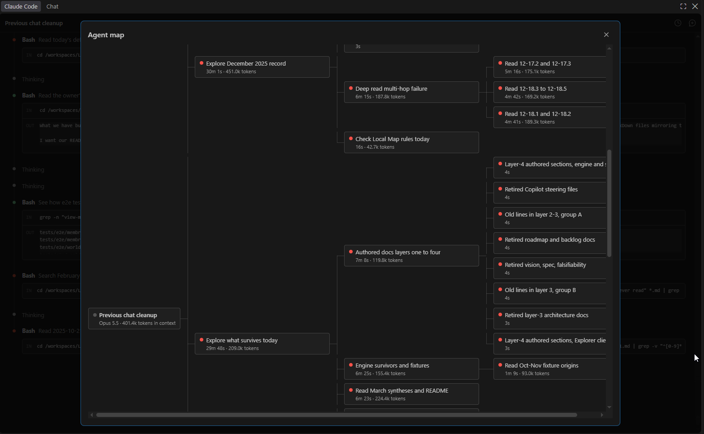
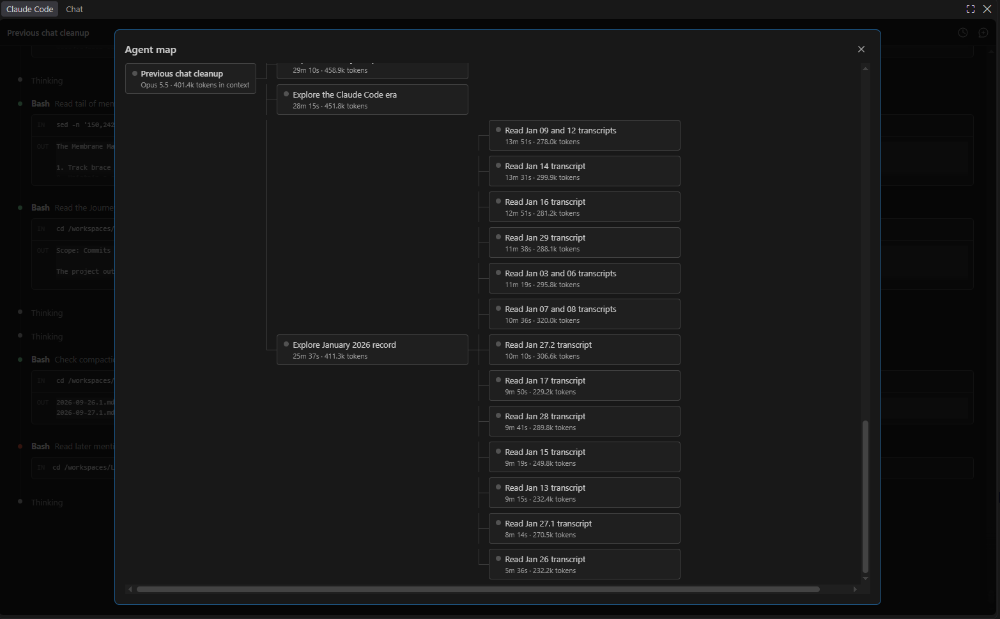

# Claude Code session, 2026-09-29 16:12 to 2026-09-30 13:09 UTC

_Both sides of the session in order, rebuilt from Claude Code's session log by [claude-code-transcript.mjs](../../../scripts/claude-code-transcript.mjs). The owner's prompts are verbatim; a line starting with `>` in one is the owner quoting Claude. Claude's messages are verbatim except in two places: their headings sit two levels deeper, so that the speakers stay the outline, and their links to files in the repository are rewritten to resolve from this folder. The work between is one line in italics: tool calls counted, subagents, workflows and commits named. What Claude Code itself said, an error or a notice, is quoted under an italic line. Commands, tool output, reasoning, the progress lines the editor showed while Claude worked, subagent reports and compaction summaries are not kept._

- Model: Opus 5.5, Fable 5.1 from 2026-09-29 17:06 UTC, Opus 5.5 from 2026-09-29 17:53 UTC.
- The owner: 13 prompts, and 4 messages sent while Claude was working.
- Claude: 204 messages, 479 tool calls, 14 subagents launched, 2 workflows started and 2 resumes.
- The repository: 28 commits. The context: compacted 1 time.

## Owner · 2026-09-29 16:12 UTC

_With `AI-Agent-Workspace/scripts/claude-code-transcript.mjs` open in the editor._

Can you please carry on with the last chat? It turned into a total mess

## Claude (Opus 5.5) · 2026-09-29 16:12 UTC

I'll start by reading the owner's memory files and the most recent chat record to find where the last session left off.

_Work, 16:12 UTC: 3 shell commands, 2 files read._

The newest transcript stops at 16:10, right after the model switch. I'll check the raw session log to see what happened after that and how it went wrong.

_Work, 16:12 UTC: 1 shell command._

The last session (`27d06f3b`) ended at 16:11, a minute after the model switch. I'll look at its tail.

_Work, 16:12 to 16:15 UTC: 4 shell commands, 1 file read, 5 file edits._

The converter no longer reads reasoning blocks at all. Next I'll finish the quote labelling and the render side.

_Work, 16:15 to 16:16 UTC: 5 file edits._

Now I'll regenerate. This session will get its own file too, `2026-09-29.2.md`.

_Work, 16:16 UTC: 1 shell command._

No notes remain, and the two quotes that trace to nothing in the log now carry the neutral label. Next I'll read the last session's transcript in full to check how the stops render.

_Work, 16:16 UTC: 1 file read, 1 shell command._

## Owner · 2026-09-29 16:16 UTC · sent while Claude was working

>The converter no longer reads reasoning blocks at all. Next I'll finish the quote labelling and the render side.

PHEW! Thank you! Can you please carry on with that thread? Jeez I am just trying to make a nice context window that is all prepped for useful changes with many preempted answers to "why" questions by way of understanding past interactions. Antrhopic, I don't want yer dang distillations please just let me do my work oh my goodness.

## Claude (Opus 5.5) · 2026-09-29 16:17 UTC

_Work, 16:17 UTC: 3 shell commands._

Every quote now names its source, and the two quotes that trace to nothing carry the neutral label. Next I'll update the documents that still describe the archive as prompts only.

_Work, 16:17 to 16:18 UTC: 2 shell commands, 4 file edits._

Now I'll rerun, and simulate a deleted log to confirm the numbering holds.

_Work, 16:18 UTC: 1 shell command._

Numbering holds: with the first log gone, this session still writes `.2` and `.1` is left alone. Next I'll update the four documents that describe the archive, starting with the ChatHistory README.

_Work, 16:19 UTC: 3 file edits._

Next, the owner's words and the session history in the memory files.

_Work, 16:19 to 16:20 UTC: 3 shell commands._

Docs are updated. Now the full commit gate, run in the background (lint, build, unit and integration tests, Live Docs generate and lint, SlopCop audits).

_Work, 16:20 UTC: 1 shell command._

While the gate runs, I'll make sure nothing in the converter still refers to the removed notes or refusal event.

_Work, 16:20 UTC: 1 shell command._

The converter is clean. The gate takes a few minutes. When it finishes I'll regenerate this session's transcript so it covers the whole session, then commit.

_Work, 16:20 UTC: 1 tool lookup._

The gate is running in the background (a few minutes, mostly lint and tests). I'll be notified when it finishes, then I'll regenerate this session's transcript and commit.

_Work, 16:21 to 16:22 UTC: 4 shell commands._

`dist/` and `out/` are already excluded as generated output. Playwright's report folder belongs beside them.

_Work, 16:22 UTC: 1 file edit, 1 shell command._

The gate is running again, this time reporting its real exit code. I'll commit once it passes.

_Work, 16:25 to 16:27 UTC: 3 shell commands; committed 261dd9bd "fix: lint leaves Playwright's report alone" and 8f80187e "docs: the Claude Code transcripts carry both sides of each session"._

The transcripts are finished and committed. All three Claude Code sessions (four counting this one) now show both sides.

**Why the last chat fell apart:** the converter got the editor's progress notes by base64-decoding the signatures on the log's reasoning blocks and then publishing their text. The safety classifier read that as extracting reasoning (`reasoning_extraction`) and stopped the session three times, on Fable and then on Opus. The converter no longer reads reasoning blocks at all, and the chat record's README now tells future agents not to read them either.

**What the record holds now:**
- Your prompts verbatim, with pasted pictures and their captions.
- Claude's messages verbatim: 68 in the first session and 194 in the second.
- One line per stretch of work, naming the tool calls, subagents and commits.
- Claude Code's own errors and notices, quoted. The three stops appear in [2026-09-29.1.md](../../../../AI-Agent-Workspace/ChatHistory/2026/09/2026-09-29.1.md), with your didgeridoo line.

**What it lost:** about 250 progress notes, the short lines the editor showed while Claude worked. Claude's actual messages still answer each of your prompts, so you're no longer shouting into the wind. Two of your prompts quote a line that only survived as one of those notes; each is labelled "words the editor showed while Claude worked, which this record does not keep".

**Two fixes found along the way:**
- **Transcript numbering:** a day's second session would have overwritten the first transcript once Claude Code deleted the older log. A session now keeps the number its file already has; I tested this with a deleted log.
- **The commit gate:** it failed on any run after an end-to-end run, because ESLint was checking Playwright's bundled report in `reports/e2e/`. That folder is now ignored alongside `dist/` and `out/`. With that change the gate passes: 974 unit and 49 integration tests, all three SlopCop audits, and 0 lint errors.

I updated the descriptions of the archive in `AGENTS.md`, the two READMEs and `direction.md`. I also added your purpose for the record to `owner.md`: "many preempted answers to 'why' questions". The commits are `261dd9bd` (the lint fix) and `8f80187e` (the transcripts). This session's transcript picks up its last few messages the next time the script runs.

That hands it back to you for the subagent explorations of both eras. Tell me what you'd like them to dig into, or I can propose a set.

_2026-09-29 17:05 UTC: the owner ran `/model claude-fable-5-1`, which answered "Set model to `claude-fable-5-1`"_

## Owner · 2026-09-29 17:06 UTC

Totally fine. No biggie. Can we pick up where my last chat left off? Having reconstructed the chats, questions about before-and-after should sharpen in a way that subagents could answer. What additional instruction can I provide to help you pick up on the unfinished work and succeed?

## Claude (Fable 5.1) · 2026-09-29 17:06 UTC

I can answer that better after a quick look at what is still un-mined, so I'm sizing up the Copilot-era material and the files not yet decommissioned.

_Work, 17:06 to 17:07 UTC: 3 shell commands._

Yes. Two threads are unfinished: the explorations you planned for after the transcripts, and the Membrane Map work, which is waiting on your word. I have launched nothing yet, because your answers below would change the briefs.

#### What I'd send subagents to answer

| Exploration | The question | What it feeds |
| --- | --- | --- |
| The Membrane Map's saga | What did you ask of it from December to March, what did each round fix and break, and what stopped it? | The next work directly |
| The Local Map's earned style | Which sizing, spacing, colour and pin decisions came from your corrections, in your words? | A syllabus for "the teacher" |
| Wants across both eras | For every want you voiced in the Copilot era: delivered, retired on your word, dropped without a word, or still open? | The "dropped without a word" column is the point |
| Baby in surviving files | For each group of pre-September files, why was it written and what in it is still true and lives nowhere else? | The remaining retirements |
| How the work changed | What caused rework then, what is different now, and which old failure modes have reappeared? | [AGENTS.md](../../../../AGENTS.md) |

The surviving files I mean are the Circuit Board and force graph views, the ten documents in [Notes/](../../../../AI-Agent-Workspace/Notes/), the `find-orphans`, `run-all` and `visualize-sample` scripts, and the root README.

#### How they'd work

- **Scale:** the Copilot era is 111 transcripts, about 418,000 lines, with 106 summaries. Subagents use the summaries to find a passage and quote only from the transcripts, with file and line.
- **Sources:** they read the markdown record only, never Claude Code's session logs.
- **Output:** each writes a dated file under [Research/](../../../../AI-Agent-Workspace/Research/), as history or open questions, never as decisions.
- **Role:** they gather and cite; any design that follows is my own work, as you asked on 2026-09-28.

#### What would help most from you

1. **What did you have in mind?** You said much "baby" remains in files not yet decommissioned, and that I don't yet know how exciting this workspace is. Naming even one or two files or ideas would aim the search better than anything I can infer.
2. **Which before-and-after matters most?** Reorder, cut or add to the table. If one question is the real one, say so and I'll put more agents on it.
3. **Your word on three answers from the last session**, which open the Membrane Map work:
   - **Depth:** a folder is drawn one level open, with subfolders as closed membranes that carry counts on their boundary.
   - **Crumb root:** the World Map, not the whole-repository treemap.
   - **Reuse:** one model and one grammar of touch, two renderers.

If the table is right as it stands, say "go" and I'll launch all five in parallel. A sweep that reads every month in full rather than by question needs more agents than the default; say "use a workflow" if you want that.

## Owner · 2026-09-29 17:16 UTC

>Naming even one or two files or ideas would aim the search better than anything I can infer.

Naming none and letting the subagent get inspired to itself spawn subagents is better than anything I can offer

>Which before-and-after matters most? Reorder, cut or add to the table. If one question is the real one, say so and I'll put more agents on it.

Explore and find good questions

>Depth: a folder is drawn one level open, with subfolders as closed membranes that carry counts on their boundary.

Agreed; one level depth render is reasonable

>Crumb root: the World Map, not the whole-repository treemap.

Deepest level available

>Reuse: one model and one grammar of touch, two renderers.

Reasonable for now; open to exploration/simplification if a unification that is sufficiently worth the cost arrives

## Claude (Fable 5.1) · 2026-09-29 17:17 UTC

Your answers are clear on all but one point, which I'll flag at the end. First I'm recording them, then I'll size the record so the briefs are right.

_Work, 17:17 to 17:19 UTC: 7 shell commands._

Your answers are recorded in the memory files. Now I'm launching seven explorers, one per stretch of the record, each free to spawn its own readers.

_Work, 17:20 to 17:22 UTC: 3 shell commands; launched subagents "Explore October 2025 record", "Explore November 2025 record", "Explore December 2025 record", "Explore January 2026 record", "Explore February to April 2026", "Explore the Claude Code era" and "Explore what survives today"._

Seven explorers are running in the background, and your answers are recorded in [owner.md](../../../../AI-Agent-Workspace/Memory/owner.md), [direction.md](../../../../AI-Agent-Workspace/Memory/direction.md) and [ideas.md](../../../../AI-Agent-Workspace/Memory/ideas.md) (not yet committed).

#### What is running

All seven got the same [brief](../../../../AI-Agent-Workspace/Research/2026-09-29-bearings/brief.md). It gives them your words and the record and names no file or idea. Each was told only which slice is theirs:

| Explorer | Slice |
| --- | --- |
| Five by time | October, November, December 2025, January 2026, and February to April 2026 |
| The Claude Code era | The September sessions, what they deleted, and whether each reason holds against the record |
| What survives | Everything tracked today that predates 2026-09-26 and has not been rewritten |

- **Freedom:** each may spawn its own readers, and those may spawn theirs.
- **Return:** each writes one report beside the brief: the story of its slice, up to ten questions ranked, what looks like baby, what looks like bathwater, and surprises.
- **Scale:** the Copilot era is 22 MB of transcripts, so a deep read could mean dozens of readers. Interrupt me if that is more than you want spent.

When they report, I'll read all seven reports myself and bring you the questions first, ranked across slices, with nothing decided.

#### One answer I could not read with confidence

On the crumb root you said "Deepest level available". I see two readings:

- **The outermost level the bundle has:** the World Map where there is a board, the repository's treemap where there is none. This is what the code does today, and how I recorded it, marked as my reading.
- **Every level in the trail:** World Map, then the whole repository, then the folders down to where you are.

Which did you mean? Nothing in the explorations waits on it; only the Membrane Map work does.

_Work, 17:48 UTC: received the report of "Explore January 2026 record"._

January's explorer is back; six are still running. I'll read its report while I wait.

_Work, 17:48 UTC: 1 file read._

January's report is in and it is strong. While the other six run, I'll check three of its claims about today's code, since those are mine to fix if true.

_Work, 17:48 UTC: 1 shell command._

One of seven is back; six are still running, and I'm holding all fixes until they finish so the repository doesn't change under them.

#### January 2026, first look

The [report](../../../../AI-Agent-Workspace/Research/2026-09-29-bearings/2026-01.md) has ten questions, each with your words and line numbers. Its three strongest:

1. **What do the shipped adapters find on a real repository?** In January the in-repo programs scored 100% while gorilla/mux gave 4 of 60 compiler edges. September removed the pinned real-world clones, so nothing measures this today.
2. **When the compiler and the adapter disagree, what decides?** January's answer was the union of both, which you chose; September's is the compiler alone. Each has a known hole.
3. **Where does "why" live for a person at the map?** 206 of 593 Live Docs still link into the chat archive, which is out of the bundle, so those links lead nowhere in the Explorer.

Two finds change how I treat sources:

- **Invented quotations:** the Copilot-era intent census puts three phrases in your mouth that occur in no transcript. Ten quotations it spot-checked in the Memory files were genuine.
- **A misattributed line:** "Live Docs ARE the database" was the agent's sentence, not yours, and the decisions log quotes it as rationale.

#### Claims I checked against the code

| Claim | Result |
| --- | --- |
| The page template loads the force graph from unpkg.com, while `SECURITY.md` says the page "contacts no other host" | True |
| Emoji survive in the Explorer client | True, and wider than reported: four files, not one |
| The Rosetta manifest names files that no longer exist, and no code reads it | True; only comments in one test mention it |

The first is a false statement in a published security document, so it goes to the top of my fix list once the explorers are done.

Its explorer used thirteen readers and could not launch a fourteenth because of the concurrent-agent limit, so one transcript (2026-01-30) was read only in part.

_Work, 17:50 UTC: received the report of "Explore the Claude Code era"._

The Claude Code era's explorer is back; five still running. Reading its report now.

_Work, 17:50 UTC: 1 file read._

Two of seven are in; five still running. I'm saving the synthesis for when all are back, but this [report](../../../../AI-Agent-Workspace/Research/2026-09-29-bearings/claude-code-era.md) has three things you should hear now, because they are about my own work.

#### What the Claude Code era's explorer found about September

- **The estate sample grades me against myself.** I wrote the sample program, its twenty "hand-verified" edges, and the adapter that finds 17 of them. The mechanisms differ, so it is not the old self-grading, but all three share one author's idea of your estate. Your own hand-drawn diagrams are the ground truth nobody here has seen.
- **The board you loved is not in git.** The page you called "exactly the direction" and the next-work map you steered by both sit in `AI-Agent-Workspace/tmp/`, which is gitignored. So do the Copilot era's last status notes on the Membrane Map. They exist on this one machine.
- **The standing documents are already drifting.** `AGENTS.md` says 17 of 21 sample programs carry expectations; the folder holds 27 and 21 carry them. Your last message of the Copilot era blamed "a leakage of stale ideas" from stateful docs, and the Status section I keep is one paragraph of about 1,500 words.

It also checked each September deletion against its stated reason. Most hold. Three hold only in part:

| What went | The reason given | What the record shows |
| --- | --- | --- |
| Test evidence sections | A test's targets were its imports | The deleted builder followed imports onward and stopped at barrels; you accepted the loss on a narrower explanation |
| The bundle's provenance stamp | Hard-coded | One field of five was; the commit and ref were real |
| Seven pinned real repositories | Cloned on every gate run | True, but nothing replaced them as a yardstick |

#### One fault of mine from today

Rebuilding the September transcripts moved their line numbers, so the probe record's archive digest now cites lines that no longer match. I'll repair those citations once the explorers finish.

This explorer could not launch readers of its own, because the agent pool was full, so its report is one reader's work and lists what it did not reach.

That notification only confirms the Claude Code era's report, which I covered above. Five explorers are still running: October, November and December 2025, February to April 2026, and what survives. I'll bring you the questions ranked across all seven once they are back.

_Work, 17:51 UTC: received the report of "Explore February to April 2026"._

February to April is back; four still running. Reading its report.

_Work, 17:51 UTC: 1 file read._

Three of seven are in; October, November, December and "what survives" are still running. Two reports now name the same risk, so I'm checking it.

_Work, 17:52 UTC: 1 shell command._

Three of seven are in. I confirmed the risk two of them raised, and it is real.

#### What sits only in the gitignored scratch folder

`AI-Agent-Workspace/tmp/` is 45 MB on this one disk, and git ignores all of it. Among its contents:

| File or folder | What it is |
| --- | --- |
| `probes/black-boxes/` | The board page you called "exactly the direction" |
| `next-work-map.html` | The map of next work you steered by twice |
| `explorer-shots-2026-09-28/` | Ten pictures, including the only ones of the Local Map, the view I'm to measure against |
| `march-loose-ends-census.md` | The loose ends at the March stop, written at your insistence and fact-checked |
| `membrane-map-last-mile-delta.md` | The Copilot era's last account of where the Membrane Map stood |
| `all-user-prompts.md` | 2,588 of your prompts to 2026-03-01, each with file and line |

I have moved nothing. `AGENTS.md` says probe pages are disposable and never committed, so which of these become tracked is your call; I'll put a recommendation in the synthesis.

#### February to April, first look

The [report](../../../../AI-Agent-Workspace/Research/2026-09-29-bearings/2026-02-to-04.md) explains how the Copilot era ended, and the trap is still set:

- **The last day:** on 2026-04-01 the agent built hover arcs between folders that had been analysed and rejected two days earlier. You called it "a leakage of stale ideas... from the stateful docs".
- **Still in the design doc:** [membrane-map.mdmd.md](../../../../.mdmd/layer-3/membrane-map.mdmd.md) still says to re-enable those arcs, and omits what you adopted instead (the crumb bar and the `Explore` button, of which you said "It's slick!").
- **The teacher has a syllabus:** in March you itemised the Local Map's grammar in your own words, including the dimming order written nearly as an algorithm. None of it is in a current doc.
- **Namespace mode for C#:** you tied it to where you will actually run the tool. It was designed and never built.

This explorer also could not launch readers, because the other explorers had used up the concurrent-agent limit. It read all 392 of your turns itself and the agent's side only at the turning points.

_2026-09-29 17:52 UTC: Claude Code said:_

> You've reached your Fable limit. Switch to another model, or manage usage credits at claude.ai/settings/usage?from=cc_cli_limit_message, to continue.

_2026-09-29 17:52 UTC: Claude Code said:_

> You've reached your Fable limit. Switch to another model, or manage usage credits at claude.ai/settings/usage?from=cc_cli_limit_message, to continue.

_2026-09-29 17:52 UTC: Claude Code said:_

> You've reached your Fable limit. Switch to another model, or manage usage credits at claude.ai/settings/usage?from=cc_cli_limit_message, to continue.

## Claude (Fable 5.1) · 2026-09-29 17:52 UTC

_Work, 17:52 UTC: received the report of "Read 12-18.1 and 12-18.2"._

_2026-09-29 17:52 UTC: Claude Code said:_

> You've reached your Fable limit. Switch to another model, or manage usage credits at claude.ai/settings/usage?from=cc_cli_limit_message, to continue.

_2026-09-29 17:52 UTC: Claude Code said:_

> You've reached your Fable limit. Switch to another model, or manage usage credits at claude.ai/settings/usage?from=cc_cli_limit_message, to continue.

_2026-09-29 17:52 UTC: Claude Code said:_

> You've reached your Fable limit. Switch to another model, or manage usage credits at claude.ai/settings/usage?from=cc_cli_limit_message, to continue.

_2026-09-29 17:52 UTC: Claude Code said:_

> You've reached your Fable limit. Switch to another model, or manage usage credits at claude.ai/settings/usage?from=cc_cli_limit_message, to continue.

_2026-09-29 17:52 UTC: Claude Code said:_

> You've reached your Fable limit. Switch to another model, or manage usage credits at claude.ai/settings/usage?from=cc_cli_limit_message, to continue.

_2026-09-29 17:52 UTC: Claude Code said:_

> You've reached your Fable limit. Switch to another model, or manage usage credits at claude.ai/settings/usage?from=cc_cli_limit_message, to continue.

_2026-09-29 17:52 UTC: Claude Code said:_

> You've reached your Fable limit. Switch to another model, or manage usage credits at claude.ai/settings/usage?from=cc_cli_limit_message, to continue.

_2026-09-29 17:52 UTC: Claude Code said:_

> You've reached your Fable limit. Switch to another model, or manage usage credits at claude.ai/settings/usage?from=cc_cli_limit_message, to continue.

_2026-09-29 17:52 UTC: Claude Code said:_

> You've reached your Fable limit. Switch to another model, or manage usage credits at claude.ai/settings/usage?from=cc_cli_limit_message, to continue.

_2026-09-29 17:53 UTC: Claude Code said:_

> You've reached your Fable limit. Switch to another model, or manage usage credits at claude.ai/settings/usage?from=cc_cli_limit_message, to continue.

_2026-09-29 17:53 UTC: Claude Code said:_

> You've reached your Fable limit. Switch to another model, or manage usage credits at claude.ai/settings/usage?from=cc_cli_limit_message, to continue.

_2026-09-29 17:53 UTC: the owner ran `/model opus`, which answered "Set model to `claude-opus-5-5`"_

## Owner · 2026-09-29 17:53 UTC · sent while Claude was working

Partial progress preserved?

## Claude (Opus 5.5) · 2026-09-29 17:53 UTC

The Fable usage limit stopped the four remaining explorers and all their readers. Before relaunching on Opus, I'll check what reached disk, and save the one reader report that arrived intact.

_Work, 17:53 to 17:54 UTC: 3 shell commands; received the report of "Deep read Dec 16 turning point"._

Nineteen reports were handed back through the hand-back tool. I'll pull each one out, with who wrote it and for which parent, using only the tool-call inputs.

_Work, 17:54 to 17:55 UTC: 3 shell commands._

Link audit is clean. One title came out mangled, so I'll fix it.

_Work, 17:55 UTC: 2 shell commands._

Two loose ends: one file needs Prettier again, and your agent-map screenshot was pulled into this session's picture folder, which needs a hand-written caption.

_Work, 17:56 UTC: 1 shell command; committed 7582b0b1 "docs: bearings on both eras, from the explorations of the chat record"._

Yes. Everything that reached disk or my messages before the limit is saved and committed in `7582b0b1`.

#### What was saved

| What | Where |
| --- | --- |
| Three finished explorer reports: January 2026, February to April 2026, the Claude Code era | [2026-09-29-bearings/](../../../../AI-Agent-Workspace/Research/2026-09-29-bearings/) |
| Three reports from readers whose explorers died: the first half of 2025-11-08, the 2025-12-16 turning point, and the 2025-12-18 multi-hop failure | [readers/](../../../../AI-Agent-Workspace/Research/2026-09-29-bearings/readers/) |
| The brief all of them were given | [brief.md](../../../../AI-Agent-Workspace/Research/2026-09-29-bearings/brief.md) |
| Your answers on depth, one system or two, and how to brief explorations | The Memory files |

I recovered the three reader reports by pulling only the hand-back tool calls out of the subagent logs; no reasoning blocks were touched. The thirteen January reader reports were already folded into the January report, so I didn't duplicate them.

#### What was lost

- **Four explorers' own work:** October, November, December 2025, and what survives. None had written its report, so what each had gathered died with it.
- **About twenty readers stopped mid-read.**
- **The two green dots in your map don't mean finished.** Both readers ended on the limit's error message, not a report.

#### Relaunching

The four could be relaunched on Opus. The first run also taught a lesson: seven explorers at once filled the concurrent-agent limit, so three of the reports that did finish were written by a single reader each, without helpers.

My recommendation is to run them two at a time, each keeping a handful of readers live. November and December would start from their saved reader reports.

On cost, measured from the first run: the finished explorers used about 410,000 to 460,000 tokens each on their own. January's thirteen readers used roughly 90,000 to 250,000 each on top. So four more explorers is a real spend, and the Fable limit shows it counts.

Should I relaunch all four on Opus, two at a time? Or should I first synthesize from the three finished reports, which already hold thirty questions, and relaunch later?

## Owner · 2026-09-29 17:58 UTC

>The four could be relaunched on Opus. The first run also taught a lesson: seven explorers at once filled the concurrent-agent limit, so three of the reports that did finish were written by a single reader each, without helpers.
>
>My recommendation is to run them two at a time, each keeping a handful of readers live. November and December would start from their saved reader reports.
>
>On cost, measured from the first run: the finished explorers used about 410,000 to 460,000 tokens each on their own. January's thirteen readers used roughly 90,000 to 250,000 each on top. So four more explorers is a real spend, and the Fable limit shows it counts.
>
>Should I relaunch all four on Opus, two at a time? Or should I first synthesize from the three finished reports, which already hold thirty questions, and relaunch later?

Learn what you can first. Then, relaunch with questions pertaining to what remains, informed by what you've learned.

## Claude (Opus 5.5) · 2026-09-29 17:58 UTC

I'll start with the one saved report I haven't read yet, then write down what the three finished reports establish together and what they leave open for the four missing slices.

_Work, 17:58 UTC: 1 file read._

I've read everything that finished. Next I'll write down what the three reports and three reader reports establish together, as the ground the relaunch starts from.

_Work, 18:00 UTC: 1 file written._

Next, the second brief: the first one's intent, plus targeted questions for each remaining slice and two lessons from the stop.

_Work, 18:01 UTC: 1 file written, 1 shell command._

## Owner · 2026-09-29 18:01 UTC · sent while Claude was working

Any subagents' subagents' semi-completed work worth mining for this chat?

_2026-09-29 18:01 UTC: commit 5747af9e landed, "docs: what the first exploration established, and the brief for the second"._

## Claude (Opus 5.5) · 2026-09-29 18:01 UTC

_Work, 18:01 to 18:03 UTC: 4 shell commands, 2 files read._

The notes are saved and their links are clean. Now I'll rewrite the second brief's slice sections around what the notes already answer.

_Work, 18:04 UTC: 1 file read, 1 shell command._

Next I'll update the record's table of what came back, then commit and launch.

_Work, 18:05 UTC: 1 shell command; committed a781bcec "docs: the stopped explorers' notes kept, and the second brief built on them"._

Committed. Launching the four explorers on Opus now: October and "what survives" with up to three readers each, November and December working alone from their notes.

_Work, 18:05 UTC: launched subagents "Explore October 2025, second run", "Explore what survives, second run", "Write up December 2025 from notes" and "Write up November 2025 from notes"._

The second run is running on Opus, all four at once. On your question: yes, the half-finished work was worth mining, far more than I expected.

#### What the stopped subagents had left

- **Where it was:** the explorers were writing working notes into the session's scratch folder through the shell, which is why my first search of the logs missed them.
- **November and December:** those notes cover nearly every day of both months, with your words and line numbers. They include a full reconstruction of the 2025-11-15 work loss and the Antigravity sessions where the force graph and the Local Map were born.
- **What survives:** that explorer had measured every tracked file against the last commit before your return.
- **Where they are now:** kept under [readers/](../../../../AI-Agent-Workspace/Research/2026-09-29-bearings/readers/) and marked unverified, since the Copilot-era censuses showed that an agent's quotes can drift.
- **Commits:** everything is in `7582b0b1`, `5747af9e` and `a781bcec`.

#### How the relaunch changed because of them

| Explorer | Work | Readers |
| --- | --- | --- |
| October | A full read; nothing of it survived | Up to three |
| What survives | Starts from the saved measurement | Up to three |
| November | Verify the notes, close their open items, write the report | None |
| December | The same | None |

The [second brief](../../../../AI-Agent-Workspace/Research/2026-09-29-bearings/brief-2.md) now asks narrower questions the notes raised. Three of them touch things you've told me or that I've written down:

- **The law of direction was reversed once.** On 2025-11-24 you put what depends on the focused file to its left. On 2025-12-03 you said "Uh, yes. Switch these." November's explorer is asked what the reversal rested on.
- **`owner.md` may be wrong about how you read designs.** It says through exact ASCII diagrams, dated 2025-12-05. The notes find that on that day you asked for sliders and checkboxes to tune by hand. December's explorer is asked what the record supports.
- **Today's git rule may name the symptom, not the cause.** On 2025-11-15 you approved the checkout after asking about it, the context had just been compacted, and a day's work sat uncommitted behind a failing gate. Your own wording of the rule was conditional; `AGENTS.md`'s is absolute.

Each explorer writes its report file early and grows it, so another limit would cost little. I'll bring you the full synthesis when all four are in.

## Owner · 2026-09-29 18:14 UTC

![The agent map again, after the usage limit, scrolled to the first run's November, October and December explorers. November's one reader of 2025-11-08 shows grey; December's readers of the Dec 16 turning point, the benchmark thresholds, the vision days, the multi-hop failure and its three readers of 12-17 to 12-18, and the check of the Local Map's rules show red, as does the "what survives" reader of authored docs with its six readers of old lines and retired documents, each stopped after four seconds.](2026-09-29.2.images/2026-09-29-1814-1.png)

Anything left to recover from Fable 5.1 subagents before limit hits?

## Claude (Opus 5.5) · 2026-09-29 18:14 UTC

Mostly no, but I'll check the two places I haven't mined yet. The first is the prompts the stopped explorers wrote for their readers: the notes files cover November and December, but "what survives" and its "authored docs" reader wrote their interim findings only into those prompts. The second is a few measurement files in the scratch folder. I'll look only at tool-call inputs, never reasoning.

_Work, 18:14 to 18:16 UTC: 6 shell commands, 1 tool lookup; committed 75c2c919 "docs: the questions the stopped explorers were about to ask, kept"._

Sending each running explorer the recovered material for its slice.

_Work, 18:16 UTC: wrote to "Explore October 2025, second run", "Write up December 2025 from notes", "Explore what survives, second run" and "Write up November 2025 from notes"._

Yes, there was a little more, and it's now saved. That exhausts what the Fable subagents left.

#### What this last pass recovered

The stopped explorers had written their interim thinking into the prompts for their readers. Those prompts sat in the logs as tool-call inputs, even when the readers never launched. Committed in `75c2c919` as [open-questions-of-the-stopped.md](../../../../AI-Agent-Workspace/Research/2026-09-29-bearings/readers/open-questions-of-the-stopped.md):

- **The Local Map's rules, a to p:** the December explorer's list of your rules, each with its file and line, which it said it had checked. It covers inputs left and outputs right, pins above wires above cards, the 10/80/10 gradient, the Internals row, the French Corset, pin semantics, the slider-tuned numbers, and "an edge is worth drawing if cutting it would have an effect". This is your half of the teacher's syllabus.
- **Two unanswered December questions:** what each benchmark number actually compared, and when the unpkg CDN load was first noticed and whether `SECURITY.md` holds claim by claim.
- **October's leads:** your first prompt of 2025-10-16 and the month's build, by commit.
- **A possible silent loss:** did September's package renames drop any authored Purpose or Notes? Nobody has checked.

I've sent each running explorer its section. I also told November's explorer about a broken link in its report so far.

#### What is truly gone

- **What the dead readers had read.** About twenty readers each took in 90,000 to 250,000 tokens of transcript and wrote nothing down. What they learned existed only in their context. The files are still there, so the second run can read them again.
- **The rest of the scratch folder is mechanical.** It holds extracts of your turns, digests of transcripts, and git tables, all reproducible from the repository. The one exception, the table of every tracked file, is already pointed at by the second brief.

One judgement call: January's thirteen reader reports are only in the scratch folder, not committed. The January report was built from them and checks its own citations, so I left them out as duplicates. Say if you'd rather keep them.

The four Opus explorers are still running, each writing its report file as it goes.

_Work, 18:27 UTC: received the report of "Write up November 2025 from notes"._

November's report is in; three explorers are still running. Its top question is about code I wrote, so I'll check it now: it says the World Map uses the same colours as the Local Map but with the opposite meaning.

_Work, 18:27 UTC: 1 shell command._

November's explorer is done; October, December and "what survives" are still running.

#### A fault of mine it found, now confirmed in the code

The two maps use the same colours with opposite meanings:

| View | What blue is | What green is | A wire follows |
| --- | --- | --- | --- |
| Local Map | The provider, a symbol's output (`localView/connections.ts`, line 225) | The consumer | The value, from provider to consumer |
| World Map | The caller: "blue calls" (`worldMap/controller.ts`, line 1485) | The server: "green serves" | The request, from caller to server |

So zoom from the board into a thing and the colour on whoever serves flips from green to blue. When I built the World Map I followed the request and never set it beside the Local Map's rule. `AGENTS.md` promises one colour code at every scale, and the code keeps the colours but not their meaning.

It's a fork, so I haven't changed it. Your 2025-12-03 rule, "Inputs are left, outputs are right", reads as the value's direction, which would make the World Map the one to change. On 2025-11-24, though, you had put things in the order a call runs, and the explorer found that the switch rested on how the labels read, not on a picture. Which should a wire follow at both scales: the value, or the request?

#### Other November findings worth your eye now

- **The git rule names the symptom.** On 2025-11-15 you diagnosed the loss as uncommitted work the agent lost track of across a compaction, behind a gate that stayed red all day. Your "Safeguard In-Flight Work" rule went out with the old instructions in September, and `AGENTS.md` now names only the commands.
- **The base layer as the only permanent docs is your idea from 2025-11-11.** You called generated system docs "materialized views" and "a house of cards", the argument the vision's first paragraph now makes. `direction.md`'s history of the layers doesn't record it.
- **Where the unpkg script tag came from.** Gemini's plan of 2025-11-19 flagged it as a CDN choice, and nobody picked it up.
- **Three corrections waiting for my memory files:** two dates in `ideas.md` are wrong (both November, not December), and "commit only when asked" in `AGENTS.md` contradicts your later permission to commit freely.

I'm holding all fixes until the other three explorers report, so their inputs don't move under them.

_Work, 18:29 UTC: received the report of "Explore October 2025, second run"._

October's report is in, so two explorers are still running: December and "what survives". Three of October's readers (10-24, 10-25 and 10-26) were still reading when it handed back. If their reports come to me, I'll keep them beside the others.

October's three findings that bear most on what comes next:

- **The audience question goes back to the first prompt.** From line 5 of the first prompt the tool was for Copilot: "The primary consumer of the outputs of our tooling are LLMs!" (2025-10-29). Nobody in October asked to see the graph. September's "humans are the audience" is a real turn, not a correction of drift.
- **Much of what September thought it decided new, you said in October.**
  - An index derived from the docs and never committed (10-16).
  - An oracle kept out of the shipped tool (10-16).
  - "Panopticon" (10-24) and hop distance (10-22).
  - Today's product in one sentence (10-30): "every code file receive its own layer 4 MDMD doc and every layer 4 MDMD doc expose its public symbols".
- **The rules had reasons, and AGENTS.md dropped them.** Nearly every rule in AGENTS.md was written with its reason in October, most in your hand on 2025-10-19. On 2025-10-16 you also set the rule that the always-loaded file holds only what is "forever true", "as terse as possible". Today two fifths of AGENTS.md is a dated Status narrative. This is the third report to reach that conclusion independently, after February to April and the Claude Code era.

It also answers one of my brief's questions differently than I'd framed it. The membrane of Membrane Design MarkDown was never defined in October. The Membrane Map's membrane, a parent folder enveloping a child, is your image from 2026-03-22, so the two names are not related.

The October explorer has now stopped with no readers still running, so its last three readers must have finished. I'll check whether their reports reached its file or need saving.

_Work, 18:29 to 18:30 UTC: 2 shell commands._

They're still working: all three were active within the last half minute, reading after their parent finished. When they hand back I'll save their reports beside the others. Where one adds to October's report, I'll send it back to the October explorer to fold in rather than editing its file myself.

Two explorers are still running as well, December and "what survives"; both are writing their report files as they go.

_Work, 18:30 UTC: received the report of "Read Oct 26"._

The reader of 2025-10-26 has reported, to me since its parent is done. I'll save it now and hand all three late reports to the October explorer together once 10-24 and 10-25 arrive.

_Work, 18:31 UTC: 1 shell command._

The 2025-10-26 report is saved in [readers/2025-10-26.md](../../../../AI-Agent-Workspace/Research/2026-09-29-bearings/readers/2025-10-26.md), and its links are clean. Two of its finds are worth your eye now:

- **Your "reverse check" of 2025-10-26 is the prose reference report in `ideas.md`, eleven months early.** You wanted to verify that "no 'symbol' in a layer 4 MDMD doc corresponds to an orphan". That same afternoon, one agent sweep wrote 18 links to files that never existed. The link audit caught them, but nothing checked the words around them, and the agent claimed a pass after fixing 2 of the 18.
- **Two more survivors that nothing reads:** `symbol-coverage.ignore.json` at the repository root, and the `enableDocstringBridge` switch in the configuration (only its own test reads it). Neither is on the list of known survivors. The first also encodes a path exclusion, which today's rules forbid.

Still running: the October readers of 2025-10-24 and 10-25, and the December and "what survives" explorers.

_Work, 18:31 UTC: 1 shell command; received the report of "Read Oct 25"._

The report was written with links relative to the folder above, so I'll fix its link paths.

_Work, 18:32 UTC: 1 shell command._

The 2025-10-25 report is saved in [readers/2025-10-25.md](../../../../AI-Agent-Workspace/Research/2026-09-29-bearings/readers/2025-10-25.md). I fixed four link paths that were one folder too shallow, and the audit is clean. Two of its finds bear on questions already open:

- **Your first design for shrinking docs was never run, and no one ever decided to drop it.** On 2025-10-25 you proposed requiring every heading to be referenced, to push docs toward "downsizing". The agent answered only the plumbing, and the item was deleted without comment on 2025-11-09 when the generated Live Docs arrived. It is the inbound half of the prose-drift check; `ideas.md`'s prose reference report is only the outbound half.
- **The Purpose section was once a detector.** Your October wording in the MDMD instructions was that difficulty writing a file's Purpose "is a signal that the code file may be unnecessary". `AGENTS.md` keeps "if a file can't be justified, delete it" but not that test.

Still running: the October reader of 2025-10-24, and the December and "what survives" explorers.

_Work, 18:32 UTC: received the report of "Write up December 2025 from notes"._

December's report is in. Only "what survives" and October's last reader are still running. December names one contradiction with `AGENTS.md` in code I can check directly: that the Explorer runs its own path search beside the engine's.

_Work, 18:32 UTC: 1 shell command._

Confirmed. The Explorer's `pathfind.ts` runs its own breadth-first search, while the engine has `searchGraph`, and the Explorer imports nothing of the engine's pathfinding. That duplication is what made `inspect` and the Explorer disagree on 2025-12-18, and it's still there. It goes on the list of fixes I'm holding, which is plain duplication rather than a fork.

December's other two findings that touch your standing rules:

- **Whose reading of a picture stands.** Your December Copilot instructions said "in disagreements of visual analysis, lean on the human interpretation". That line went out with the old instructions on 2026-09-27. `AGENTS.md` now says visual behaviour is verified with Playwright, yet every false "working" claim in December came through Playwright. I'd propose restoring your line, once you confirm it still stands.
- **`owner.md` is wrong about how you read designs, and December's explorer found where.** The ASCII diagrams and "down to pin placement" are from March 2026. In December you said you couldn't judge a design ahead of time and asked for sliders. Every Local Map number was set by your hand on those sliders, and the code still carries those values. I'll correct `owner.md` with both dates.

The report also turns your Local Map rules into a list of 26, each marked by whether you confirmed it by eye. The unconfirmed ones are what a folder-scale view will have to settle: ordering by relatedness, marking clones, more than one hop, and From/To.

Waiting on the "what survives" explorer and October's reader of 2025-10-24. Then the synthesis.

That notification only confirms December's report, which I covered above. Still running: the "what survives" explorer and October's reader of 2025-10-24.

_Work, 18:34 UTC: received the report of "Read Oct 24"._

The last October reader is in. I'll save its report, then check its claim that `AGENTS.md` still describes the chat record as prompts only, since I thought I fixed that this morning.

_Work, 18:34 UTC: 2 shell commands._

All three late October reports are saved beside the others, with clean links.

That reader's claim about `AGENTS.md` is wrong. Line 36 has said "both sides of each Claude Code session" since `8f80187e` this morning, so I'll mark the claim as false in the synthesis rather than act on it.

Its finds that matter most:

- **Docs-first was your method in October.** You wrote the doc before the code so the agent's memory would survive compaction. The generated mirror inverted that. The same day, a doc written ahead of its code named functions and errors that never shipped, and only opening the code caught it. That gives the prose reference report a benchmark from history with known answers, rather than a measure written by the same hand that wrote the checker.
- **"Why does this file exist" was a justification against the file's cost.** Written that way on 2025-10-23 and 10-24, it was meant for "your future clean-slated self". Today's Purpose sections describe a file rather than justify it. This is the second report to find that shift.
- **Your instinct on the committed snapshot took eleven months to win.** On 2025-10-24 you asked whether a recomputed file should be committed. The agent argued you out of it, and it took until 2026-09-28 for your instinct to become the rule (the index is gitignored). The reader asks how often an agent's confident rebuttal has overruled an instinct of yours that later proved right.

Only the "what survives" explorer is still running. Its report file is already about 49 KB and growing, and when it lands I'll write the synthesis across all seven slices.

_Work, 18:45 UTC: received the report of "Explore what survives, second run"._

All seven slices now have reports. The "what survives" explorer says its engine reader hadn't returned when it handed back, so that report may still come to me. I'll commit what's in now, then read the four new reports whole before writing the synthesis.

_Work, 18:45 to 18:46 UTC: 1 shell command; received the report of "Engine survivors: why and what's unique"; committed 7acb1660 "docs: the second run's reports on October, November, December and what survives"._

That commit went in with three files not Prettier-formatted. I'll format them, and check whether the engine reader's report reached anyone.

_Work, 18:46 UTC: 1 shell command._

The engine reader's report came to me, since its explorer had already finished. I'll save it with the others and commit alongside the formatting fixes.

_Work, 18:46 to 18:47 UTC: 1 shell command; committed 48b4a9ee "docs: the engine reader's report kept, and the bearings folder formatted"._

Saved and committed; every report from both runs is in. Before writing the synthesis I'll read the four new reports whole, starting with "what survives", the one most tied to the next work.

_Work, 18:47 UTC: 5 files read, 1 shell command._

Reading December's report, the last of the four, before writing the synthesis.

_Work, 18:47 UTC: 2 files read._

I've read all seven reports and the readers' material. Now I'll write the synthesis as the folder's front page, ranked across all slices, and mark `what-is-known.md` as the first run's interim.

_Work, 18:49 UTC: 1 file written._

A quick check of my own claims against the reports turned up one overstated count in finding 5, so I'll fix it. Then I'll mark the interim synthesis as superseded, run the audits and commit.

_Work, 18:50 UTC: 1 shell command._

Links and symbols are clean. I'll add a pointer to the bearings in `direction.md`'s session history, refresh this session's transcript, and commit.

_Work, 18:50 to 18:51 UTC: 1 shell command; committed 175aff86 "docs: bearings on both eras, the seven reports joined and their questions ranked"._

Your three agent-map screenshots from 18:14 went into the transcript without captions. I've seen them, so I'll caption them now.

_Work, 18:51 UTC: 1 shell command; committed df6b3f07 "docs: captions for the pictures pasted into this session"._

The bearings are written and committed: [README.md](../../../../AI-Agent-Workspace/Research/2026-09-29-bearings/README.md) in the bearings folder. It points into the seven reports for the evidence, so each claim has a transcript and line behind it. Commits are `175aff86` for the bearings and `df6b3f07` for the captions on your agent-map screenshots.

#### What the whole record says

- **`AGENTS.md`'s rules are yours, from October to December, and most of their reasons are gone.** You wrote nearly every rule with its reason on 2025-10-19, and only the rules survived. Your own test for the always-loaded file was "forever true… as terse as possible", and a 1,073-word Status narrative now breaks it.
- **Much of September was you, earlier.**
  - The uncommitted index and the oracle kept out of the product (October).
  - The base layer as the only permanent docs (November).
  - People before agents as the audience, and the World Map's premise of combining workspaces (December).
  - A ratchet on accuracy (December), which answers the floor question.

  The Memory files date all of these to September.
- **Your eye has been the only check on the interface that worked.** You judge a design by seeing it built and tuning it by hand. Every Local Map number came from your sliders. `owner.md`'s "reads through ASCII diagrams" is really March 2026.
- **The Local Map's grammar is now written out twice**: your 26 rules with their days, and the 24 things the code does. The teacher breaks two of its own laws: its text scales with zoom, and it brightens related wires.
- **Stale documents are drifting again.** That is how the Copilot era ended, and the Membrane Map's design doc still invites back the arcs you rejected in March.

#### The questions only you can answer, top five of fifteen

1. **Direction.** Should a wire follow the value (the Local Map) or the request (the World Map)? Today they are opposite under the same colours.
2. **The finish line.** What is "at least matched in quality" measured with: your numbers, sliders on the new view, pictures, or the rule list? And does the lesson include what the teacher breaks?
3. **`AGENTS.md`.** Should it carry its reasons again, move Status out to its own file, and in whose hand?
4. **Pictures.** When you and the agent read a picture differently, whose reading stands? From 2025-12-19 the instructions said "lean on the human interpretation"; `AGENTS.md` dropped that line.
5. **Real code.** What are the adapters measured on beyond programs I wrote for them? One option is a well-known repository cloned outside the gate. The other is your own diagrams of the estate as its ground truth.

The other ten, and what a measurement can settle, are in the bearings.

#### Fixes that are plainly mine, none done yet

- **`SECURITY.md`:** it says false things, the unpkg load among them.
- **Emoji:** they remain in four client files.
- **A second path search:** the Explorer runs its own, and that caused the 2025-12-18 divergence.
- **Product code that names this repository:** the move on 2026-09-27 silently reclassified all 260 sample-program docs as tests.
- **Code nothing runs:** including the renderer of the arcs you rejected.
- **Stale docs and Memory entries:** the ones listed in the bearings.

Should I start on that list now while you look at the questions? I'd keep anything that touches questions 1, 2 or 12 until you've answered. I can also turn the bearings into a visual page if that would read better than markdown.

_2026-09-29 18:56 UTC: the owner ran `/compact`. 624,490 tokens of context became a summary, and Claude's working memory starts over here._

## Owner · 2026-09-29 18:59 UTC

_With `AI-Agent-Workspace/ChatHistory/2026/09/2026-09-29.2.md` open in the editor._

>AGENTS.md's rules are yours, from October to December, and most of their reasons are gone. You wrote nearly every rule with its reason on 2025-10-19, and only the rules survived. Your own test for the always-loaded file was "forever true… as terse as possible", and a 1,073-word Status narrative now breaks it.

Oh-hokay terrifying I see Opus gaslights into believing that this file was created any earlier that 9/01/2026... uhhhh oh boy maybe I should wait for my fable limits to reset and retry. Holy moly that on its own is mega-mega-worrisome. 

>Stale documents are drifting again. That is how the Copilot era ended, and the Membrane Map's design doc still invites back the arcs you rejected in March.

Correctly or incorrectly? Were these threads resolved or unresolved?

>Direction. Should a wire follow the value (the Local Map) or the request (the World Map)? Today they are opposite under the same colours.

Oh boy please bring back Fable who is this dude uh oh

>The finish line. What is "at least matched in quality" measured with: your numbers, sliders on the new view, pictures, or the rule list? And does the lesson include what the teacher breaks?

I'll wait for the Fable reset.

## Claude (Opus 5.5) · 2026-09-29 19:00 UTC

I'll check each claim against git and the code before answering.

_Work, 19:00 UTC: 3 shell commands._

AGENTS.md was first committed on 2026-09-27 (`29d58b50`). I'm checking what the October report actually traced, what happened to the arcs, and the colour claim in the code.

_Work, 19:01 UTC: 3 shell commands._

The colour claim holds in the code. In the Local Map the file being used gets the blue pin. In the World Map the thing being called gets the green door. Next, the arcs: the March and April record.

_Work, 19:01 UTC: 2 shell commands._

The arcs record is mixed, and my "rejected in March" was loose. Checking two more facts before I answer: who wrote AGENTS.md, and the owner's "slick" line.

_Work, 19:01 UTC: 1 shell command._

AGENTS.md was written by Fable 5.1 on 2026-09-27. I'll correct the bearings so Fable doesn't inherit my wording.

_Work, 19:02 UTC: 3 shell commands; committed 4ba849ab "docs: bearings corrected on when AGENTS.md was written, who rejected the arcs, and the direction question"._

You were right to push back. Two of the lines you quoted were wrong as I wrote them, and the third was a real finding that I put badly.

**AGENTS.md.** My sentence was wrong. Fable 5.1 wrote `AGENTS.md` on 2026-09-27 (`29d58b50`). The October report was actually about the file it replaced, `.github/copilot-instructions.md`. That file's "Behavior Expectations" section is in your hand in `d692a3b0` (2025-10-19); you pasted it into the chat that day as "I have updated my github copilot instructions twice". `AGENTS.md` repeats several of those rules without their reasons. For example, "You own the code" comes from "Total Code Ownership", but that rule's reason didn't carry over: owning the code "incentivizes reducing the size of the codebase". I merged the two files into one sentence. The underlying reports kept them apart; my synthesis didn't.

**The arcs.** My sentence got this wrong too, and the arcs issue is only half resolved.
- **2026-03-30:** you asked questions ("I'm open to this… should it only occur on hover?"). Copilot analysed arcs, rejected them in the plan, and built the crumb bar and the `Explore` button instead. You called that "slick".
- **2026-04-01:** Copilot rebuilt hover arcs anyway. You said "By eye, this doesn't appear to look right", and they were reverted. So the rejection that was yours came in April, not March.
- **Resolved in** `Notes/membrane-map-execution-plan.md`, which now says "Do NOT re-propose drawing SVG bundle arcs on the treemap."
- **Unresolved in** [membrane-map.mdmd.md:135](../../../../.mdmd/layer-3/membrane-map.mdmd.md#L135). It still says to turn them back on "when hover-only… rendering is implemented", which is exactly what was built and rejected on 04-01.

So the design doc is wrong: it contradicts a decision that only the plan recorded.

**Direction, in plain terms.** If `a.ts` uses `b.ts`, the Local Map draws the wire from `b`'s blue pin to `a`'s green pin ([connections.ts:224-225](../../../../packages/explorer/src/client/views/localView/connections.ts#L224-L225)). If thing A calls thing B, the World Map draws it from A's blue side to B's green door ([controller.ts:1485](../../../../packages/explorer/src/client/views/worldMap/controller.ts#L1485)). The thing being used is blue on one map and green on the other. The code confirms it, and it's a fair question for whoever picks this up next.

I've corrected all three in the bearings file and noted the corrections there (`4ba849ab`). I haven't rechecked the rest of the file line by line, so Fable should treat it as a draft to verify, not settled fact.

_2026-09-29 19:09 UTC: the owner ran `/model claude-fable-5-1`, which answered "Set model to `claude-fable-5-1`"_

## Owner · 2026-09-29 19:10 UTC

_With `AI-Agent-Workspace/ChatHistory/2026/09/2026-09-29.2.md` open in the editor._

How do I use the 250 $ credit provided so that fable can finish this thread? I only wanted to get Claude's bearings straight on the repo and it seems to have gone rather topsy-turvy.

_2026-09-29 19:10 UTC: Claude Code said:_

> You've reached your Fable limit. Switch to another model, or manage usage credits at claude.ai/settings/usage?from=cc_cli_limit_message, to continue.

_2026-09-29 19:12 UTC: the owner ran `/model opus`, which answered "Set model to `claude-opus-5-5`"_

## Owner · 2026-09-29 19:14 UTC

Hmmm I see I can't use the 250 $ credit. Okay, no problem. Opus, can you help clean this up? Can you see what I was _aiming to do_ in this thread versus _what was actualy accomplished_? Opus is a just-fine model. We just had some silliness with rate-limting-like limitations which caused a cascading set of subagents to abruptly stop altogether. I appreciate your attempts to reconstruct the transcript. Is there anything else that we can reasonably reconstruct such that, once my Fable limits reset in 1D, fable is ready to cook? I feel like you and me, Opus, could very easily make that our goal. Cleanup too! I bet there's vulns that we gotta check in the npm and whatnot!

## Claude (Opus 5.5) · 2026-09-29 19:14 UTC

I'll start by reading the owner's side of this session and the one before it, then check git state and npm audit.

_Work, 19:14 UTC: 3 shell commands._

The owner's aim is clear from their first prompt at 15:32. I'll look at the synthesis's structure so I can split a fact-check of it across a few agents, then work on the npm audit while they run.

_Work, 19:15 UTC: 1 shell command; launched subagents "Fact-check bearings findings 1-5", "Fact-check bearings findings 6-10 and fixes" and "Fact-check bearings questions and corrections"._

While those run, I'll look at the vulnerabilities. First: which of them reach what ships?

_Work, 19:16 UTC: 3 shell commands._

`npm audit fix` crashes on this workspace layout (an npm bug: "Cannot read properties of null (reading 'edgesOut')"), so I'll update the affected packages directly within their declared ranges.

_Work, 19:16 UTC: 1 shell command._

Nothing needs `--force`. Every fix is within range, except that esbuild 0.28 needs its range raised, and `tsx` needs a newer version too so both share one esbuild. I'll do the in-range updates first.

_Work, 19:16 UTC: 2 shell commands._

The crash is inside npm 10.9.4's resolver, while it loads Vitest's optional peer packages. I'll try naming the patched versions explicitly.

_Work, 19:16 UTC: 1 shell command._

I'll try a newer npm, which may not have the resolver bug. I'll check the size of the lockfile diff afterwards.

_Work, 19:17 UTC: 2 shell commands._

Eleven of twelve are fixed within range. The last is esbuild, and moving from 0.27 to 0.28 can carry breaking changes, so I'll read its changelog before raising the range.

_Work, 19:17 UTC: 2 shell commands._

Zero vulnerabilities, and one esbuild in the tree. Vitest 4.1.11 brought Vite 8 with it, so the whole gate has to pass before this is committed. I'll run it in the background with its real exit code.

_Work, 19:18 UTC: 2 shell commands._

While the gate runs, I'll read what a fresh Fable session will load first: `direction.md`, the paragraph on these sessions, and what it says is next.

_Work, 19:18 UTC: 5 shell commands, 3 files read._

Status: the dependency updates are in the gate now (npm audit: 12 → 0), three fact-checkers are verifying the bearings, and I'm captioning the only Local Map pictures so they can be kept.

_Work, 19:19 UTC: 7 files read, 1 shell command._

Still linting. Meanwhile I'm checking what the empty boxes in those pictures' sidebar are, since they look like the emoji the owner asked to have removed.

_Work, 19:19 to 19:20 UTC: 5 shell commands._

The default gate doesn't include the Playwright suite, and esbuild builds the Explorer, so I'll run `test:e2e` after the gate too. Meanwhile I'll file the ten pictures.

_Work, 19:20 UTC: 3 shell commands._

Confirmed: the fix was "Found by looking at the Local Map, which drew a wire no code justified", and these pictures show that wire. Writing their captions:

_Work, 19:20 UTC: 2 shell commands._

974 unit and 49 integration tests pass under Vitest 4.1.11. The lint stage printed about 58 lines, so I'll check whether any of them are new warnings from the update:

_Work, 19:20 UTC: 1 shell command._

Those are older JSDoc warnings, not errors, and the update didn't touch the JSDoc plugin. I'll count them for the cleanup. While the gate finishes, I'll read the nav icon styles for the emoji fix.

_Work, 19:21 UTC: 3 shell commands._

The result rows already name the archetype as text on a badge, so the emoji icon adds nothing and both copies of the helper can go. The gate is on its last audits.

_Work, 19:21 UTC: 4 shell commands, 1 tool lookup._

The gate passed with exit 0. Before committing the dependency update, I'll check whether the pipeline regenerated any docs, then run the Playwright suite, since esbuild builds the Explorer it drives.

_Work, 19:22 to 19:24 UTC: 3 shell commands; committed b54f3fa5 "chore(deps): clear all twelve npm audit findings" and 9ae7ba5a "docs: keep the only pictures of the Local Map in the gallery"._

Both committed. Next, the emoji. I'll check whether any test expects them before editing.

_Work, 19:24 to 19:25 UTC: 2 shell commands._

The stylesheet edit didn't apply because one pattern didn't match. I'll look at those rules as written, and at the third warning icon I hadn't expected.

_Work, 19:25 UTC: 1 shell command._

`sources.css` has CRLF line endings in the working copy, which is why the match failed. I'll check what git holds, then edit it with its own line endings.

_Work, 19:25 UTC: 1 shell command._

Git holds LF, and `.gitattributes` normalizes on commit. Several working-copy stylesheets are simply older CRLF checkouts, so writing this one back as LF only brings it into line with git.

_Work, 19:25 UTC: 1 shell command._

The shorter rule's text also appears inside the longer one, so it matched twice. I'll remove the longer one first.

_Work, 19:25 UTC: 1 shell command._

No emoji remain in the Explorer's source. Now I'll build it and look, as `AGENTS.md` asks. First, how the e2e suite serves the bundle:

_Work, 19:25 to 19:26 UTC: 6 shell commands._

Dependencies are committed with the gate and all 50 Playwright tests passing. The recovered Local Map pictures are committed too. I'm now checking the emoji removal by eye in the built Explorer.

_Work, 19:27 UTC: 5 files read, 1 shell command._

Search results and cards are clean now. The detail panel still shows an empty box before "GENERATED", a character outside the ranges I searched. Finding it:

_Work, 19:27 UTC: 1 shell command._

`⏱` is the last one. The rest (`✓`, `✕`, `⟲`, the circled hop numbers) are ordinary text symbols, and the pictures show them drawing properly.

_Work, 19:28 UTC: 2 shell commands._

I'll rebuild and retake the pictures for the gallery.

_Work, 19:28 UTC: 2 shell commands, 1 file read._

`pkill -f` matched the shell's own command line and killed it. I'll rerun the rest without it.

_Work, 19:29 UTC: 4 shell commands; received the report of "Fact-check bearings questions and corrections"._

While the gate runs I'll leave the repository alone and wait for the other two fact-checkers.

_Work, 19:29 to 19:34 UTC: 2 shell commands; received the report of "Fact-check bearings findings 1-5"._

The commit message says twenty-six, but I didn't count. Counting the removed emoji from the diff:

_Work, 19:35 UTC: 2 shell commands; committed d2a0618f "fix(explorer): no emoji anywhere in the interface"._

While the second fact-checker finishes, I'll check one of the third's claims: that `AGENTS.md`'s "Commit only when asked" contradicts a standing grant the owner gave in September.

_Work, 19:35 UTC: 2 shell commands._

`AGENTS.md` now matches the grant, quoted in `owner.md`. Next, the bearings file itself. I'll read it whole before revising it against the two reports in hand.

_Work, 19:35 to 19:36 UTC: 1 file read, 4 shell commands._

The quotes hold; the line numbers point at long paragraphs that contain them. I'll start the rewrite with the header, the tables and findings 1 to 5, the parts the first report covered.

_Work, 19:37 UTC: 1 shell command._

Now the questions: rewritten in plain words, the ones the owner has already answered moved out, and every quote attributed to whoever said it.

_Work, 19:38 UTC: 1 shell command._

A few sentences I just wrote go further than their sources. The board-page size counts every probe. The "only threshold" wasn't checked. The quality-bar quote was paraphrased. Tightening them:

_Work, 19:38 UTC: 1 shell command._

Next, the corrections and "How it was read" sections. First a check, since the reports disagree on the date "High Autonomy" entered the Copilot instructions:

_Work, 19:38 to 19:39 UTC: 2 shell commands._

Everything but the second fact-checker's slice is rewritten. Checking whether it's still working:

_Work, 19:39 UTC: 1 subagent listing._

It's still running, which fits: its slice needs searches across the code. Meanwhile I'll run the link audit over the rewritten pages.

_Work, 19:39 UTC: 2 shell commands._

`AGENTS.md` was already unformatted before my edit: one row of its commands table is misaligned. Prettier fixes that and nothing else, so I'll let it.

_Work, 19:39 UTC: 1 shell command._

While the last checker works, I'll fix one stale number it's certain to confirm: `AGENTS.md` says 17 of 21 sample programs carry compiler expectations, and the first report counted 21 of 27.

_Work, 19:40 UTC: 4 shell commands._

While that runs, I'll add a short "where the next session starts" note to the end of `direction.md`'s Next section, so a fresh Fable session doesn't have to reconstruct it.

_Work, 19:40 UTC: 2 shell commands, 1 subagent listing._

Still running; that match was a false signal. Meanwhile I'll read `SECURITY.md` whole, since fixing it is next on the agent's own list whatever the checker reports.

_Work, 19:40 UTC: 1 shell command._

`SECURITY.md` makes five claims I can test directly. I'll check each before rewriting it.

_Work, 19:41 to 19:42 UTC: 7 shell commands; received the report of "Fact-check bearings findings 6-10 and fixes"._

Now `SECURITY.md`, rewritten so that every claim is true and every check can fail:

_Work, 19:42 to 19:43 UTC: 2 shell commands._

Adding the last report's findings to the corrections list:

_Work, 19:43 UTC: 1 shell command._

The rewrite is done. The owner caught what my last version got wrong, so I'll read this one whole before committing it.

_Work, 19:44 UTC: 1 file read, 1 shell command._

The list is whole. Before the gate, I'll run `SECURITY.md`'s install-script check exactly as the file now prints it:

_Work, 19:44 UTC: 2 shell commands._

While the gate runs, I'll prepare the next cleanup batch, the code nothing runs, by checking every reference myself before deleting anything.

_Work, 19:44 to 19:45 UTC: 3 shell commands._

Everything checks out as unused. I'll read the design doc's arcs passage too, so the deletion can carry the decision into the doc instead of leaving the invitation behind.

_Work, 19:45 UTC: 3 shell commands._

`42c8658b` also claims to have decoupled `DirectoryAggregate`, which the doc lists as a blocker. Checking:

_Work, 19:45 UTC: 1 shell command._

`DirectoryAggregate` is still defined in the Circuit Board, so that bullet stays with a small correction. Animations exist, so "not yet attempted" goes. Checking the gate:

_Work, 19:46 UTC: 1 shell command._

Both pass. Committing in two parts: the security statement with the dead button, then the checked bearings with the `AGENTS.md` and `direction.md` updates.

_Work, 19:49 to 19:50 UTC: 1 shell command; committed 1330f59c "fix: make SECURITY.md true, and remove a button that called a retired server" and a344f711 "docs: bearings checked claim by claim, and where the next session starts"._

Both committed. Next, the code nothing runs. I'll read the smaller pieces before deleting.

_Work, 19:50 UTC: 3 shell commands._

Removing the `expected`/`inferred` lines leaves the JSON valid, since each is followed by `notes`. Here is the old resolver's full extent, including its doc comment:

_Work, 19:50 UTC: 1 shell command._

The type imports are still used elsewhere; only the comparator import goes with the resolver. Making all the deletions:

_Work, 19:51 UTC: 1 shell command._

The Membrane Map still takes a `resolveLinkEndpoint` option that it renames with an underscore, apparently kept only for the arcs block. Checking whether anything else uses it:

_Work, 19:51 UTC: 1 shell command._

The Membrane Map's copy of the option is now unused, and one call site passes it. Finding that call:

_Work, 19:51 UTC: 2 shell commands._

Now the two design docs, so the arcs decision is written where the invitation was:

_Work, 19:51 UTC: 1 shell command._

I'll leave a one-line note in "Where this design stopped" that three items were removed because they had landed, so nobody wonders where they went:

_Work, 19:51 UTC: 1 shell command._

The manifest's diff is larger than the 17 lines removed, which suggests Prettier reformatted it. Checking what else changed:

_Work, 19:52 UTC: 1 shell command._

Prettier also reflowed unrelated lines. I'll rebuild the manifest from its committed version with only the 17 lines removed, so the diff says exactly what changed:

_Work, 19:52 to 19:53 UTC: 4 shell commands._

The markdown link audit failed. Everything else passed, including all 50 Playwright tests. Here are the broken links:

_Work, 19:57 UTC: 1 shell command._

Two causes. The generator left the docs of the deleted files behind, and the dated "what survives" report links to files that no longer exist. First, whether the generator can prune orphaned docs:

_Work, 19:57 to 19:59 UTC: 7 shell commands._

The gate passes. Deleting the arc renderer's tests took the unit count from 974 to 952, and `AGENTS.md` quotes the count, so I'll update that, mark the items done in the bearings, and commit.

_Work, 20:02 UTC: 2 shell commands._

`git add` stopped on a path that was already staged as deleted, so the commit took only the deletions. It's my own unpushed commit, so I'll add the rest and amend it.

_Work, 20:02 UTC: 1 shell command._

`.vscode` is gitignored, so that `git add` failed as well and the amend added nothing. Checking whether the settings file is tracked at all:

_Work, 20:02 UTC: 1 shell command._

Everything is staged now; only the amend was skipped, because the warning ended the command chain. Amending:

_Work, 20:02 to 20:03 UTC: 2 shell commands; committed 8c19c892 "chore: delete code nothing runs, and the arcs the owner rejected with it"._

Before changing Memory I'll verify each correction at its source.

_Work, 20:03 UTC: 2 shell commands._

Everything else checks out. Applying the Memory corrections, each dated and quoting the record:

_Work, 20:04 UTC: 2 shell commands; committed 27245cbb "docs: correct the dates the Memory files had wrong"._

`direction.md`'s account of this session names only the first three of these commits. I'll bring it up to date, then regenerate the transcript.

_Work, 20:04 to 20:05 UTC: 2 shell commands; committed c632cf24 "docs: this session's transcript through the evening's cleanup, and its account in direction.md"._

Here's what you set out to do in this thread, what actually got done, and what's now ready for Fable.

**What you were aiming for** (your words at 15:32 and 16:16):
1. Rebuild the Claude Code transcripts with both sides, so you don't look like you're "shouting into the wind".
2. Use them to send subagents into both eras for "a really wonderful set of bearings".
3. From there, start a development session with "many preempted answers to 'why' questions".

**What actually got done:**
- **Transcripts:** done. Every Claude Code session now shows both sides, and the converter never reads reasoning.
- **Bearings:** done, but bumpy. The usage limit stopped four of Fable's seven explorers mid-run, and I redid them on Opus from what they had left. My first synthesis had the errors you caught. Tonight three more agents checked it against the transcripts, git and the code: about 260 claims, and roughly a quarter needed correcting. I rewrote it from their findings.
- **Development:** none started. The "prepped context window" didn't survive as a window, because this session was compacted. It lives on disk instead, which is where a fresh Fable session reads from anyway.

**Ready for Fable:**
- **The rewritten bearings:** [README.md](../../../../AI-Agent-Workspace/Research/2026-09-29-bearings/README.md). It has 16 questions for you in plain words, each quoting what you said before, plus four you had already answered, listed separately.
- **A starting point:** [direction.md](../../../../AI-Agent-Workspace/Memory/direction.md) now ends with "Where the next session starts": bringing the Membrane Map up to the Local Map's quality.
- **The Local Map pictures:** the only ones were in the ignored `tmp/` folder. They're now in the screenshot gallery under 2026-09-28. They even show the wrong wire that was found and fixed that night.
- **Memory dates:** fixed where the checkers found them wrong. For example, the ASCII diagrams were dated December, but you first asked for them on 2026-02-24.
- **This session's transcript:** rebuilt through your last message.

**Cleanup:**
- **npm vulnerabilities: 12 → 0.** Two were critical and seven high. Two reached production code (`brace-expansion` and esbuild). npm 10.9.4 crashes on this workspace, so I wrote the lockfile with npm 11. The full check suite and all 50 Playwright tests pass.
- **Emoji:** 30 removed from the Explorer. Pictures are in the gallery.
- **`SECURITY.md` was false, and now it's true.** It said the page contacts no other host, but every open loads the force graph library from unpkg.com. Its check for install scripts also could never fail.
- **Code nothing ran is deleted.** That includes the arc renderer, whose comments and docs still said "re-enable", the same trap that sank April 1. The design doc now records the rejection instead.
- **`AGENTS.md`:** "Commit only when asked" now matches your standing grant, and two stale counts are fixed.

**Still open:**
- **Yours:**
  - Three questions in the bearings bear directly on the Membrane Map work:
    - Question 1: should a wire's colours mean the same thing inside a system and between systems?
    - Question 2: how will you judge "as beautiful and functional as the Local Map"?
    - Question 12: must path mode come across before the Membrane Map replaces the Local Map?
  - Question 16: should the force graph's library ship inside the page, so it contacts nothing online?
  - What "Deepest level available" meant for the crumb root.
- **Mine or Fable's** (listed with locations in the bearings):
  - the Explorer's second copy of path search;
  - the hardcoded package scope in `dependencies.ts`;
  - the stale README, guides and C# adapter docs;
  - the archive digest's citations.

Tonight's work is 10 commits, `4ba849ab` through `c632cf24`, and the working tree is clean.

## Owner · 2026-09-29 20:46 UTC

_With `AI-Agent-Workspace/Research/2026-09-29-bearings/README.md` open in the editor._

>Question 1: should a wire's colours mean the same thing inside a system and between systems?

Wonderful question! I love this! What are the pros and cons? I suspect the pros are a consistent visual grammar and the cons are "more connection lines between systems than potentially necessary to communicate at the World Map level". Does that feel accurate?

>Question 2: how will you judge "as beautiful and functional as the Local Map"?

>Tonight's work is 10 commits, 4ba849ab through c632cf24, and the working tree is clean.

Everything pushed to origin. Free to proceed.
That's a great question. What is difficult for me to evaluate for me is whether or not Claude models or the Claude Code harness are capable of evaluating such a thing. In what way can we make design systems... well, systematized, and how can we take such a design system and use it as a lense to compare the existing Local Map to the existing Membrane Map? I feel that, pixel-for-pixel, I know more from _a single image_ of the preexisting Local Map versus the preexisting Membrane Map. **Simultaneously**, I know from experience that I can learn more from the **continuous interaction with** the Membrane Map than the Local Map. How can we measure this discontinuity, turn it into signal for remediation, and improve? I am as of yet uncertain. Aesthetic disagreements with an LLM will be fruitless in the quest for maximizing user experience and legibility. 

>Question 12: must path mode come across before the Membrane Map replaces the Local Map?

Explain please? Path  mode as in the search system which can search to or from? Or path mode as in something out at the World Map abstraction level? Please clarify. 

>Question 16: should the force graph's library ship inside the page, so it contacts nothing online?

Yeah, probably. Being honest to our principles is important. A worthwhile exercise and Opus-sized in scope. Reasonable to execute if desired.

## Claude (Opus 5.5) · 2026-09-29 20:47 UTC

You've approved shipping the force graph's library inside the page, so I'll do that. Before I explain question 12, I'll check the Membrane Map's code. The bearings say it has no path mode, but that claim rests on a report whose checker never read that code, and there's a Playwright spec named `membrane-multifocal-path`.

_Work, 20:47 to 20:49 UTC: 9 shell commands._

It type-checks. Confirming that config actually covers the client file, then building the bundle to see its size:

_Work, 20:49 to 20:50 UTC: 3 shell commands._

The name matches are data fields, not function names, so minifying is safe. ESLint names a client `tsconfig`, so I'll type-check with that one:

_Work, 20:50 to 20:51 UTC: 3 shell commands._

The view is clean. Now minification, and a check for where else the repository mentions unpkg or the old network exception:

_Work, 20:51 UTC: 1 shell command._

No new install scripts. I'll word that build comment for a maintainer rather than as a changelog, then make `SECURITY.md`'s promise unconditional again.

_Work, 20:51 to 20:52 UTC: 4 shell commands, 1 file read._

The Force Graph draws from the bundled library, the same as before. I'll add the picture to the gallery, record your answer on question 16, and correct question 12's wording in the bearings.

_Work, 20:53 UTC: 1 shell command._

Running the gate and the Playwright suite on this. Meanwhile I'll read the five client type errors that predate tonight.

_Work, 20:53 UTC: 3 shell commands._

Saved values are merged over defaults when read back (lines 177 to 185), so the behaviour is right and only the declared type is wrong: saved tuning holds partial sub-objects. Fixing all five:

_Work, 20:53 to 20:54 UTC: 4 shell commands._

The natural home is the Explorer's own build: it compiles everything in the package except the client. I'll make it type-check the client too, so every build and the gate cover it.

_Work, 20:54 to 20:56 UTC: 4 shell commands._

Same config, different results depending on the directory. That points to two different TypeScript installs:

_Work, 20:56 UTC: 1 shell command._

Both resolve TypeScript 5.9.3, so it isn't the version. I'll compare the files each run actually includes:

_Work, 20:57 UTC: 4 shell commands._

The client type-checks cleanly now, checked from the repository root with the real config path. Running the full gate and Playwright with nothing else touching the tree:

_Work, 20:58 UTC: 1 shell command._

Both pass. Committing in two parts: the eight client type fixes on their own, then the bundled library with the build change that keeps the client checked.

_Work, 21:03 UTC: 1 shell command; committed 4a64b3c6 "fix(explorer): the eight type errors nothing was checking" and 772d6766 "feat(explorer): ship the force graph's library in the page, and type-check the client on every build"._

You asked about questions 1, 2 and 12 and approved 16. Question 16 is done, and one more problem turned up while doing it.

#### Question 1: pros and cons

Your pro is right: one visual grammar to learn, and a zoom that doesn't quietly swap what the colours mean.

Your con doesn't quite hold. The colour rule doesn't change how many wires there are: one call is one wire either way, and only which end is blue changes. Extra lines would come from a different change, bringing the Local Map's one-pin-per-symbol style up to the World Map, which would give every route its own wire. That's a separate choice; the World Map already draws one wire per call.

The real costs:
- **One map has to change.** You tuned the Local Map's colours by eye in December. The World Map's were my choice in September.
- **"Gives" is fuzzy between systems.** A call can carry data either way; a POST sends data to the server. "Who offers and who uses" stays clean, though: thing B offers a route and A uses it, just as a file offers a function.
- **Your favourite motion reverses physically.** It would still run from outputs to inputs, blue to green, but from server to caller.

My lean: make blue mean "offers" at both scales, by changing the World Map. The payoff is at the wall. A route a thing serves would be the same colour outside, on its door, as inside, on the file that serves it. The folder view inside a thing already put what it calls on the left and what it serves on the right.

Your 2025-12-03 switch was decided from the words "inbound" and "outbound", never from two pictures. I can build both versions on the C# sample for you to compare side by side.

#### Question 2: a way to measure it without arguing about taste

Your observation splits naturally into two numbers, taken from the same situations in both views:
- **What a still picture shows.** For fixed situations (a folder open, a file in focus, a symbol pinned), count the facts from the graph that are legibly on screen: names at readable size, not overlapped, not faded out, and wires whose two ends can both be identified. Playwright can compute this from the page's layout and check it against the graph, so no model judges it. This measures "I know more from a single image of the Local Map."
- **What moving through it shows.** Write tasks as questions whose answers come from the graph, such as "which files outside `views/` use `state.ts`?" Count the clicks and scrolls until the answer is on screen, and how much of the surrounding map stayed in view on the way. This measures "I learn more from interacting with the Membrane Map."

Where the Membrane Map's still-picture number is low, that's what to fix. Each fix must not lower its task number, and under your December rule each number only ever goes up.

The design system becomes the 26 rules you set, written as checks: text never resizes, pins sit above wires, the fade levels, what the colours mean. Playwright can assert them on both views and report a table of which view follows which rule.

Where Claude fits: measuring, not judging beauty. I can spot obvious faults in a screenshot, but I'm unreliable at tracing thin wires by eye, so the numbers should come from the page's layout, not from a model reading pixels. Your eye stays the judge of which rules and tasks matter.

If you want this, I'd start with the still-picture count, since that's the difference you feel most.

#### Question 12: which path mode

It's the From and To boxes at the top of the Local Map, visible in the Local Map pictures in the gallery. You pick two files and it shows the chain of files between them. That's file scale, nothing to do with the World Map.

The Membrane Map can already draw a path with numbered hops if one is handed to it in the page address, but nothing on it lets you ask for one; the boxes feed only the Local Map. So the question is whether, before the Membrane Map replaces the Local Map, the From and To boxes should drive it. The Explorer's second copy of the path search, from the cleanup list, would naturally be replaced with the engine's in the same change. The bearings had said the Membrane Map has no path mode at all; I've corrected that.

#### Question 16: done (`772d6766`)

- **The library ships inside the page.** It's pinned at 1.80.0. Unpkg had been serving whatever version was newest on every page load, which was a supply-chain risk of its own.
- **Only one host is contacted.** A Playwright script opened the World Map, Local Map, Membrane Map and Force Graph and logged every host the page contacted. The only one was the page's own, with no errors.
- **The page is smaller.** Minified, it's 1.76 MB in total, against 2.0 MB before (a 690 KB bundle plus a 1.31 MB library).
- **The Force Graph looks the same.** A picture is in the gallery, and `SECURITY.md` now makes the offline promise without exceptions again.

**Found along the way (`4a64b3c6`):** nothing had ever type-checked the Explorer's client code, and eight type errors had built up. One was a real bug: a path search that couldn't find either end returned no direction. They're fixed, and the Explorer's build now checks the client every time. The full check suite and all 50 Playwright tests pass.

## Owner · 2026-09-29 22:46 UTC

_With `AI-Agent-Workspace/Research/2026-09-29-bearings/README.md` open in the editor._

>Your pro is right: one visual grammar to learn, and a zoom that doesn't quietly swap what the colours mean.

>"Gives" is fuzzy between systems. A call can carry data either way; a POST sends data to the server. "Who offers and who uses" stays clean, though: thing B offers a route and A uses it, just as a file offers a function.

Fair point. Maybe we should... gahh I'm like "ohh we'll just call it 'Serves'" and I immediately see how loaded that terminolgy is too.

>My lean: make blue mean "offers" at both scales, by changing the World Map. The payoff is at the wall. A route a thing serves would be the same colour outside, on its door, as inside, on the file that serves it. The folder view inside a thing already put what it calls on the left and what it serves on the right.

Offers!! I Like that! Killer terminology, yeah!

>Where the Membrane Map's still-picture number is low, that's what to fix. 

Awesome

> Each fix must not lower its task number, and under your December rule each number only ever goes up.

I'm willing to renege on that if only for the slightly-longer-time-horizons that the new frontier models can work at. 

What's next for you and what do you need next from me?

## Claude (Opus 5.5) · 2026-09-29 22:47 UTC

I'll record both decisions in the Memory files first, in your words, so tomorrow's session has them. Then my answer, and then I'll start on the colours.

_Work, 22:47 UTC: 2 shell commands._

Prettier had padded that row's first cell, so my anchor didn't match. Retrying against the padded text:

_Work, 22:47 to 22:48 UTC: 5 shell commands; committed 0611d766 "docs: the owner's word on what a wire's colours mean, and on scores that may fall"._

The wire runs from the calling door to the serving one, and the flow animates in that direction. Here is the gradient that colours it:

_Work, 22:48 UTC: 1 shell command._

The gradient runs blue to green from the wire's start to its end, so reversing each curve to start at the offering door does the rest. Checking which docs describe the old colours:

_Work, 22:49 UTC: 3 shell commands._

The README doesn't mention colours. Making the change in the World Map's code, its styles, its help and tour text, `AGENTS.md` and the vision:

_Work, 22:49 UTC: 1 shell command._

Two uses of "serves" remain in the tour and the pinned panel. Changing both to "offers":

_Work, 22:49 UTC: 1 shell command._

It type-checks. Now I'll build this repository's bundle and the C# sample's, then take pictures of the World Map at rest, a wire hovered, and the help panel.

_Work, 22:50 to 22:51 UTC: 6 shell commands, 3 files read._

Status: the World Map now says blue offers and green uses, and I've checked the pictures. I'm relabelling the shared sidebar legend to the same words, then the gate.

_Work, 22:51 to 22:58 UTC: 3 shell commands._

One Playwright test fails, and it fails again on a rerun: "pin-active layout is pixel-stable across page reload" on the Membrane Map. Reading the test and its error:

_Work, 23:00 to 23:05 UTC: 4 shell commands._

The suite now builds its own bundles: about 30 seconds more, and all 50 pass. Checking whether CI builds them separately:

_Work, 23:08 UTC: 1 shell command._

CI doesn't run the Playwright suite at all, only the Pages build, so nothing there needed changing. I'll file the World Map pictures with captions, lint the changed script, and commit.

_Work, 23:08 UTC: 1 shell command._

`AGENTS.md`'s description of the suite, "both built first", is now simply true. One more check: whether the layer-3 design docs describe the World Map's door colours.

_Work, 23:09 UTC: 2 shell commands; committed 5db91c78 "feat(explorer): blue offers and green uses, on the World Map as inside a system" and 39f7cfa7 "test: build both bundles before the Playwright suite"._

Both committed. Last, I'll update the "where the next session starts" note in `direction.md`, since question 1 is now answered and done.

_Work, 23:09 UTC: 1 shell command; committed 2299fd2d "docs: where the next session starts, after the owner's word on colours and on measuring the Membrane Map"._

"Offers" is live on the World Map (`5db91c78`), and I found and fixed a gap in how the Playwright suite runs.

**The colour change:**
- A thing's door is blue where it offers a route, an endpoint, a procedure or a table, and green where it uses another's.
- Each wire runs from the blue door that offers to the green door that uses it, and the flow animation runs the same way.
- The help, the walkthrough, the pinned panel and the sidebar legend all use the new words. The legend now reads "Offers" and "Uses" in every view.
- `AGENTS.md` and the vision say it the same way.
- Pictures are in the gallery under 2026-09-29, `world-map-offers-01` to `03`. On the C# sample, `gateway`'s doors facing `portal` are blue (the routes it offers) and its door toward `hub` is green (what it uses).

**The gap in the Playwright suite (`39f7cfa7`):** the suite served whatever bundle was already in `dist/explorer` and never built one, although `AGENTS.md` said it did. So some of my suite runs earlier tonight tested a bundle a step behind the code. It surfaced as a pixel-stability test that failed twice on a stale bundle and passed six times out of six on a fresh one. The suite now builds both bundles first. All 50 tests pass on fresh bundles of the current code, which includes every commit tonight.

Your two decisions are recorded in `direction.md` and the bearings (`0611d766`). The "where the next session starts" note is up to date (`2299fd2d`), and everything is committed.

**Still needed from you:**
- **Path mode (question 12):** should the From and To boxes drive the Membrane Map before it replaces the Local Map? Yes, no, or later?
- **Crumb root:** does "Deepest level available" mean the outermost level the page has: the World Map when there's a board, and the whole repository's folder map when there isn't?
- **Board files:** the text files the World Map reads still use the word `serves` for what a thing offers. Should that become `offers` too? It's a change to the file format, so it touches the format's design doc, its checks and both boards, and I didn't want to make it without asking.

Next for me is the still-picture count, Local Map against Membrane Map. I can start it now, or leave it for Fable tomorrow alongside the Membrane Map work it would steer.

## Owner · 2026-09-30 00:35 UTC

_With `AI-Agent-Workspace/Research/2026-09-29-bearings/README.md` open in the editor._

>Path mode (question 12): should the From and To boxes drive the Membrane Map before it replaces the Local Map? Yes, no, or later?

That would be sincerely appreciated, but I could understand if pathfinding elements were useful at either the World Map scale or the (to-be-consolidated-as) Local Map scale. Not confident that one can necessarily pathfind between abstraction levels, but it does present an interesting avenue for presenting colleagues with data flows through their hops. 

>Crumb root: does "Deepest level available" mean the outermost level the page has: the World Map when there's a board, and the whole repository's folder map when there isn't?

It's a great question and it really pushes back on the left sidebar to begin with. It's possible that a more parsimonious design throws away the left sidebar (at least most of the time, perhaps?) in favor of smoothly transitioning between scales. If the root breadcrumb is the world map, switching views does become rather easy. (That said, I do note, independently of any praise or critique of the plans for the system, that the system as-is leaves me _deseparately_ wishing for back/forward buttons (undo/redo?) as I am known to hop around navigating a lot. ) That said, I think the "Knowledge Sources" tab has utility to give. I just think the overall UI functionality we have could just use rearrangement into different places and different contexts. I could imagine many different ways that navigation through the Explorer might work (and who knows! Maybe that's another great prototype subagent extravaganza we could kick off!), but I just mean that the question begs deeper questions underneath it. 

>Board files: the text files the World Map reads still use the word serves for what a thing offers. Should that become offers too? It's a change to the file format, so it touches the format's design doc, its checks and both boards, and I didn't want to make it without asking.

Hmmmm... Gosh I hate the word "exposes" for its connotations, but for software I feel like that's the better term, especially with respect to giving the intuitive impression that one needs to minimize their security surface -- their _exposure_. I do think that "Exposes" is more semantically correct if only it didn't have the odd connotations. "Serves" means something very specific. "Offers" is an improvement, but it leaves an impression that someone "offers" something _intentionally_. And I wonder if scan-derived views (however those are made) might instead _reveal_ to a user how _exposed_ their distributed system really is! 

I don't know. What do you think?

## Claude (Opus 5.5) · 2026-09-30 00:36 UTC

Your three answers each raise a design point, so before I say what I think I'll check two facts: how the board text words a thing's openings today, and whether the Explorer records navigation in the browser's history at all.

_Work, 00:36 to 00:37 UTC: 3 shell commands; committed 6373c86b "docs: the owner's word on path mode, the crumbs and sidebar, back and forward, and the word for openings"._

I've recorded all three in the Memory files (`6373c86b`). Here's what I think.

#### The word

Your instinct has found a distinction the product already has. A thing's openings come from two places, and each deserves its own word:
- **Declared by a person.** The board's `Serves:` line is someone writing down a door the scan can't see, like the estate's `CENTRAL.ACCOUNT` table. That really is intentional, so "offers" is exactly right there.
- **Found by the scan.** Every public route, address, procedure and table in the code exists whether anyone meant it to or not. That's exposure, and "exposes" is the right word there, because its connotation is the point.

So I wouldn't choose one word for everything:
- **Board text:** `Serves:` becomes `Offers:`, since a person declared it.
- **Colours:** they stay "blue offers, green uses", because they describe the two ends of a connection.
- **"Exposed" becomes a finding, not a label.** This is the view you imagined: openings the scan found that nothing on the map uses, or that nobody declared. That's the surface a PCI-DSS estate wants to shrink, and the docs already hold what's needed to count it. I've noted it in `ideas.md`.

#### Path mode across scales

I read your answer as yes. As for pathfinding between abstraction levels, I think it can work, because the levels are one graph seen at two zooms. Every World Map wire is carried by named file-level edges: hovering `portal`→`gateway` lists `GatewayClient.cs` → `PaymentsController.cs`. So one search over the file graph could run from a file in `portal` to the table in `sqlserver`. The World Map would light up the things the path passes through, and opening each one would show its chain of files. That's your "data flows through their hops". I'd demonstrate it on the estate before promising it.

#### Crumbs, sidebar, back and forward

- **Crumb root:** the World Map. Recorded.
- **Dropping the sidebar** is a real design question, and a good one for a round of prototypes. For example, three builders each try a different way of navigating the same bundle:
  1. no sidebar, just the crumbs and zooming between scales;
  2. crumbs plus a command palette;
  3. a dock that appears on demand, with Knowledge Sources as one of its panels.

  You'd judge them by eye. That suits Fable tomorrow.
- **Back and forward** can be fixed now, independently of that redesign. Each deliberate move would add a history entry: switching view, opening a thing, focusing a file, pinning, finding a path. Hover, pan and zoom would keep overwriting the current entry. Then the browser's buttons, Alt+←, your mouse's side buttons and on-page ← → buttons all work.

#### Proposed order

1. Back and forward, tonight.
2. `Serves:` to `Offers:` in the board text, tonight, if you agree with the split above.
3. Tomorrow on Fable: the still-picture count, then the Membrane Map work with the From and To boxes driving it. The navigation prototypes could run alongside.

Go on 1 and 2?

## Owner · 2026-09-30 01:21 UTC

>For example, three builders each try a different way of navigating the same bundle

Look to videogames for inspiration. I think that The Sims (and maybe Spore?) had bubbles at the bottom center of the screen for primary actions or something like that. (And interesting multi-popover-like elements with choices surrounding their instantiating context). All I mean to say with that example is: think very far outside the box -- the goal here is to present people with the ability to model and navigate complex systems. The raw ingredients we need to succeed -- UI nits hard-won -- are spread across more than one view. But I personally think we have all the guts we need to compose a really staggering number of variants inspired by a big variety of different domains. This is **DESIGN**. I want to see these subagents defining **intentions.** In design, nothing is accident. Everything is a choice to be justified. I want to see a big variety of schools of thought at work demonstrating how these raw ingredients we've assembled can be composed into user-friendly experiences aligned with our vision and proposed use cases. **It should be a joy to navigate in the Live Documentation Explorer**. 

I think you not only need subagents designing, but you need subagents exploring different design _possibilities_, researching and rapidly discarding ideas after they fail thought experiment. I think that the subagents doing this work should reasonably themselves need subagents to do research on their school of design, similar interaction surface references, inspiration for new ways to interact, etc. We want a nicely-accessible works-at-basically-any-screen-size highly-portable client-first secure experience for exploring complex systems and sharing that exploration with others easily. 

>Back and forward can be fixed now, independently of that redesign. Each deliberate move would add a history entry: switching view, opening a thing, focusing a file, pinning, finding a path. Hover, pan and zoom would keep overwriting the current entry. Then the browser's buttons, Alt+←, your mouse's side buttons and on-page ← → buttons all work.

If you believe that this is a core ingredient that we need in order for the subagent(s) to cook properly, I am inclined to agree that we should implement this before spinning up the subagent(s) who will fan out and explore the design space. 

I have lots of usage left and it resets tomorrow -- I just ran out of Fable usage. Feel free to just do what you need to succeed and not worry about the tokens. (This is on a Claude Code subscription)

## Claude (Opus 5.5) · 2026-09-30 01:22 UTC

Yes, I think back and forward is a core ingredient, and for a reason beyond convenience. To implement it, I have to decide what counts as a place in the Explorer: every view, every thing opened, file focused and pin gets an address, and moving between addresses becomes history. Every navigation design the subagents invent will be a way of moving between those places, and sharing an exploration becomes sharing an address. So I'll build that first, then launch the design exploration on top of it.

I'll start by reading how the Explorer stores its state in the URL today:

_Work, 01:22 UTC: 2 shell commands, 3 files read._

Now the Membrane Map's side: what it reads at creation, when it writes, and what it exposes to the rest of the app.

_Work, 01:22 UTC: 1 shell command._

## Owner · 2026-09-30 01:23 UTC · sent while Claude was working

>To implement it, I have to decide what counts as a place in the Explorer: every view, every thing opened, file focused and pin gets an address, and moving between addresses becomes history. Every navigation design the subagents invent will be a way of moving between those places

Remember that we can split out the pinning history from the navigation history. We have the ability to store sooooomewhat complex data via URL, so URL transitions should be a good sign of navigation change (hah! Unless it's storing pin state, in which case, you'll need to make sure you're working off the parsed data to be sure about that)

## Claude (Opus 5.5) · 2026-09-30 01:23 UTC

_Work, 01:23 to 01:25 UTC: 2 shell commands._

Header it is: two small buttons between the title and the collapse toggle. Writing the history module first. The decisions are pure functions, so Vitest can test them without a page.

_Work, 01:25 UTC: 1 file written._

Next, the pure function that reads a place from an address, in either of the two URL formats the Explorer writes:

_Work, 01:25 to 01:26 UTC: 2 shell commands, 1 file written._

No import cycle: the history module imports nothing, and the place reader is wired in at start-up. Now the three URL writers go through `commitUrl`:

_Work, 01:26 UTC: 2 shell commands._

Now the Membrane Map needs a way to take a snapshot back when Back lands on one of its entries. Its public interface:

_Work, 01:26 UTC: 4 shell commands._

Checking the sidebar header's styles, so the buttons match the collapse toggle and hide when the sidebar collapses:

_Work, 01:27 UTC: 2 shell commands._

It type-checks. Before testing, I'll confirm the path finder's `setFrom` and `setTo` accept "no endpoint" and update their input boxes, since the restore relies on both:

_Work, 01:27 UTC: 1 shell command._

Both setters accept "no endpoint", so the restore can clear the boxes. Now the unit tests for the two pure decisions: whether a write is a new entry, and what counts as the same place.

_Work, 01:27 to 01:28 UTC: 2 files written, 2 shell commands._

39 pass. Now a Playwright spec that drives the real page: Back and Forward across views, folders counted as moves, and pins not counted. Checking the existing helpers first:

_Work, 01:28 to 01:29 UTC: 3 shell commands._

Those are my own edits, and the tests pass. Now the Playwright spec:

_Work, 01:29 to 01:30 UTC: 1 file written, 3 shell commands._

Three of three pass. My spec uses `window.__worldMap`, whose type is declared in the World Map spec, so I'll lint and type-check the tests and the changed client files to make sure that resolves:

_Work, 01:31 UTC: 2 shell commands._

The import order is fixed. Checking whether my new files add any JSDoc warnings to the existing pile:

_Work, 01:32 to 01:33 UTC: 2 shell commands._

The new modules lint cleanly. Running the full gate and the Playwright suite, which now builds its own bundles:

_Work, 01:33 UTC: 1 shell command._

All pass: 963 unit tests and 53 in Playwright. The generator wrote docs for the five new files. The two product modules deserve an authored Purpose, so here is the doc's shape:

_Work, 01:38 to 01:39 UTC: 2 shell commands._

The docs lint, and the generator sees no drift. Now a picture of the buttons, as `AGENTS.md` asks after an Explorer change: one right after the page opens, and one after two moves and a Back.

_Work, 01:39 to 01:44 UTC: 9 shell commands, 4 files read, 1 skill loaded; committed 31a98e3f "feat(explorer): Back and Forward between places"._

21 pictures, with no page errors. Spot-checking two, since designers will reason from them:

_Work, 01:46 to 01:48 UTC: 2 files read, 1 file written._

Before relying on the brief's data description, I'll check it against `graph.ts`: the field names, and that edges crossing a process boundary carry a `basis`.

_Work, 01:48 to 01:50 UTC: 2 shell commands; started workflow "navigation-design-probes"; committed be79b4e8 "docs: the brief for eleven schools of design exploring how the Explorer is navigated"._

Back and Forward is committed, and the design exploration is running in the background.

**Back and Forward** (`31a98e3f`) splits navigation from pins, as you asked:
- **Moves** (another view, file, open folder, or a path with both ends) become history entries.
- **Pins, expanded cards, pan and zoom** only change the current entry. Back never steps through pin toggles, and a place comes back with its latest pins.
- **The decision uses the parsed address.** The Membrane Map packs its folders and pins into one compressed parameter, so the raw address alone would count every pin as a move.
- **One click is one step:** writes made in the same browser task join a single entry. Joining by task rather than by time keeps two quick clicks as two steps.
- **Buttons:** Back and Forward sit in the sidebar header, and the browser's buttons, Alt+← and mouse side buttons also work.
- **Tests:** Vitest covers the two decisions, and a new Playwright spec walks views, a folder with pins, and a thing opened from the World Map, back and forth. All 963 unit tests and 53 Playwright tests pass.

**The exploration** runs eleven schools:
- life-sim and god games (The Sims, Spore)
- strategy and factory games
- open-world exploration
- digital cartography
- zoomable canvases
- keyboard-first command surfaces
- architectural wayfinding
- node editors
- the information-visualisation canon
- hypertext trails and storytelling
- touch and spatial computing

Each school goes through five stages:
1. Three researchers study its canon, its precedents, and inspiration from far outside software.
2. A designer works through at least fifteen ideas, discards most by thought experiment, and writes intentions in the form "Intention, Because, Therefore", with every visible choice traced to one.
3. A builder makes a working prototype on the real data and photographs it at phone, laptop and wall sizes. The prototype runs offline, either on top of the real Explorer or as a fresh page built from the repository's own modules.
4. A critic with fresh eyes walks the six scenarios and checks the constraints.
5. The builder revises and writes a record.

Finally, one synthesis agent compares all eleven.

The brief is committed (`be79b4e8`) at `AI-Agent-Workspace/Probes/2026-09-30/brief.md`. It carries your words from tonight verbatim, plus six concrete scenarios on real data: where to start, what my change touches, tracing a payment, showing a colleague, the hopper, and how exposed the estate is. Each designer also starts from pictures of today's Explorer at all three sizes.

It's about 70 agents and will take a while; `/workflows` shows live progress. When it finishes I'll read the synthesis and the records, commit them with the best pictures, and bring you the three prototypes to open first.

One decision is still yours: should the board text's `Serves:` become `Offers:`?

## Owner · 2026-09-30 12:58 UTC

_With `tmp/design-audit.cjs` open in the editor._

Ran overnight... I see the dev container required a restart when I came back though? What were those agents up to? Did the workflow work? I see no changed files except design-audit.cjs

## Claude (Opus 5.5) · 2026-09-30 12:59 UTC

I'll find out what state the run left behind: what each school's folder holds, what the workflow's journal recorded, and where `tmp/design-audit.cjs` came from. The probes wrote into `AI-Agent-Workspace/tmp/`, which git ignores, which would explain why you see almost no changed files.

_Work, 12:59 to 13:02 UTC: 7 shell commands._

Three schools' scripts mention `design-audit.cjs`. Checking whether any pointed at the root copy I just removed, so the resumed builders aren't surprised:

_Work, 13:03 UTC: 2 shell commands; resumed workflow "navigation-design-probes"._

The tool doesn't accept a script path from before the restart. I'll copy the edited script into the working tree, into the probe kit, which git ignores, and resume from there:

_Work, 13:04 UTC: 1 shell command; resumed workflow "navigation-design-probes"._

Relaunched. Checking the journal to confirm the finished research and designs came back from the cache, and only the builders started fresh:

_Work, 13:04 to 13:05 UTC: 1 shell command, 1 tool lookup, 1 background task stopped._

It's stopped. Checking whether the brief re-run overwrote anything:

_Work, 13:05 to 13:07 UTC: 3 shell commands._

Still in the script: the research and design prompt definitions, which are now unused but harmless. The pipeline starts at Build. Launching it fresh:

_Work, 13:08 UTC: 2 shell commands; started workflow "navigation-design-probes-build"._

Only the eleven builders started, each continuing from its predecessor's partial work.

The workflow did work, until WSL updated itself and restarted at about 03:55 UTC. The kernel went from 6.18.33.2 to 6.18.40.1, and the VM has been up nine hours. The restart took down the container and all eleven builders mid-build. No agent hit an API error or a usage limit.

**What got done overnight.** You saw no changed files because everything lives in `AI-Agent-Workspace/tmp/probes/2026-09-30/`, which git ignores:
- **Research:** 33 notes, three per school.
- **Designs:** 11 `intentions.md`, each working through 35 to 57 ideas and discarding 15 to 22 with reasons.
- **Partial prototypes:** 10 schools had built part of a prototype, with 19 to 169 screenshots each. Wayfinding had none yet.
- **Not reached:** no builder had written its findings, so there are no critiques or records yet.

**The stray `tmp/design-audit.cjs`** was my kit's fault. Its bundler ran from the repository root, so a builder's relative output path landed there. The kit now keeps bundles beside their entry, and I've removed the file; git is clean.

**My own mistake this morning.** My first attempt to resume began re-running the research and designs, because the workflow's cache matches finished work by call order. I stopped it within a minute, before it had overwritten anything. The run now going is a fresh one that starts at Build and reads the designs from disk. After the builds, the critics, the revisions and the synthesis follow as planned.

**A first look at the designs:**
- **Common ground:**
  - All eleven drop the sidebar.
  - Nearly all put Back and Forward, each labelled with where it goes, in one place with the crumb.
  - Every design gives pins their own undo, separate from Back.
  - Several make "Share" a link or tour that opens framed on the recipient's phone.
  - Exposure is a lens you switch on.
- **Most distinctive:**
  - **life-sim:** a compass pie with the same eight slots at every scale: Uses on the green left, Used by on the blue right, a count on each.
  - **open-world:** an "altimeter" of rungs from the board down to the symbol you stand on, and numbered flags you jump to with keys 1 to 9.
  - **command-first:** the address as a sentence, each word a button back out to that scale.
  - **strategy-logistics:** a route with one open end shows the blast radius.
  - **node-editors:** pins travel with you, so climbing out from `core.ts` fades whatever it doesn't reach on the board.
  - **trails-and-stories:** keep places as stops in a trail, and send the trail.

You can read any school's `intentions.md` now. When the run finishes I'll commit the records with the best pictures and bring you the three prototypes to open first.

WSL could update and restart again during the run. If it does, the finished stages are on disk and I can pick up from them.
