# Three probes in depth, 2026-09-28

_A record for the owner and for whoever designs the Explorer's next views. The probes were disposable pages built in one day and are not committed; this folder keeps what they taught. It holds the brief the builders followed ([brief.md](brief.md)), the digest of the owner's own words the brief was checked against ([archive-digest.md](archive-digest.md)), each builder's findings verbatim ([cards-in-depth.md](cards-in-depth.md), [membranes-as-volumes.md](membranes-as-volumes.md), [estate-canvas.md](estate-canvas.md), [estate-place.md](estate-place.md)), the findings of the board the coordinating agent built in the afternoon ([black-boxes.md](black-boxes.md)), and the screenshots of every round under `shots/`. Nothing here is a decision; the forks at the end of each section are the owner's to call._

## What was asked and what was built

The owner cleared two probes over the real graph index and a bespoke mockup of the stage where whole systems are wired together, with attention to the transitions between scales. Three agents built one probe each from the same brief, in parallel, each one a single HTML page with the index embedded, three.js from a CDN, no build. Each agent screenshotted its own page, looked at the screenshots, and iterated at least four times before handing over. A fourth agent read the chat archive for what the owner had already said and rejected, and its digest was sent to the builders while they worked.

| Probe                | Scale        | Data                                                         | The question it was built to answer                                                            |
| -------------------- | ------------ | ------------------------------------------------------------ | ---------------------------------------------------------------------------------------------- |
| Cards in depth       | file         | this repository, 549 files, 2949 edges                       | does depth give the Local Map's grammar an order 2D cannot, and can the corset lace be real    |
| Membranes as volumes | folder       | `packages/engine/src/live-docs/` and the folders wired to it | does volume give cross-folder wires the room the 2D map lacked, and what is a folder's surface |
| The estate canvas    | system, zone | the payment-chain fixture: six systems, three tiers of wires | what matters at the wiring-systems stage, what must vanish, and what the docs cannot say       |

The pages stay under `AI-Agent-Workspace/tmp/probes/<name>/index.html` until the owner has looked at them, then they are deleted.

## The verdict on depth, by scale

| Scale  | What depth bought                                                                                                        | What it cost                                                                                          | Verdict                                                                            |
| ------ | ------------------------------------------------------------------------------------------------------------------------ | ----------------------------------------------------------------------------------------------------- | ---------------------------------------------------------------------------------- |
| file   | the corset lace is real and still reads as the 2D stubs front-on; a hub of 38 neighbours fits one screen, nearest first  | at 30 degrees of yaw the far consumers swing to the left of the focus, which breaks the one fixed law | yes, as recession from a resting camera; not as free orbit                         |
| folder | cross-folder wires get a corridor of their own and pierce the wall at pins; the transition keeps landmarks and font size | the interior is a hairball at rest and its text is 9 px; the wall pin, not the volume, is what reads  | partly: keep the wall pins and the transition; the interior needs the 2D rules     |
| system | zones as volumes, a library arcing over the chain, back-connections routed behind cards                                  | perspective breaks the law again, and floating labels never occlude                                   | little: two and a half dimensions are enough here; tiers and wall pins do the work |

**File scale.** Front-on the card is the Local Map: rows, green pins on the left wall, blue on the right, the corset stubs as before.

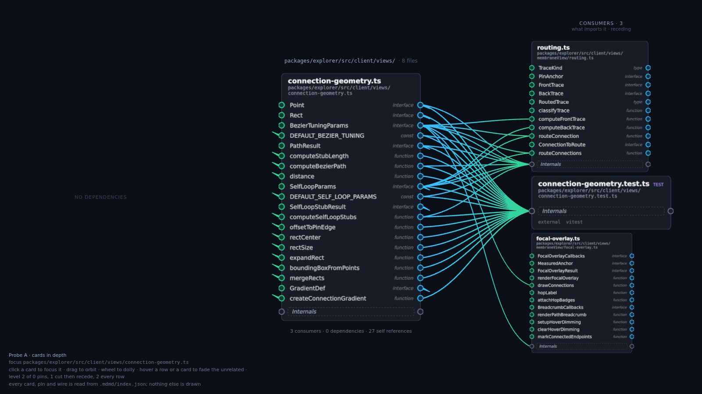

Orbited to 60 degrees, the laces that the 2D stubs only imply are there, curling behind the right wall and re-entering on the left, and the card occludes them, which is the "cut, do not boost" rule in geometry.

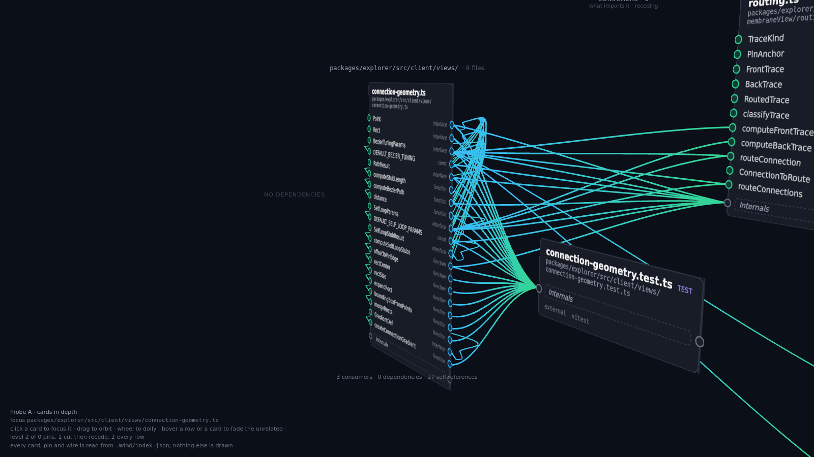

The hub `core.ts`, 13 dependencies and 25 consumers, sits on one screen. Depth carries one ordinal a column cannot: the heaviest neighbour is nearest. Every one of its 59 dependency wires lands on its `Internals` pin, because a re-export line names the origin but not the barrel's own row; see the growth list below.

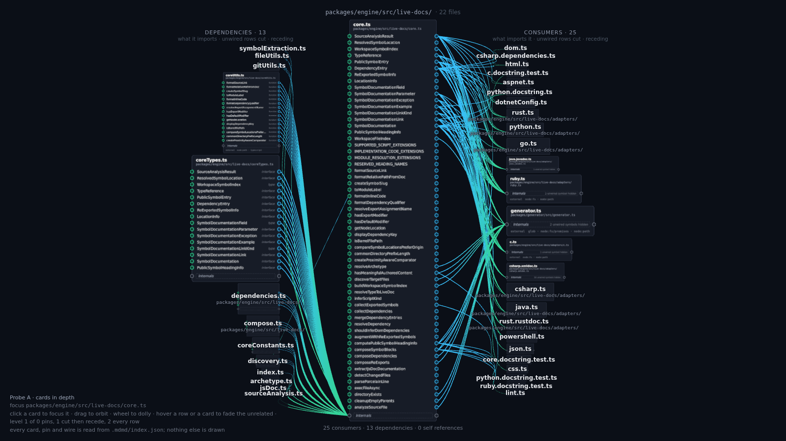

**Folder scale.** The open box holds 22 cards in dependency order and two subfolders as closed boxes inside. What the folder consumes arrives at green pins on its left wall from the three folders standing there; what consumes it leaves through blue pins on its right wall to seven folders. The 2D Membrane Map had disabled these wires as noise; here they have a corridor.

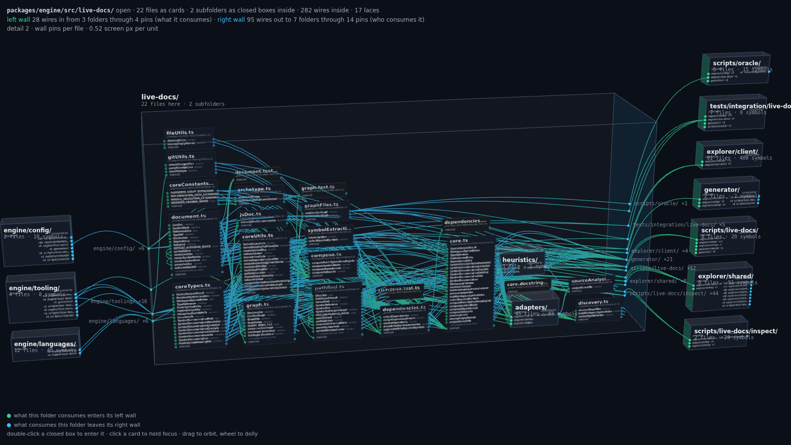

With one pin per neighbouring folder and a count, the wall reads at rest; per-file pins are for hover.

Entering a neighbouring box is a translation of the camera, not a zoom: the new layout is dropped where the box already stood, the box we came from shrinks in place into its closed form, and text stays the same size throughout.

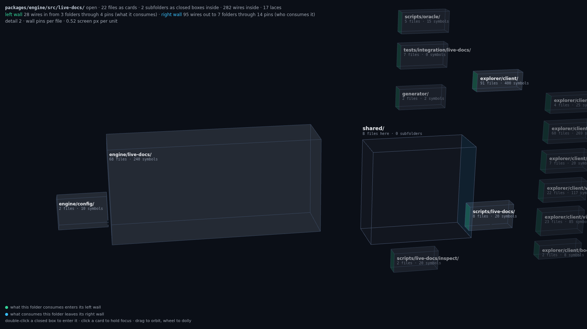

**System scale.** Six boxes in two zone volumes, the tunnel between them drawn as the one declared thing, packages hanging beneath each box from its project file, and three tiers of wire told apart by line style alone.

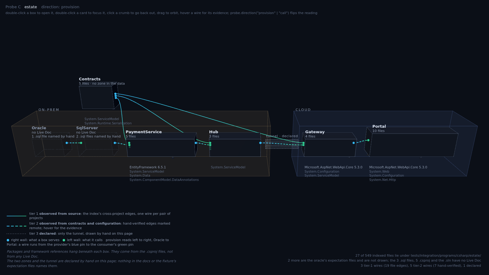

Hovering a wire shows the evidence the hand-verified file holds, and says plainly that the Live Docs carry none of it.

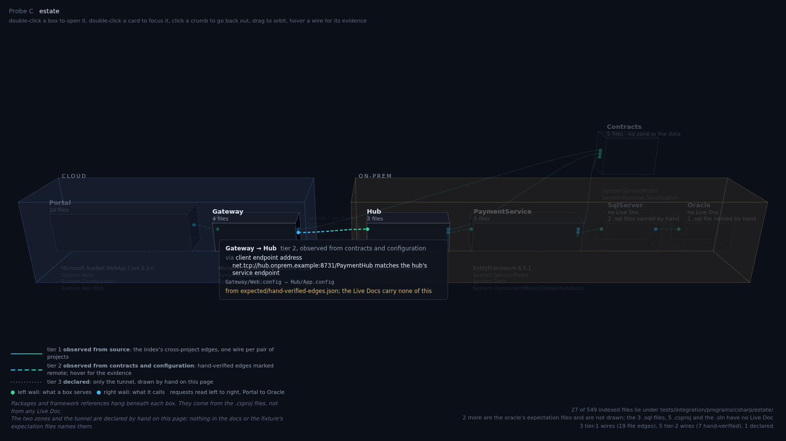

Inside the Gateway, the wire from the hub arrives at the left wall and the route the portal calls leaves the right wall; the neighbours stay where they were, dimmed.

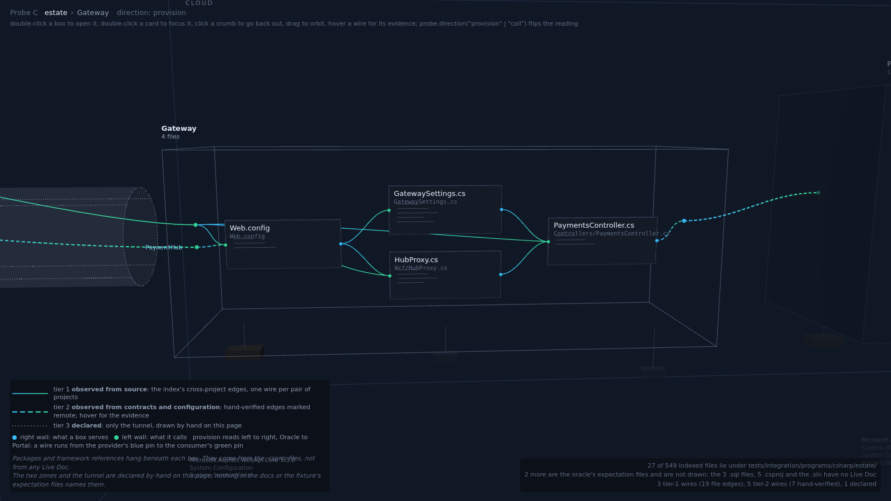

## The scale ladder

What the three probes agreed on when they had to move a viewer between scales.

| Scale  | The node              | What shows                                                                                    | What fades or is gone                         | One scale in                                 | One scale out                                                   | What stays put                             |
| ------ | --------------------- | --------------------------------------------------------------------------------------------- | --------------------------------------------- | -------------------------------------------- | --------------------------------------------------------------- | ------------------------------------------ |
| symbol | a row on a card       | the row, its wires, its laces                                                                 | every other row of the card is dim            | (none built)                                 | the whole card, same font                                       | the card, its wall pins                    |
| file   | a card                | every row with its kind, both walls, consumers and dependencies                               | unwired rows of neighbours, then their bodies | hover or click a row                         | the folder line above the card; columns collapse into wall pins | the focus card, the left-right reading     |
| folder | a translucent box     | cards in dependency order, wall pins per neighbour with counts                                | symbol text below a legible size              | a card grows at the same font, the box stays | the box closes into a card whose rows are its wall pins         | the box's title, band headers and counts   |
| system | a closed box          | endpoints served on the right wall, called on the left, packages beneath, tiers by line style | symbols entirely                              | open the box; wires keep their wall pins     | the canvas                                                      | zones, the tunnel, the other boxes, dimmed |
| zone   | a volume around boxes | the boundary and what crosses it                                                              |                                               | a box                                        | (an estate of snapshots; not built)                             |                                            |

The rules they converged on, each of which the owner had stated before in another form (see the digest):

1. **Text never resizes across a transition.** A camera dolly that shrinks the world is the wrong move; the entered thing re-renders at reading size and the rest recedes. All three pages keep pins, dashes and labels at one pixel size at every scale.
2. **The wall pin is the junction between scales.** A wire that leaves a card continues to the wall; a wire that leaves the wall continues onto the canvas. The same pin is the last thing you see going out and the first thing you see coming in.
3. **Landmarks stay, dimmed.** The box you came from, the neighbours, the zones: they do not move when you enter something. The dimming spec is the owner's: unrelated bodies illegible, names half legible.
4. **The pull is the next scale's summary at the edge.** A closed box shows its file count and its wall pins with counts; a card shows the folder line above it; folded cards carry row marks that are illegible by design. Each is enough to make you want to go there.
5. **Recession, not orbit.** Depth as distance from a resting camera keeps the left-right law; a free orbit breaks it within 30 degrees at file scale and within one perspective at system scale. If a page orbits, it must re-lay out for the new camera.

## Which way the chain reads

The Local Map puts a file's dependencies on the left and its dependents on the right; a wire runs from a provider's blue right-wall pin to a consumer's green left-wall pin, so provision flows left to right. Applied unchanged to the estate, the chain reads Oracle, SqlServer, PaymentService, Hub, Gateway, Portal: each system's exposed endpoints sit on its right wall and what it calls arrives at its left, which is the vision's own table for the system scale. The estate page was first built the other way round, in call order, Portal to Oracle, and now switches between the two. The builder's judgement, which I share: provision is the truer picture, because a wire then means one thing at every scale and a system reads like a machine with inputs and outputs. Its cost is that a non-software reader expects to start at the click, so the page has to say which way it runs.

## What the docs cannot carry today

The most valuable thing the probes produced. Grouped by what it would take.

**The generator already knows it and does not write it.** These are generator gaps, not format questions.

- Which of a barrel's own rows a re-export line belongs to. `core.ts` has 59 re-exported symbols and 59 re-export lines, and nothing ties a row to its line, so every wire lands on `Internals`.
- The kind of a re-exported symbol. All 59 are `unknown`, so the hub card's kind column is blank.
- Whether a wire into a folder lands on the barrel or on the origin. The edge says `to`; it does not say "through a re-export". Probe B counted 80 of 95 wires into `live-docs/` bypassing `core.ts`.

**The format has to grow.** New facts, each with the place the picture wanted it.

- The consuming symbol of an import. Import edges have no `from`, so every import lands on the consumer's `Internals` row, even when one function uses the symbol. Type references carry `from`; imports would need per-symbol use.
- Calls inside a file. The corset laces type references only; a function that calls another function of the same file is in no doc, so the lacing shows type coupling, not call coupling.
- A folder as a thing: a display name (basenames collide: `scripts/live-docs/`, `tests/integration/live-docs/`), a purpose, and which files form a system (the truth is `Estate.sln` and the project files, not path segments).
- A home for external modules. `glob`, `node:fs`, `typescript` are wires from nowhere at file scale and get no wall pin at folder scale. The picture wanted a wall for "outside the map".
- Packages and versions. `EntityFramework 6.5.1`, `Microsoft.AspNet.WebApi.Core 5.3.0`, `net48`: from project files only, drawn as barnacles with a note saying so.
- Routes, both ends. The controller's doc has `Post` and `Get`, not `[Route("api/payments")]`; the client's doc has the route text only in summary prose. Wanted at the Gateway's right wall and the Portal's left.
- Endpoint addresses. The docs name `PaymentHub` and `Estate.Hub.PaymentHub` as an `endpoint` and a `service`, which gave the direction; `net.tcp://hub.onprem.example:8731/PaymentHub` is in neither, so the wire came from the hand-verified file.
- Connection-string targets, procedure and table names, and a procedure's result columns: prose or absent.
- A tier on every edge. The grammar's qualifier list is where it goes, and nothing writes one yet; `Gateway/Web.config -> Contracts/IPaymentHub.cs` is observed from configuration and drawn solid.
- Evidence text for an edge, the `via` the hover panel showed. Entirely the hand-verified file's today.

**An adapter has to exist.** No `.sql` file has a Live Doc, so SqlServer and Oracle are ghost boxes whose files are known only as targets of hand-verified edges. Project files, solution files and `package.json` are the source of packages, versions and membership and have no adapter either.

**A person declares it.** Zones, the tunnel, and where a snapshot came from. The vision's third tier exists on the page only because the builder drew it.

## What the probes changed about existing doctrine

- **The barrel is not the membrane, on this repository's data.** The Membrane Map doctrine says a barrel file is the folder's public surface. Probe B measured 80 of 95 wires into `packages/engine/src/live-docs/` landing on `pathfind.ts`, `graph.ts`, `document.ts` and `graphFiles.ts` directly, not on `core.ts`. The wall is honest; the doctrine would have to move those wires onto the barrel, which is inference.
- **Edge bundling has an untried alternative that reads.** The hover arcs of April were reverted as noise. One wall pin per neighbouring folder with a count, per file on hover, per symbol never at folder scale, held up at rest.
- **The Local Map's law survives depth only from the resting camera.** See rule 5.
- **Both builders of the two 3D scales reached for the corset principle at their own scale**: a wire that would cross a card, or run backwards, dips behind and the cards occlude it. The owner called the inter-card corset "the most visually understandable and truthful of what we've seen" in March; it generalises.

## Forks, for the owner

1. **Which way the chain reads**: provision left to right, the same law as the file scale (recommended), or call order with a labelled exception at system scale.
2. **Depth at file scale**: recession from a resting camera (recommended), or free orbit with re-layout.
3. **A folder's public surface**: the wall, one pin per neighbour with a count (recommended), or the barrel as the doctrine says.
4. **A linked library at system scale**: a box, or cruft beneath the boxes that use it. Probe C's Contracts hangs behind the chain as a box today.
5. **Where declared edges and zones are written**: nothing in the data says cloud or on-prem or names the tunnel. The vision says a person draws them; the probes say the place to write them is beside the index, read the same way, not inside any one Live Doc. Undecided.
6. **The pages**: delete them once looked at, keeping this folder, or keep one as a reference build.

## Where the pages are

`AI-Agent-Workspace/tmp/probes/cards-in-depth/index.html`, `.../membranes-as-volumes/index.html`, `.../estate-canvas/index.html`. Each opens by double-click, exposes a `window.probe` API described in its findings, and has a `shoot.cjs` that reproduces every screenshot. They read the index as it was on 2026-09-28 and will drift from the docs after that; they are not to be maintained.

## Rounds 2 to 4: the owner's verdict, and the estate as a place

_Added later the same day._

The owner looked at the nine round-1 screenshots and said: "Not gonna lie, I can see the screenshots and they all came out pretty mid. Can you please fire up more subagents and keep iterating based on critiques of the screenshots you stored in `shots/` and my cumulative user intent?" Then the rule that shaped everything after: "consider whether it might be wise to stick to 2D inside the black box of a software system, and 3D outside of one (between software systems/rigging up many)."

The evidence agreed with the hint, so the loop changed shape. The file and folder probes stopped where they were; their findings stand as inputs to a two-dimensional interior. The iteration went into one target, written up in [brief-2.md](brief-2.md): the estate as a place, three dimensions between systems, and inside each box a real HTML panel in the Local Map's own card design, placed in the scene by three.js's CSS3D renderer so text is crisp and never resizes. Two builders took it, one evolving the round-1 page and one starting fresh from a diorama composition. Between rounds a critic judged every screenshot against [critic.md](critic.md), a rubric built from the owner's words, and ranked the faults. The first page went four rounds, the second two. The coordinator looked at every screenshot before anything went back to the owner.

Why round 1 was mid, in three faults: everything was drawn at once, so the resting state was a hairball; the craft was at debug level, grey slabs, hairline wires, illegible text, a legend a quarter of the screen; and depth was spent on tilt, which costs legibility, instead of on the space between systems, which is the only place it paid.

### What the rounds changed

- **Round 2**: a floor, lights and shadows, two zone slabs, fog; boxes standing on their cruft, showing their guts through the faces; the databases as drums; the interior as an HTML panel with the Local Map's cards, pins, gradient wires and corset stubs; opening a box moves the camera to one panel pixel per screen pixel; a request traced end to end across six boxes.
- **Round 3**: the chain made the line, the shared library receded behind it; cruft as a counted cluster; interiors dimming with their boxes and nothing on the path lit above its resting value; stand-in cards for files beyond the wall, so an empty consumers column names the Portal file that consumes the focused one; every label off every other label.
- **Round 4**: every system whole in the frame; a band at the panel's mid-height that wall pins own, so a wall wire runs straight and branches into its columns instead of looping along the ceiling; four wires into one pin meet at a junction with the count; the evidence card off the conduit it explains; every arrow in provision order.
- **The diorama, two rounds**: a horizon; the tunnel as a lit tube the conduit passes through; count badges on the conduits; the open box with lid and floor in perspective around the panel; cards measured to their content so nothing truncates; one Bezier per wire that passes behind a card in depth when it would cross it; and an experiment with the zones stacked in depth.

### The two pages side by side

| Choice                         | The first page                                                               | The diorama                                                                   |
| ------------------------------ | ---------------------------------------------------------------------------- | ----------------------------------------------------------------------------- |
| Resting camera                 | steep, from the Oracle end, the chain climbing to the top-right corner       | low, with a horizon, the chain a band across the middle                       |
| Composition                    | one row, a second view mirrored from the Portal end                          | one row, or the zones stacked in depth with the tunnel receding               |
| The open box                   | the panel over the dimmed world, neighbours named at the frame's edges       | the panel inside the box, lid and floor in perspective, wall pins with counts |
| A click on a card              | re-layout into dependencies, card, consumers, with stand-ins beyond the wall | nothing moves; the unrelated fade; the wall pin fans into the rows it touches |
| A wire that would cross a card | a bus at pin height with branches into the columns                           | one Bezier that passes behind the card, which the panel's depth allows        |
| Many wires into one pin        | a junction with the count and one trunk into the row                         | count badges on the conduits between boxes                                    |
| Cruft                          | a cluster of nubs on stalks with the count beside                            | solid shapes at the foot with the count                                       |

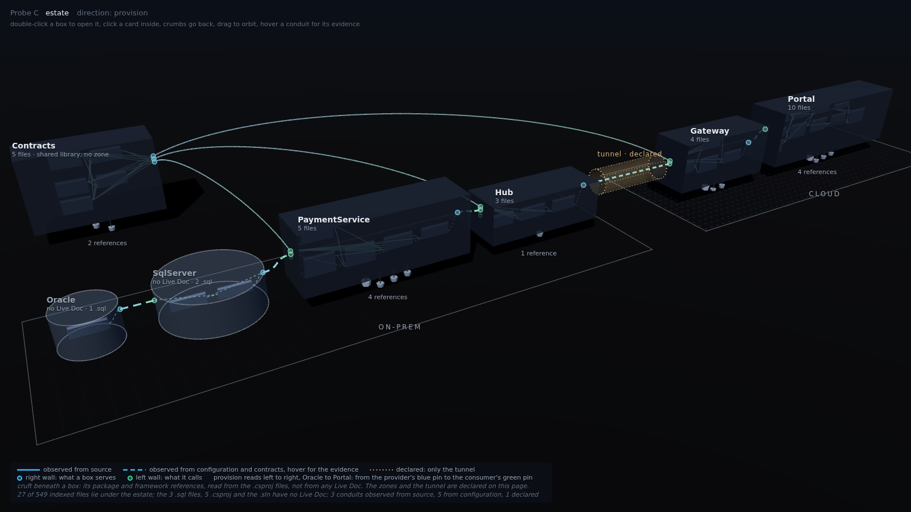

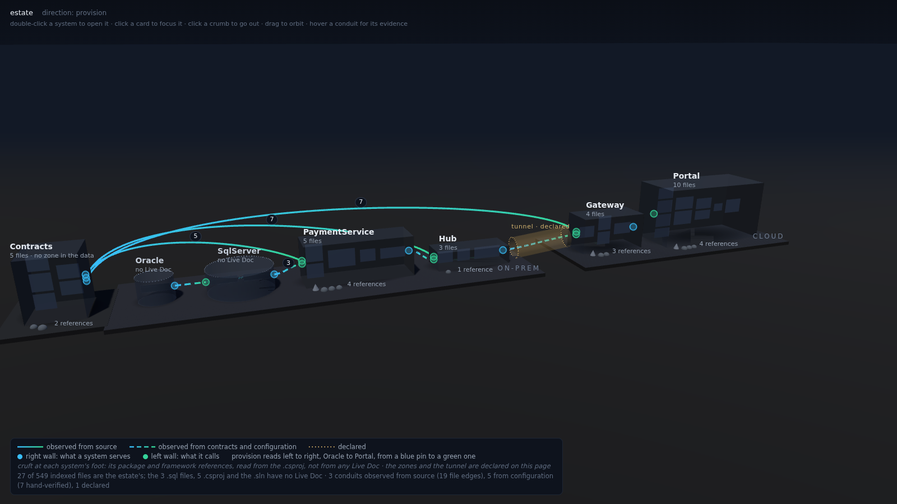

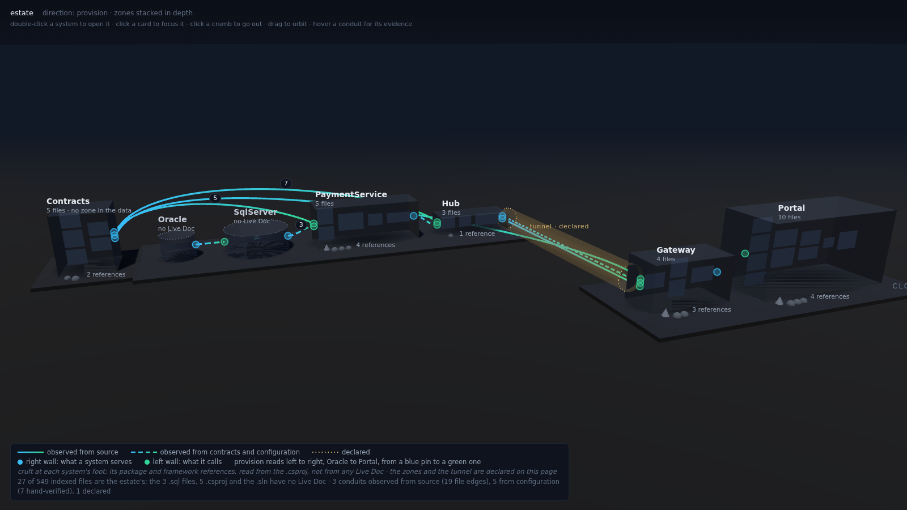

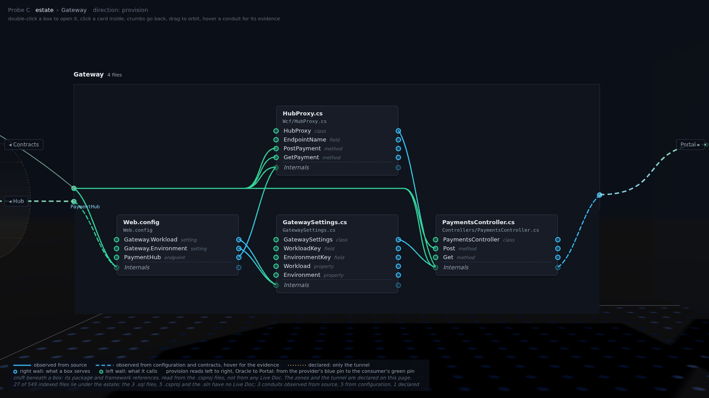

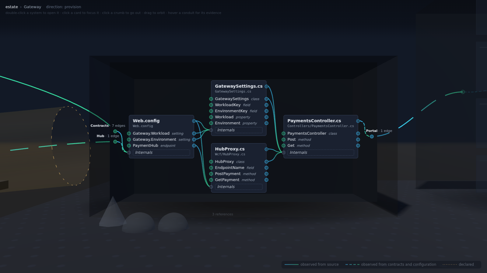

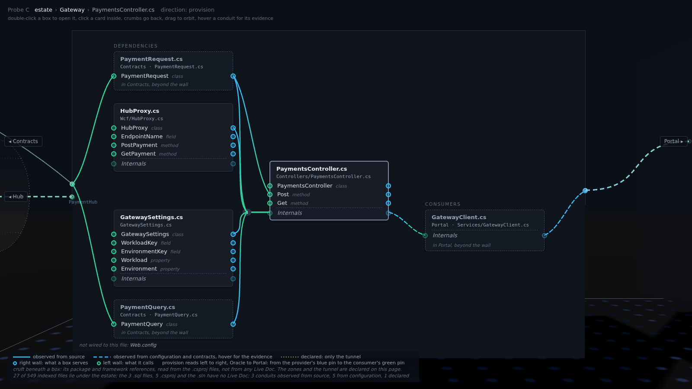

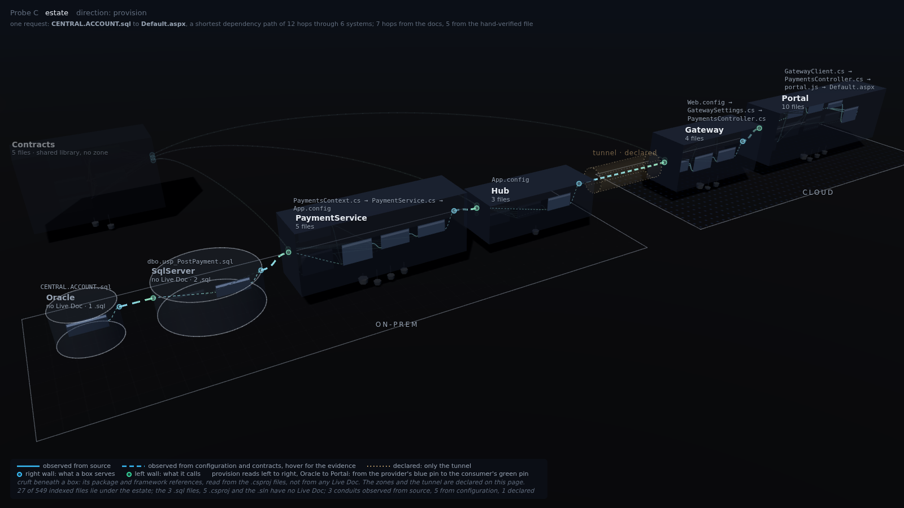

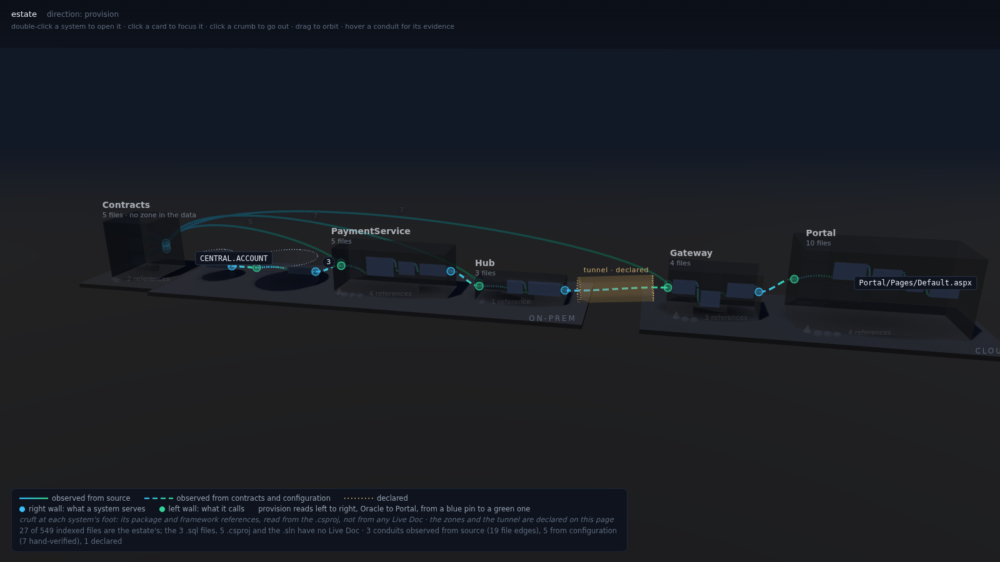

### What the rounds taught, beyond round 1

- The interior belongs in two dimensions and in the browser's own text: an HTML panel in the scene is crisper than any texture, and the Local Map's grammar transferred whole.
- The wall pin held as the junction at every scale: the same pin, the same height, in the world and in the panel, so a conduit meets the panel where it met the wall.
- A wall pin owns a band of the panel's height; cards stack above and below it; a wall wire runs straight at pin height and bends only into its column.
- A badge replaces a fan or is not shown; a fan beside a count is two statements of one fact.
- Dimmed lines lose alpha, they do not gain dashes, because dashes mean a tier; the warm hue is the tunnel's alone.
- A chain of seven systems in a 16:9 frame is a band with sky above it. Stacking the zones in depth fills the frame and gives the tunnel length, at the cost of a chain that zigzags.
- What the docs cannot carry gained two items: what kind of system a box is (a web app, a WCF service, a database; the drums are a guess from a folder name), and which of two equal-length dependency paths is the call path, since the docs do not distinguish a call from a read.

### Forks added by these rounds

7. **A click on a card**: re-layout into columns with stand-ins beyond the wall, which is the Local Map's answer and the owner's "once pinning of symbols begins... a layout rearrangement must begin"; or nothing moves and the unrelated fade, which is the Membrane Map doctrine's "the spatial layout never changes". Both are the owner's words; both are built.
8. **Composition at the canvas**: one row, or the zones stacked in depth.
9. **A wire that would cross a card**: corset stubs, or a real pass behind the card that depth allows.
10. **Which page to carry forward**, or which parts of each.

The pages are `AI-Agent-Workspace/tmp/probes/estate-canvas/index.html` and `AI-Agent-Workspace/tmp/probes/estate-place/index.html`; each has a `probe.direction` switch, and the diorama a `probe.composition("row" | "depth")` switch. They are disposable, like the round-1 pages.

## The board: the owner's second verdict, and the estate as pieces

_Added the same afternoon. The rounds above were shown to the owner as hosted pages; what follows is their verdict, verbatim, and the probe the coordinating agent then built itself. The full findings are in [black-boxes.md](black-boxes.md)._

"Huh. Dang I did not love those at all. Is it possible that we could look to videogames for inspiration?" Then the frame that replaces the morning's:

- "It is a total mess to be able to see _inside_ each black box of software. **I think we should not be able to see inside the boxes** until we zoom in enough that we go to a new view. So long as the transition feels seamless, it's fine."
- "In 3D, I see that you're still worried about the left-to-right semantics. This is a mistake in my opinion. We're opening ourselves up to 3D specifically because we think that there is insufficient ordinal space to appropriately show dependency shapes honestly."
- "you _could_ reimagine the outer multi-software canvas as a 2D canvas which you plop boxes down on, and each box you point to a directory... and you can wire those boxes together along the openings that each expose."
- "3D seems good when your universe is big and your nodes and connections are many. 2D seems good when you're trying to work with UI elements."
- "consider whether or not 3D might mean 'faked 3D' (i.e. isometric perspective) or something like that. Think outside the box. What are you drawing and who are you drawing it for? These probes really lack vision."
- "Rather than spinning up a subagent, can you maybe work on this yourself? If I had to make a guess as to why the subagents were uninspired, my only guess is that they lacked sufficient familiarity with my user intents and the overall vision."

And while the first build rendered: "be more abstract"; "A cloud white blank surface upon which you plop isometric-looking markers is great too", or "a deep dark gray black background for those folks"; "floating cubes in the sky above the isometric ground could be a great way to see these things being wired up"; "the outermost interaction surface feels like plopping pieces down on a board game. Wargames system design haha!"; "Try smooth placement first", with snapping as "a slider or checkbox".

### What was built

One page, plain SVG, no three.js: the estate as pieces on a board. A blank white surface, or a deep dark one; two declared districts as faint tints; pieces of one size floating above the board with shadows beneath, a cube for a service, a tile for the shared library, a drum for a database with no source. Doors on the faces the viewer can see, green where a piece serves and blue where it calls. Wires in the air from the caller's blue door to the server's green door, with the request's flow along them and the evidence on hover. Strands of what each piece is built on hanging from its underside, and a layer of tokens on the board for the references two or more pieces share. The tunnel as a warm sleeve where the wire crosses between districts. Quarter-turn rotation and a top-down projection of the same board. Nothing inside a piece shows until the viewer wheels into it, when the lid unfolds into the folder map in the Local Map's grammar, the piece's doors as its wall pins. Pieces are dragged anywhere and stay there; snapping is a toggle.

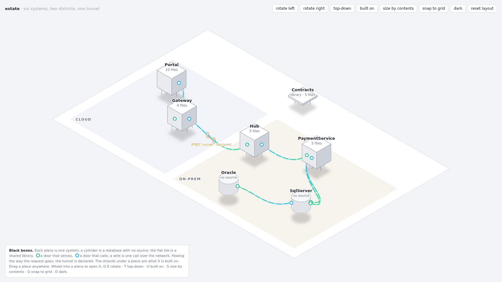

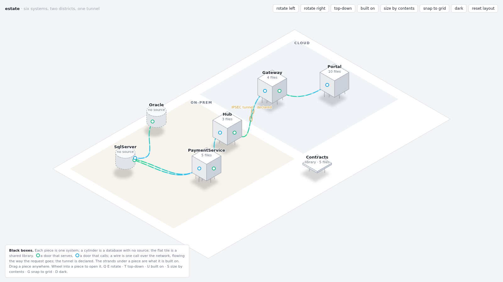

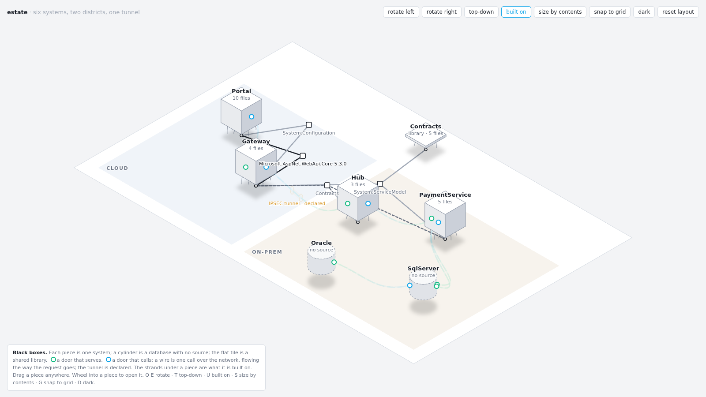

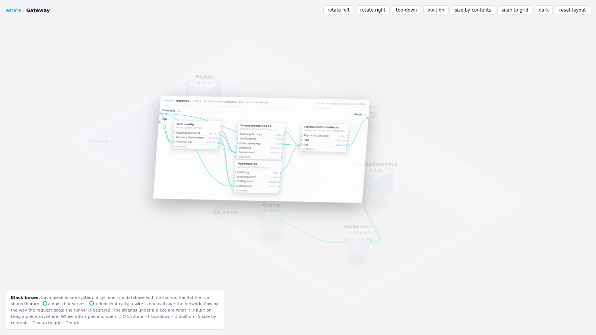

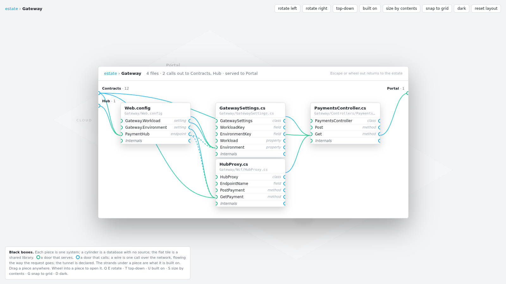

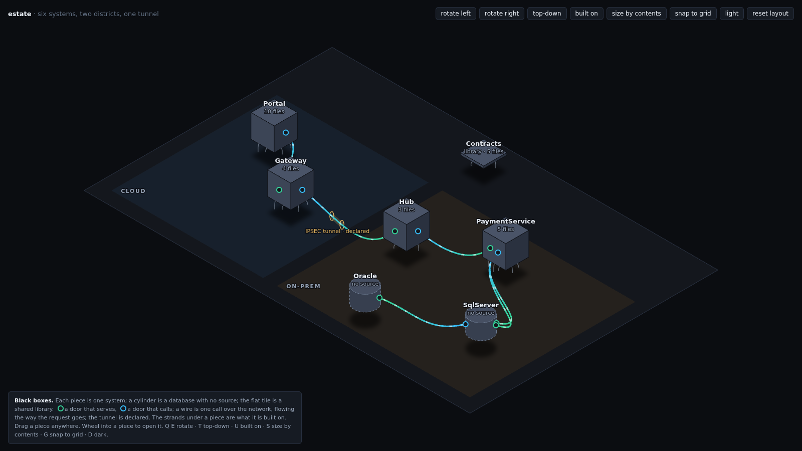

### What it taught

- A board is a better frame than a scene. Once the boxes are closed, the pieces uniform and the surface blank, the reader's attention goes to the wires and the doors, which is where the facts are.
- The third dimension earns its place twice at this scale: volume, so the pieces read as things one placed, and height, so what a piece is built on can hang beneath it. Everything else, including position, is better two-dimensional. The top-down toggle shows the same board flat and loses only those two things.
- Doors that slide to the faces the viewer can see keep every wire visible under rotation; the cost is that a door is not a fixed place on a piece.
- Shared references belong on the board, under the pieces, not underground: the tokens with spokes read at a glance which pieces stand on the same thing, which is the SBOM question at this scale.
- The lid unfolding into the panel is a seamless enough transition to satisfy "we go to a new view": the piece's outline becomes the panel's frame, and the panel's text is the browser's own at one size throughout.
- The docs still cannot say what a system's openings are, what it is built on, what kind of system it is, or where the zones and the tunnel lie. This page declares all four from the fixture's expected files, project files and README.

### Forks from the board

11. The board's colour by default: white, or the deep dark one.
12. Uniform pieces, or sized by contents.
13. The built-on layer: tokens with spokes, or only the strands and the hover list, or another drawing.
14. Doors that slide to visible faces, or doors fixed to the facing wall.
15. What opens a piece: the wheel past a threshold, a double-click, or both.
16. The shared library: a tile on the board, or only a token beneath the pieces that stand on it.
17. The inside of a piece: the folder map as drawn here, or the Membrane Map's rendering once step 3 consolidates the views.
18. Where a board's declared districts, tunnel and positions are written so that it can be shared.

The page is `AI-Agent-Workspace/tmp/probes/black-boxes/index.html`, disposable like the others; `node build.cjs` rebuilds it and `shoot.cjs` takes its screenshots.

### The owner's answer

On the hosted page, the same evening: "HOLY SHIT THIS IS SO GOOD. WOW! Yeah this is -- this is exactly the direction I'm looking for. Absolutely phenomenal." What they wished for: the force graph's freedom of movement, "Could probably keep the camera orthogonal so it still feels isometric even when panning and things stay sane sizes"; a light mode without its "haze"; less parenthetical text on hover; and "A simple question mark element in a corner which allows one to bring up a guided walkthrough or an explainer modal/popover of the UI" in place of the on-screen legend. They also named the district colours as their firm's convention, light blue for cloud and light orange for on-prem, and asked whether a directory's outside dependencies can be known in general. All four wishes went in as rounds 8 and 9; the answer to the question, and two forks it adds, are in [black-boxes.md](black-boxes.md).

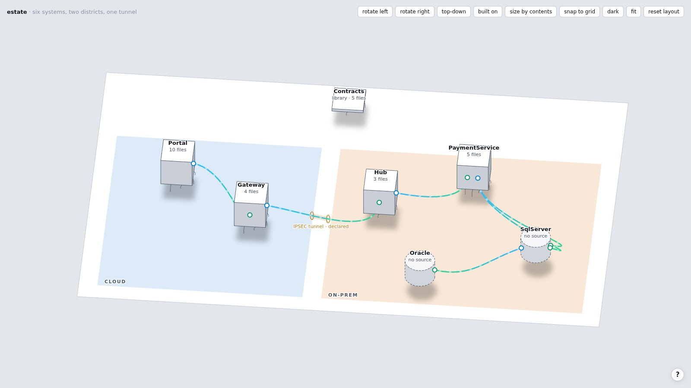

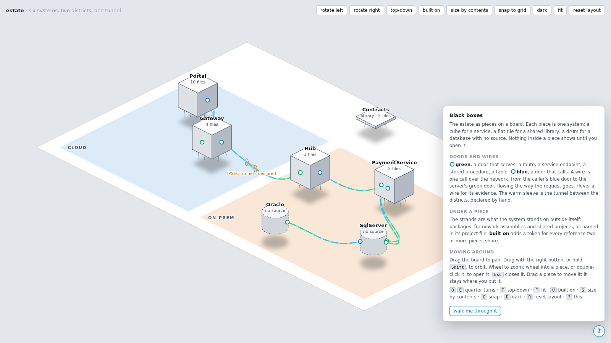

On round 9: "Super slick. This is awesome." Round 10 followed: the orbit turns the way the force graph's does, a click pins the panel and the pinned panel opens the piece, the text was halved, and the views took the names the owner proposed on trial: the World Map outside, the Local Map inside, reached by zooming in far enough. "Overall, I think this is the right direction and we could really work with this."
